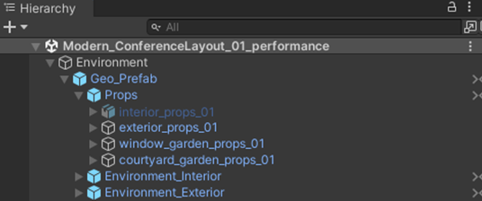
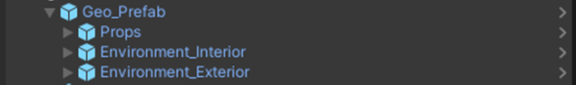

# Project Structure

### Naming conventions

*ProjectName_category_assetName_subcategory_iteration_type.format*

*Here are some naming convention examples:*

### Unity folder structure

### Perforce folder structure

## Unity file hierarchy

Keep the **Hierarchy** clean by removing disabled objects.

**Disabled objects still add to the file size of the root
object/project.**

Embedding Prefabs into Prefabs is okay, especially if multiple people
are working within a workstream.

