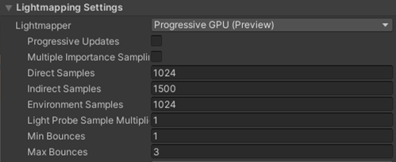

# Troubleshooting

## Known issues & limitations

Mesh is still in development, with new features and updates to existing
features ongoing. You may find that some features or
experiences are not polished or fully functional.

Look at the Release notes for details on features, bug fixes, and known
issues.

If you find new issues, file a bug or speak to your Microsoft partners.

## Release notes

Look at the Release notes for details on features, bug fixes, and known
issues.

We love feedback and bug reports! If you'd like to provide feedback, use
the Feedback button inside any Mesh experience. This ensures that your
feedback and bug reporting will be triaged and incorporated quickly.

If you're not able to give feedback or report bugs using the Feedback
button in Mesh, use the Teams chats with your Microsoft partners or
contact your Microsoft partners directly.
