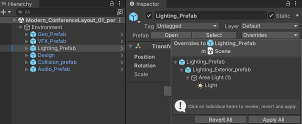
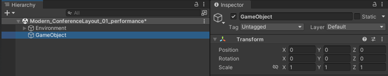
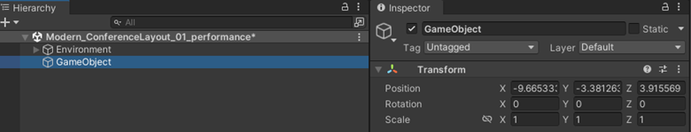

# Unity Prefabs

We recommend that you start each project with Prefabs. This will allow your scene to be accessible to multiple people at once without worrying
about overriding others' work. Splitting each scene up into common sub-disciplines is a great place to start.

Using Prefabs allows easier collaboration within a single Unity scene and is preferred for Microsoft Mesh projects.

When editing the scene, always make sure the Prefab you're working in has its overrides applied. If there are overrides waiting to be applied on a Prefab, that means those changes are **not yet associated with the Prefab**. In the screenshot here, the changes are at the scene level and, when saved, will modify the scene file only.

 

Applying the override will remove the changes from the scene file and apply them to the Prefab file.

**Prefab Overrides and Git**

Note what happens if you save the project **without** applying the overrides and commit the project files to a Git repository:

When you eventually apply the overrides to the Prefab, you'll have to commit the Prefab file and the parent object file to the Git repo. In this scenario, you're adding the changes to the Prefab file while removing the changes from the parent file.

When you're making a new Prefab, make sure the empty GameObject node is zeroed out **before** turning it into a Prefab.

**CORRECT**

**INCORRECT**

