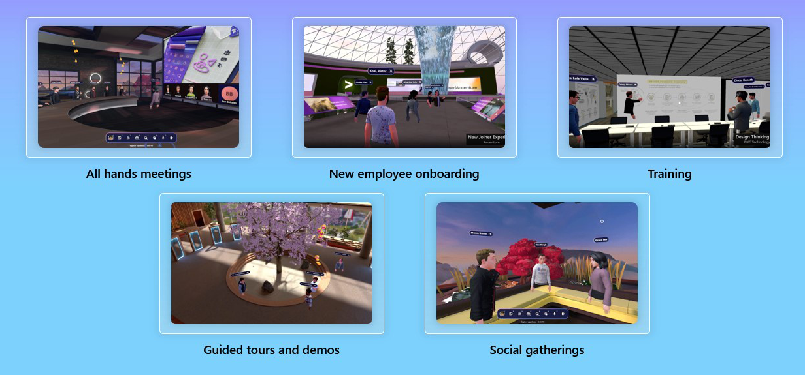
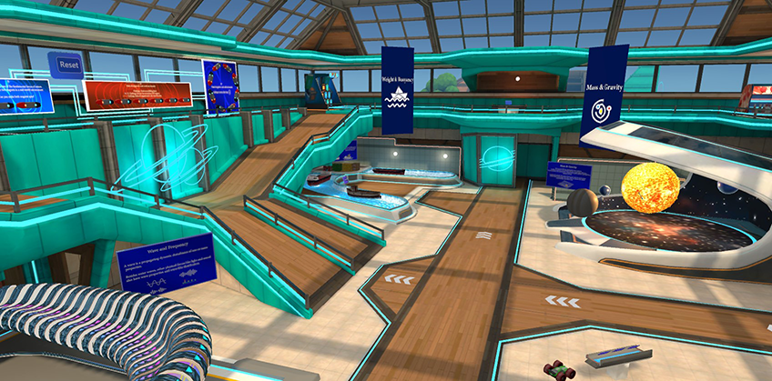
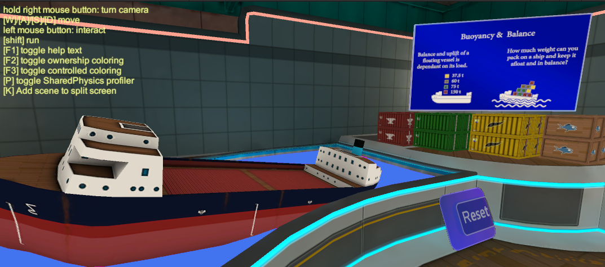
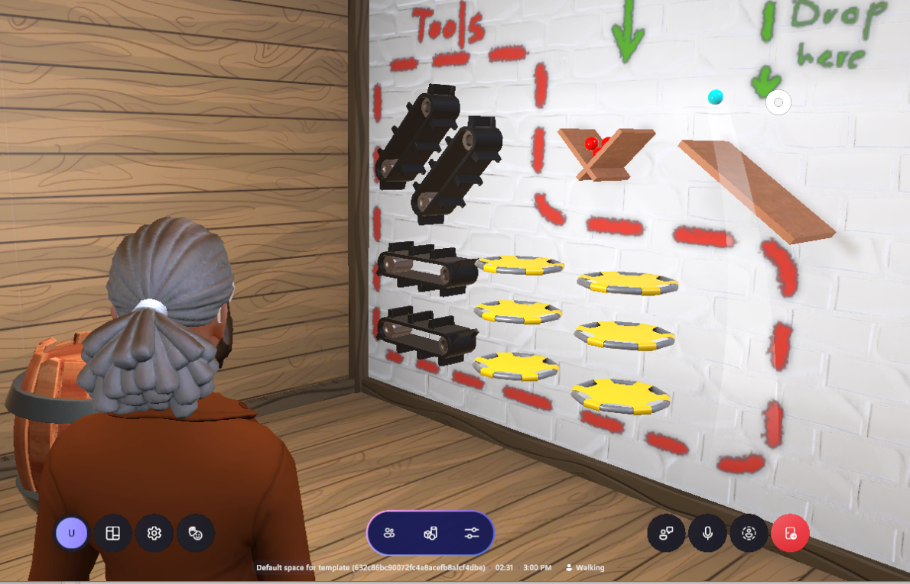
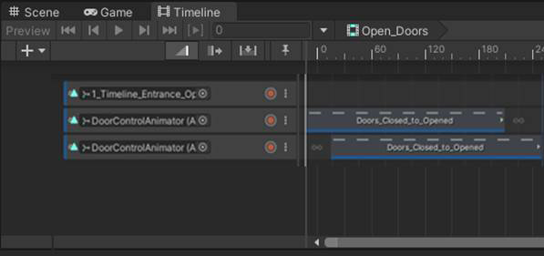
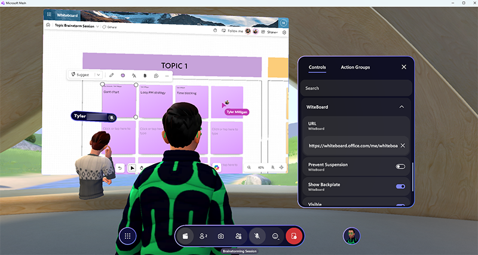
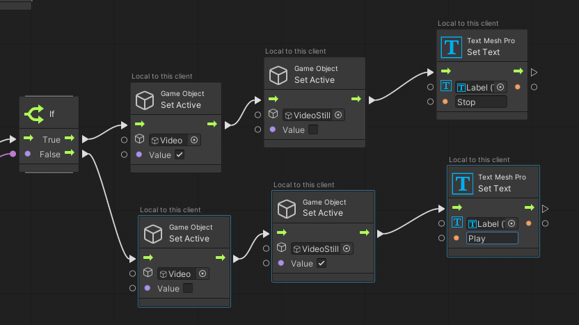
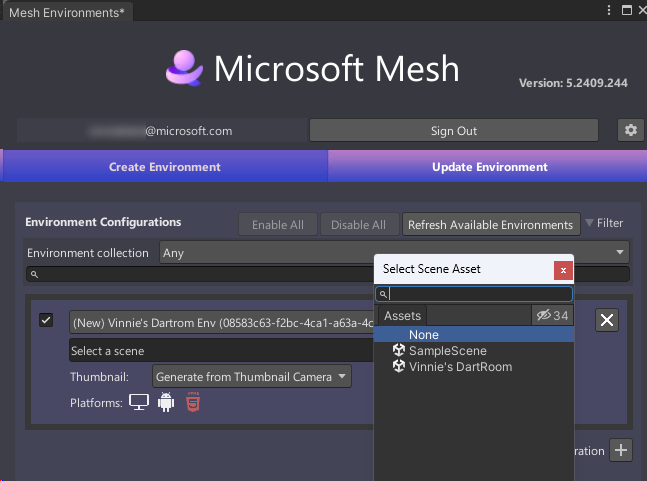
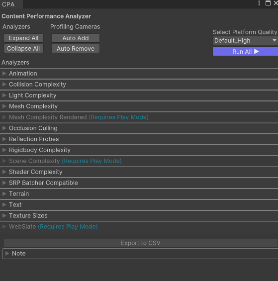

# Mesh Development Overview

## What you can do with Mesh

As a Mesh developer, you have an exciting opportunity to bring people together in shared immersive experiences in 2D (PC) or 3D (Oculus Quest). Your key to creating these experiences is the Mesh toolkit for Unity which provides a collection of features that enable you to develop rich interactive worlds. Here are some examples of the types of experiences you can create:

Click the thumbnails below to learn about what some of our partners are doing with Mesh.

:::image type="content" source="../media/get-started-developing-mesh/040-accenture-inline.png" alt-text="a thumbnail image of the Accenture logo that the reader can click to open a larger descriptive image." lightbox="../media/get-started-developing-mesh/043-accenture-expanded.png":::
---
:::image type="content" source="../media/get-started-developing-mesh/041-takeda-inline.png" alt-text="a thumbnail image of the Takeda logo that the reader can click to open a larger descriptive image." lightbox="../media/get-started-developing-mesh/044-takeda-expanded.png":::
---
:::image type="content" source="../media/get-started-developing-mesh/042-village-inline.png" alt-text="a thumbnail image of the World Economic Forum's Mesh project title that the reader can click to open a larger descriptive image." lightbox="../media/get-started-developing-mesh/045-global-expanded.png":::

## How to build a Mesh experience

Your custom Mesh experience starts out in Unity as a new project or existing sample. You can add content to the project/sample *Scene* and then upload it to a Collection in Mesh on the web as an *Environment*. An *organizer* can then create a Mesh event based on your Environment.

In the *Develop environnments* section of the Mesh help site, you'll find articles that introduce you to the features of Mesh toolkit, walk you through Unity setup, and describe the samples provided by Microsoft that you can use as a starting point for your Environment. Here are some links to the major steps in Mesh development:

[Create a new project or update an existing one](../develop/build-your-basic-environment/create-a-new-project-or-update.md)

[Add 3D models, textures and lighting](../develop/design/overview.md)

[Add enhanced features such as animations, physics and WebSlates](../develop/enhance-your-environment/enhanced-features-overview.md)

[Add C# scripts for integrating live backend data, calling .NET APIs, and more, or use node-based visual scripting](../develop/script-your-scene-logic/mesh-scripting-overview.md)

[Build and publish your environment](../develop/make-your-environment-available/build-and-publish-your-environment.md)

## The Mesh tookit in detail

:::image type="content" source="../media/get-started-developing-mesh/056-mesh-toolkit-features" alt-text="An inforgraphic that shows four of the features of the Mesh toolkit.":::

* [Mesh graphics tools](design/overview.md) is a collection of scripts, shaders, assets, and samples created to help improve the visual fidelity of Mesh worlds while staying within performance budgets.

    

* [Mesh physics](enhance-your-environment/physics/mesh-physics-overview.md) lets you create enabling and engaging dynamic content.

    

* [Mesh interactables](enhance-your-environment/avatar-and-object-interactions/interactables.md) allow event attendees to grab, hold, throw, select, anchor, tether and spawn.

    

* [Mesh controllables](enhance-your-environment/multi-room-sync.md) enable event hosts to control and sync video and timeline playback across multiple rooms of a large event.

    

* [Mesh WebSlates](enhance-your-environment/webcontent.md) are panels that display web content.

    

* [Mesh visual scripting](script-your-scene-logic/visual-scripting/visual-scripting-overview.md) lets you add interactivity and dynamic runtime behavior to your Mesh Environments by creating script graphs instead of writing code.

    

* [Mesh cloud scripting](script-your-scene-logic/cloud-scripting/cloud-scripting-basic-concepts.md) is a more traditional coding approach that lets you connect to real-time backend data and call .NET APIs via cloud-hosted server scripts.

    

* [Play mode with Mesh Emulator](debug-and-optimize-performance/mesh-emulator.md) lets you press Play in a Mesh content project and preview how your content will look to attendees who join events based on your environment.

    

* [Mesh Uploader](make-your-environment-available/build-and-publish-your-environment.md) is how you upload the Environments you create to Mesh on the web.

    

* [Mesh Content Performance Analyzer](debug-and-optimize-performance/cpa.md) (CPA) automatically reports content optimization issues and opportunities before content is uploaded to Mesh on the web.

    

The Mesh toolkit is free to [download](../develop/build-your-basic-environment/add-the-mesh-toolkit-package.md); however, a Teams Premium license is required for all users (including developers and technical 3D artists) to use Microsoft Mesh.

## Next steps

 > [!div class="nextstepaction"]
 > [Prerequisites](getting-started/prerequisites.md)
