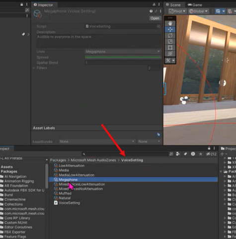

# Audio Zones in Mesh

A Mesh event has *audio spatialization* (we describe this as "the way a sound behaves in a 3D space"). However, until now, you've had limited control over how spatialization works; there's one default audio setting and it hasn't been customizable for different event sizes and scenarios. this can be a problem if, for example, your event takes place in a large room and you want the volume of the voices between attendees to fade out more gradually as the attendees get further apart. Another example is an event where there's a large table and attendees at the extreme ends of the table are far enough apart that they can't hear each other. In real life, if you're far away, you can speak louder, but in a Mesh event all voice volumes are *normalized* so this doesn't work. In some cases, there are workarounds (for example, make everyone in the event an *Organizer* so they can push the *megaphone* button to make themselves heard by everyone) but these limitations and workarounds can detract from immersion and presence. 

With our latest Mesh toolkit updates, you have much more control over how sound behaves in your environment. You can customize the sound settings for the whole space or create *Audio Zones* which are individual areas in the space that override the audio settings of the environment with their own unique audio settings. this gives you the ability to not simply equal the experience of being in a real-life acoustic space but to go surpass it. 

- No matter how large the space is, you can give certain attendees the ability to be heard throughout the entire space.

- Certain attendees can have multi-directional conversations without interrupting each other. tbd - more detail.

the benefits:

--Increase productivity, interaction and engagement.

--Decrease mis-communication.

--If you want to change an audio setting, you can do this __________________ tbd without having to edit the environment itself.

--Audio Zones can be user-facing or function invisibly.

Common scenarios:

- In an environment, create a small "discussion area" with a few chairs or couches. Place an Audio Zone over the area. Select the Audio Zone setting called "low attenuation." Anyone inside of this Audio Zone will hear anyone else inside the Zone clearly. You can also choose a setting called "Muffled voices outside" (tbd -- check on name) which muffles the voices of anyone outside the Audio Zone, making it easier for people inside the Zone to hear each other.

- Set up walls and create distinct separations between rooms.

- Create tunnels that have more reverberation.

- Have distinct acoustic features for different areas. For example, you can have an "outdoor space" where there's no echo and things sound flat, and an "indoor space" where concrete and glass surfaces cause more echo.

- Create a "production booth" for people who are in the event to help the host (for example, running the lights). they can talk normally and no one outside the booth can hear them but they can hear everything that's going on outside the booth.

=====================

Solution for Organizer/Megaphone problem: create a *stage* area. Anyone who walks into this area is automatically heard by everyone in the environment. 

## Create an Audio Zone

1. Add an empty GameObject to the scene.
1. Add an Audio Zone script (component? tbd) to this new GameObject.
1. Add a trigger collider in the shape you want (capsule collider, or rectangle).
1. Adjust the trigger collider to the size you want.
1. Specify the Audio Zone options you want. For example:
    1. For **Default Voice**, choose "Low attenuation."
    1. Choose "Muffled voices."

Note: these steps aren't the preferred way to set up an Audio Zone. We want Audio Zones to be Objects. the Audio Zones in the environment should be more about defining acoustics than user functionality (for example, muffled voices). By configuring these options within objects, the environment creator can place the objects in an environment. the environment can then be used as the basis for templates. An Organizer can then choose the template that has the Audio Zone-based objects they want for an event. 

Prefabs

Rectangular acoustic zone
Circular acoustic zone

these aren't audio zones. they're "marker prefabs" used at runtime to configure an acoustically-oriented audio zone. 

## Step by Step

Packages:

(tbd this is what we're shipping with:)

Here are audio assets in the project. Note that there's a folder named "AudioZonePrefabs".

there are birds, etc. that's a different workflow.

Now we want ensure that when someone steps into this room:

... they don't hear people in the room next to them.

We have various tools we can use here.

### VoiceSetting Collection

the items in this folder are (I think) made up of individual "voice settings". One of these Voice Settings is "Default Voices".

### Default Voices

If you don't select a specific Voice Settings, the event will be set up with "Default Voices" voice setting which contains these six default "filters" or "voices". tbd

these voices are found in the "VoiceSetting" folder.

Each setting has a *Use* assigned to it. (I think ... tbd ... this means that ...) For example, the Default Voices voice settings include the Megaphone filter, which **Uses* set to "Megaphone." (I think ... tbd) this means that when the Megaphone is turned on in an event, this filter becomes active.

the six voices/filters that make up the Default Voices voice setting are found in the **Filters** folder:

Breakdown
tbd (I think):
In the Voice Setting Collection folder, you have various VS Collections. One of these is "Default Voices."
Default Voices is made up of seven "voice settings". One of these is "Megaphone."
the Megaphone voice setting has its Uses property set to "Megaphone." So it goes into action when the event Megaphone is turned on. 
You can assign a different "Use" for each voice setting so that the voice setting only becomes active when a specific circumstance exists. See the Megaphone example. Another example: you have an event with an Audio Zone that has the Default Voices collection, which has the Media Voice Setting. You can configure a Media Player to use the "Media" Voice Setting. A Media Player that's dropped as an Object outdoors might sound a little different than the same Media Player that' located indoors. It picks up a different Voice Setting from whatever Voice Setting applies in that area.
there's also a "Filters" folder with various filters (they all have "Filter" in the name). image 012
A "voice setting" is made up of various filters. See image 013. Ex: Mixed Voices Low Attenuation.
You can have a voice setting collection set up for:
- the entire environment
- a specific region in the environment
- a specific object (? --tbd)
- 

======

 Each item listed here in the Packages > MM AudioZones > VoiceSetting window is a "voice setting." If you select the voice setting "MixedVoicesLowAttenuation", its individual features (and settings) are shown in the window above. In this case, the VS has three filters (volume, low pass, reverb)

Note: You get a lot more control over audio with these voice settings than by using Unity Spatial Audio source. 

We want this "Megaphone" voice setting to apply to people who are "megaphoned" in the space.

this has:
--flat volume filter (similar to the attenuation filter)
--reverb filter (we want lots of reverb--"Wizard of Oz" effect)

the "Use" is set to "Megaphone", which is found in the "Default Voices" collection.

 to copy it into the new folder and then rename it "ImaginaryRoomImmersiveSetting".

    We don't want the current Reverb filter, so let's delete that. Click the "-" button next to that filter.

    We'll add a new Reverb filter with settings more in line with our needs

1. Create a new folder. We'll name it "Workshop_Voice_Filters".
1. Drag an existing filter (we'll use "NaturalReverbFilter") to copy it into the new folder and then rename it "ImaginaryRoomImmersedSetting".

1. In the **Inspector** window for our "ImaginaryRoomImmersedSetting" Voice Setting, click the "+" button.
1. In the **Select Voice Filter** window, search for and then select the new filter you created.

    

## Create the Audio Zone

1. Add an empty GameObject to the scene and then name it "Acoustics".

    In this example scenario, there's a child object to *Acoustics* named "teamArea" that has its own Audio Zone. We've also create another child object that's a container for several objects that each have their own custom Audio Zone: **Room_1**, **Room_2**, and more. We'll take a look at how the **Room_1** object is constructed. As the name implies, this is the Audio Zone object that will be applied to Room 1 in the scene.

1. In the **Inspector**, click the **Add Component** button and then search for and add the "Audio Zone" component.
1. Add the "Box Collider" component and then select its **Is trigger** property to *true*.
1. to choose a collection, click the round button in the **Voices** field and then, in the **Select Voice Setting Collection" window, search for and select the Voice Collection you want.

    

1. We want attendees in the room to hear if something is going on outside the room, but at a low volume. to make this happen, select **Muffle Voices Outside**. the Voice Collection selected for this Audio Zone contains a "Muffle Voice" setting that makes this work.
1. 

<!-- Note tbd: it looks like there are more settings in the Audio Zone component that are already in place:

trigger collider: Room_1 (Box Collider)
Applicability: When Both Inside
Voices: WorkshopRoomVoices (Voice Setting _____).

See 29:30. -->

1. 

## Audio Zone properties

State:

Zone type:

Priority:

Applicability:

- **When both inside**: the Zone's rules apply only if the attendee *and* the source of the audio are both inside the Audio Zone.
- **When Audio Source inside**: the Zone's rules apply if the source of the audio is inside the Audio Zone. (this is how a stage works, for example. When the presenter is on the stage, the stage's audio effects go into effect.) 

    

Voices:

Default Voice Selection:

Muffle Voices Outside:

Can Audio Exit:

Can Audio Enter:

Glow Sound at Border:

Attenuate Voices at Border:

Walla Murmur:

Entry toast title:

Entry toast body:

Exit toast title:

Exit toast body:

1

