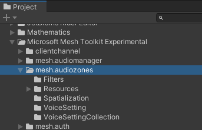
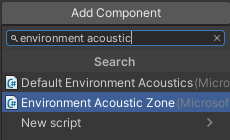
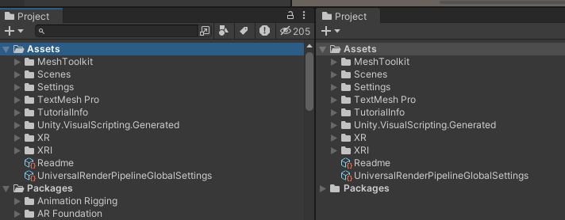
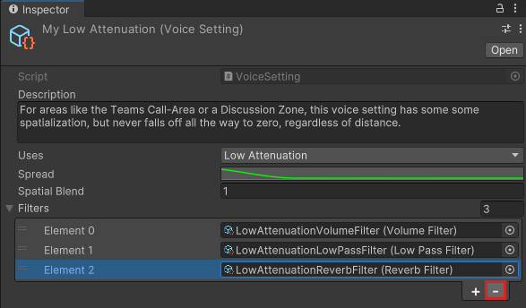
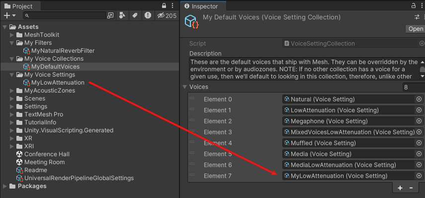
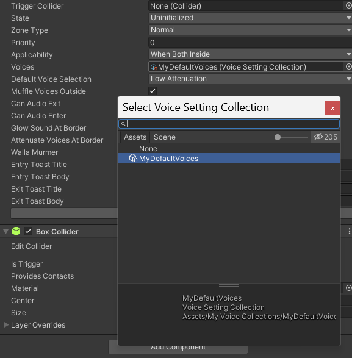
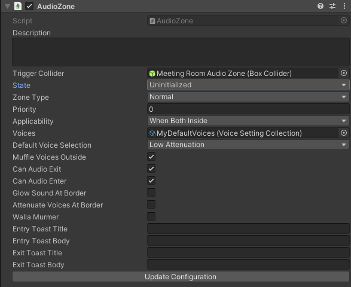
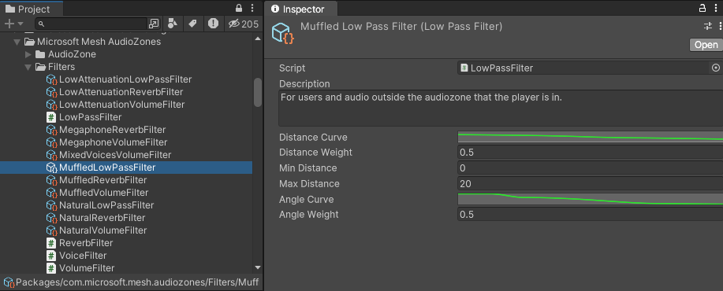
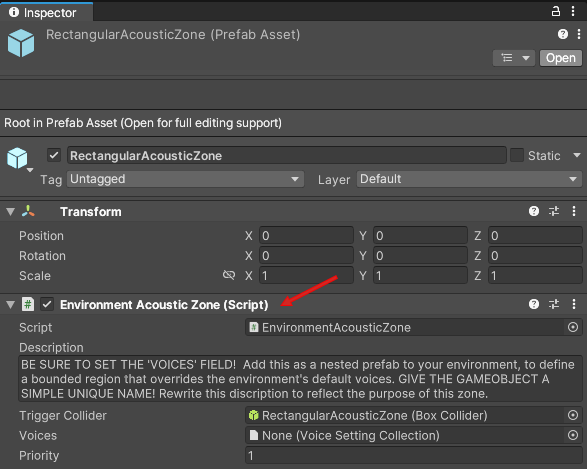
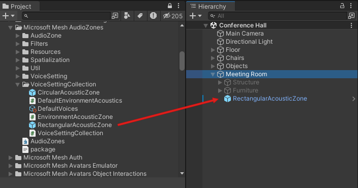

# Audio Zones in Mesh

## Overview

A Mesh event has *audio spatialization* (we describe this as "the way a sound behaves in a 3D space"). However, until now, you've had limited control over how spatialization works; there's one default audio setting and it hasn't been customizable for different event sizes and scenarios. This can be a problem if, for example, your event takes place in a large room and you want the volume of the voices between attendees to fade out more gradually as the attendees get further apart. Another example is an event where there's a large table and attendees at the extreme ends of the table are far enough apart that they can't hear each other. In real life, if you're far away, you can speak louder, but in a Mesh event all voice volumes are *normalized* so this doesn't work. In some cases, there are workarounds (for example, make everyone in the event an *Organizer* so they can push the *megaphone* button to make themselves heard by everyone) but these limitations and workarounds can detract from immersion and presence.

With our latest Mesh toolkit updates, you have much more control over how sound behaves in your environment. You can customize the sound settings for the whole space or create *Audio Zones* which are individual areas in the space with customized audio settings that override the settings of the environment. In a sense, this gives you audio "super powers; you can Give event attendees audio experiences beyond what they could have in real life. For example, no matter how large the space is, you can give certain attendees the ability to be heard throughout the entire space. Attendees can have multi-directional conversations without interrupting each other. tbd - more detail.

## Audio Zone benefits

--Increase productivity, interaction and engagement.

--Decrease miscommunication.

--If you want to change an audio setting, you can do this __________________ tbd without having to edit the environment itself.

--You can set up Audio Zones to be very visible to attendees by using properties such as glowing borders or short messages called *toasts* that display when an attendee enters or exits the Zone. However, you can also design Audio Zones to work "behind the scenes" without any of these visual cues.

## Common scenarios

- In an environment, create a small "discussion area" with a few chairs or couches. Place an Audio Zone over the area. Select the Audio Zone setting called "low attenuation." Anyone inside of this Audio Zone will hear anyone else inside the Zone clearly. You can also choose a setting called "Muffled voices outside" (tbd -- check on name) which muffles the voices of anyone outside the Audio Zone, making it easier for people inside the Zone to hear each other.

- Set up walls and create distinct separations between rooms.

- Provide a more realistic ambience to tunnels by increasing reverberation.

- Have distinct acoustic features for different areas. For example, you can have an "outdoor space" where there's no echo and things sound flat, and an "indoor space" where concrete and glass surfaces cause more echo.

- Create a "production booth" for people who are in the event who are tasked with helping the host (for example, running the lights).  When they talk normally, no one outside the booth can hear them, but they can hear voices and sounds from outside the booth.

- Create a "stage" Audio Zone. Anyone who walks into this Zone is automatically heard by everyone in the event.

## Audio terminology

In order to fully understand how you can control sound with Audio Zones, it's useful to be familiar with some audio terminology.

**attenuation**: a decrease in intensity. If you create an Audio Zone and you want the sounds outside of the Zone to barely be audible inside the Zone, you can *attenuate* those incoming sounds using the *Low Attenuation Volume** filter.

**frequency**: the property of sound that most determines its pitch. We perceive tones coming from a bass guitar as having low frequencies, while tones from a flute are perceived as high frequency.

**low pass filter**: this is a filter that you can apply to an Audio Zone. Lower frequencies in a sound will *pass through* the filter and be audible, while higher frequencies will be *attenuated*.

 **reverb** (short for "reverbation"): the amount of echo in a sound. Sounds in a cave, tunnel or large cathedral typically have a lot of reverb; sounds in a small room have a little to no reverb.

**Megaphone**: this is a Mesh term. When an attendee in an event has their *Megaphone* turned on, they can be heard by everyone in the event regardless of location.

## Audio Zone Package

the Audio Zone package is included with the Mesh toolkit.

## Create an Audio Zone

1. Add an empty GameObject to the scene and select it.
1. In the **Inspector**, click the **Add Component** button and then search for and add the "Audio Zone" component.

1. Click the **Add Component** button again and then add the collider that comes closest to the shape of the Audio Zone you have in mind. For example, for a rectangular room, your best choice is probably the "Box Collider".
1. If needed, in the **Box Collider** component, click the **Edit Collider** button and then adjust the shape of the Collider.
1. In the **AudioZone** component, specify the settings you want. [Audio Zone properties are explained further below](#audio-zone-properties).

## Features of an Audio Zone

there are three main components, or what we'll call "features", of an Audio Zone. Each is detailed below.

### Voice Settings Collection

- In the Audio Zone component, you can choose an existing *Voice Settings Collection* prefab for the Zone. You can also choose "no Collection"; if you do this, the "Default Voices" Collection prefab is applied.

The purpose of a Voice Collection is to make a variety of *Voice Settings* available for the Audio Zone to use.

### Voice Setting

You can think of a Voice setting as "the thing you apply to a sound to give it the qualities you want." In the Default Voices Collection, there are seven available Voice Settings.

The Voice Settings prefabs are located in the **VoiceSetting* folder.

Why would you want up to seven different Voice Setting options for one Audio Zone? Different circumstances, and different Objects in the Audio Zone, may require different sets of audio qualities. 

You can set a default Voice Setting for an Audio Zone in the *Audio Zone* component. Let's say you apply an Audio Zone to a specific room in your experience and you want voices outside of the room to sound audible but muffled to anyone inside the room. For **Default Voice Selection*, we'll choose "Muffled".

However, if someone in the event turns on the Megaphone, we don't want attendees in our Audio Zone to hear that voice as sounding muffled; we want it heard clearly. Since we have the "Megaphone" Voice Setting the Collection that's chosen for our Audio Zone, the Zone switches to that Voice Setting if the Megaphone is turned on.

Also, let's say you have a Media Player Object in the Audio Zone. this Object requires different sound settings than the ones supplied by the default Voice Setting for the Zone. When the Player is turned on, the "Media" Voice Setting becomes the active setting for the Zone.

What makes this happen? Each Voice Setting has a **Uses** property. The Collection attached to the Audio Zone contains a Voice Setting named *Media*. The "Uses" property for this Voice Setting is set to "Media".

This property tells the Audio Zone to detect if a Media Player in the Zone gets turned on. If it does, the Zone switches to the "Media" Voice Setting.

In addition to the *Uses* property, a Voice Setting has the *VoiceSetting* script attached, a couple of control settings (*Spread* and *Spatial Blend*), and one or more *filters*.

### Filters

You can think of filters as the lowest level unit that affects the sound.

There are four filter scripts and a variety of filter prefabs. Each prefab has a Filter Script plus some control settings that are unique to the sound element being controlled. For example, the *LowAttenuationReverbFilter* has the *ReverbFilter* attached plus controls for the amount of reverb, the amount of time it takes for the reverb to fade out, and more.

**Distance and Angle attenuation curves**

In each Volume Filter, you not only get a **Distance Curve** for attenuation (the sound volume decreases based on the attendee's distance from the sound source), you also get an **Angle  Curve** (the sound volume decreases based on the angle of the attendee's head relative to the sound source). For example, if you want something to sound much quieter when it's behind the attendee's head, you can control this by adjusting the Angle Curve.

**Tip**: Voice Settings and Voice Setting Collections are *Scriptable Objects*. A Voice Setting Collection Scriptable Object can be added to the overall environment or to an Acoustic Zone or Audio Zone in the environment.

**Note**: You get a lot more control over audio with the Voice Setting properties than by using Unity Spatial Audio source.

## Create custom Audio Zone features

You don't have to be limited to the Voice Collections, Voice Settings and Filters that come with the Audio Zone package. You can copy any of these and then alter them to create your own customized features. In this example, let's assume we want a Voice Setting with a slightly different Reverb Filter.

1. In your project, right-click the **Project** tab and then select **Add tab** > **Project**.
1. Relocate the second **Project** window so that it's to the right of the first **Project** window.

1. In the second **Project** window, right-click and then select **Create** > **Folder**.
1. Rename the folder to "My Voice Collections".
1. Create two more folders the same way. Rename them to "My Voice Settings" and "My Filters".

1. Click the Lock button in the upper right corner of the second **Project** window to lock that window's view in place.

1. In the first **Project** window, navigate to the **Packages** > **Microsoft Mesh Audio Zones** > **VoiceSettingCollection** folder and then expand it.
1. Drag the **DefaultVoices** Voice Setting Collection prefab from Project window #1 and then drop it on the **My Voice Collections** folder in Project window #2.

1. Rename the prefab to "MyDefaultVoices".

    We don't want to use any of the existing Voice Settings in this prefab so we'll make a new one.

1. In Project window #1, navigate to the **Packages** > **Microsoft Mesh Audio Zones** > **VoiceSetting** folder and then expand it.
1. Drag the **LowAttenuation** Voice Setting prefab from Project window #1 and then drop it on the **My Voice Settings** folder in Project window #2.

1. Rename the prefab to "MyLowAttenuation".

    We don't want the Reverb filter that's include with this prefab, so let's delete it. 

1. In Project window #2, ensure that the "MyLowAttenuation" prefab is selected.
1. In the **Inspector**, select **Element 2**, which contains the filter named "LowAttenuationReverbFilter", and click the "-" button to delete it.

    We'll add a new Reverb filter with settings more in line with our needs.

1. In the first **Project** window, navigate to the **Packages** > **Microsoft Mesh Audio Zones** > **Filters** folder and then expand it.
1. Drag the **NaturalReverbFilter** Filter prefab from Project window #1 and then drop it on the **My Filters** folder in Project window #2.

1. Rename the prefab to "MyNaturalReverbFilter".
1. Select this prefab, and then, in the **Inspector**, adjust any of the controls needed to create the reverb you want. You can also change the **Description**.

**tip**: to adjust any of the curve-based properties (the ones with the green lines), click the property, and then in the **Curve** window, choose a preset (see #1 in the image below), or drag the control points on the curve in the graph (this is similar to editing [Bezier curves](https://en.wikipedia.org/wiki/B%C3%A9zier_curve) in a graphics program)

    Let's add our new customized Reverb Filter to our customized Voice Setting.

1. In Project window #2, select the **MyLowAttenuation** prefab.
1. In the **Inspector** in the **Filters** section, click the "+" button.
1. Click the round button in the newly added Element, and then, in the **Select Voice Filter** window, select **MyNaturalReverbFilter**.

    Finally, let's add our new customized Voice Setting to our customized Voice Setting Collection.

1. In Project window #2, select the **MyDefaultVoices** prefab.
1. In the **Inspector** in the **Voices** section, click the "+" button.
1. Click the round button in the newly added Element, and then, in the **Select Voice Setting** window, select **MyNaturalReverbFilter**.

## Common Audio Zone use cases

### Simple meeting room

In this example, our environment is a large conference hall. We want to add a smaller room with its own Audio Zone that attendees can go into for a more private conversation.

1. Create an environment that will act as a large conference hall.
1. Add an empty GameObject to the scene and then rename it "Meeting Room".
1. Add a child GameObject to "Meeting Room" and then rename it "Meeting Room Audio Zone".
1. In the **Hierarchy**, select **Meeting Room Audio Zone**.

    

1. In the **Inspector**, click the **Add Component** button and then search for and add the "Audio Zone" component.
1. In the Audio Zone component, click the **Default Voice Selection** drop-down and then select **Low Attenuation**.
1. Add the "Box Collider" component and then select its **Is trigger** property.
1. Choose a collection: click the round button in the **Voices** field and then, in the **Select Voice Setting Collection** window, search for and select the Voice Collection you want.

    

1. We want attendees in the room to hear if something is going on outside the room, but at a low volume. to make this happen, select **Muffle Voices Outside**. the Voice Setting Collection selected for this Audio Zone contains a "Muffled Voice" Voice Setting that makes this happen.

### Stage

1. Create an environment that will act as a meeting room as described in the previous section.
1. Add a GameObject that will act as a stage in front of the room.
1. Follow the steps in the previous section to add an Audio zone to the stage and choose its settings.
1. In the **Audio Zone** component attached to the stage, click the **Applicability** drop-down, and then select **When Audio Source inside**.

When an attendee in the event enters the Stage GameObject and speaks, everyone in the event will hear them.

## Audio control in an Event

From the developer perspective, Audio Zones in the environment should be more about defining acoustics than user options such as muffled voices. You can configure these options within Objects; your environment can then be used as the basis for templates. An Organizer can choose the template that has the Audio Zone-based objects they want for an event.

In a Mesh event, you might want a variety of audio sources inside an Audio Zone (for example, attendees, video players, and radios). Mesh determines which Voice should be assigned to which source and then applies the appropriate setting using the Spatializer. Every time someone enters or exits an Audio Zone, the settings are adjusted.

## Audio Zone properties

**Trigger Collider**: This property contains the GameObject that has an attached Trigger Collider that defines the boundary of the Audio Zone. In most cases, this will be the GameObject the Audio Zone component is attached to. You can set this by dragging the GameObject from the **Hierarchy** and dropping it onto the **Trigger Collider** property, or clicking the round button in the property and then selected a GameObject in the **Select Collider** window.

**State**: Leave this set to **Uninitialized**.

**Zone type**: Leave this set to **Normal**.

**Priority**: You can assign a priority value to the Audio Zone which can be useful if there are several Audio Zones in the scene. For more details, hover the cursory over this property and read the informational popup.

    

**Applicability**:

- **When both inside**: the Zone's rules apply only if the attendee *and* the source of the audio are both inside the Audio Zone.
- **When Audio Source inside**: the Zone's rules apply if the source of the audio is inside the Audio Zone. (this is how a stage works, for example. When the presenter is on the stage, the stage's Audio Zone settings go into effect.) 

**Voices**: Choose the Voice Settings Collection that contains the Voice Settings you want for this Audio Zone. Click the round button in the property and then search for and choose a Collection in the **Select Voice Setting Collection" window.

**Default Voice Selection**: the drop-down for this property contains a list of various *uses* you may be interested in. If, for example, you want the Audio Zone to use the settings for the *Natural* use, select *Natural* here and the Audio Zone will look for and use a Voice within the Collection you chose that has *Natural* set for its use. If no Voices with that use can be found in the Collection and there are nested Audio Zones, the Audio Zone will look in the Collections for other Audio Zones (going from highest Priority to lowest Priority) for a Voice with that use. If no Audio Zones have such a Voice, the Audio Zone looks to the Environment for such a Voice. If it still can't be found, the default settings for all environments are used.

the standard default voice is **Normal**. However, if you want everyone inside the Zone to be heard easily, then **Low Attenuation** might be a better option.

**Muffle Voices Outside**: Allows attendees inside the Audio Zone to hear voices outside the Zone and applies settings that make those voices sound muffled. the "Muffled" Voice Setting uses three filters.

Much of the "muffled" effect from this voice is due to the strong influence of the [Low Pass Filter](https://docs.unity3d.com/Manual/class-AudioLowPassFilter.html).

 

**Can Audio Exit** and **Can Audio Enter**: these properties are useful for controlling privacy. Let's say this current Audio Zone is for Room #1, and Room #2 next to it has an Audio Zone with its "Muffle Voices Outside" property selected. 

    **to allow sounds from Room #1 to be heard in Room #2 (or any area outside the room)**:
    Select **Can Audio Exit**. 
    
    **to prevent sounds from Room #1 from being heard outside the room**:
    Make sure **Can Audio Exit** is unselected. 
    
    **to allow sounds from outside of Room #1 to be heard inside the room:
    Select **Can Audio enter**.
    
    **to prevent sounds from outside Room #1 from being heard inside the room:
    Make sure **Can Audio Enter** is unselected.

**Glow Sound at Border**: This works best when you have some sort of visual representation for the border of the Audio Zone. When this property is selected, a sound triggers when an attendee gets close to the border. For example, you could create an Audio Zone that has an electric fence as its border, and then when an attendee approaches the fence, they hear a crackling electrical sound.

**Attenuate Voices at Border**: As an attendee approaches the border of the Audio Zone, overall volume of voices is lowered.

**Walla Murmur**: this is another property that's useful when you want a certain level of privacy. Let's say that for this room/Audio Zone, you have **Can Audio Exit** deselected, meaning you don't want attendees outside the room to hear what's being said inside the room. However, in this instance, you *do* want attendees outside the room to detect that attendees are inside the room and talking. With **Walla Murmur** selected, when attendees inside the room talk, attendees outside the room will hear what *sounds* like conversation coming from the room but is actually just a sound effect that mimics talking and doesn't represent the actual conversation.

*tip**: **Glow Sound at Border**, **Attenuate Voices at Border**, and **Walla Murmur** are designed to work together. Imagine this scenario: you're in an open space, with attendees talking around you, and you walk towards Room #1 which has an Audio Zone with the three above-mentioned features turned on. As you approach the room, you can hear that attendees inside the room are talking (*Walla Murmur*). the volume levels of the voices around you fade to nothing (*Attenuate Voices at Border*). At the same time, you start to hear a sound that steadily increases in volume as you approach the border of the room (*Glow Sound at Border*). As you walk into the room, the glow sound gets quieter and the volume of the voices inside the room increases. the result is a smooth transition from the voices you were hearing outside the room to the voices inside it.

**Entry toast title:**
**Entry toast body:**
**Exit toast title:**
**Exit toast body:**

A *toast* is a short message that pops up on the screen and then, after a brief period of time, disappears. You can create a toast that will be displayed when an attendee enters or exits the Audio Zone. 

## Acoustic Zones

If you don't need all the properties that come with an Audio Zone and you just want to specify a particular set of voice settings for a bounded region, you can use an *Acoustic Zone* prefab. 

 

An Acoustic Zone prefab comes with the *Environment Acoustic Zone* script and is like a simplified Audio Zone. It lets you select a Voice Setting Collection and the trigger Collider it applies to.

 

### Create a simple Acoustic Zone

1. Create an environment that will act as a large conference hall.
1. Add a Cube to the scene and then rename it "Meeting Room".
1. Adjust the dimensions of **Meeting Room** to give it a rectangular shape at the scale you want.
1. Drag the **RectangularAcousticZone** prefab from the **VoiceSettingCollection** folder and then drop it on the **Meeting Room** GameObject in the scene, making it a child to **Meeting Room**.

    

1. In the **Inspector**, edit the **Box Collider** for the **RectangularAcousticZone** prefab to have the same size and location as the **Meeting Zone** GameObject.
1. Follow the instructions in the **Description** for the prefab to choice a Voice Collection with the **Voices** property and, if desired, rename the prefab so its name is more descriptive.

    
