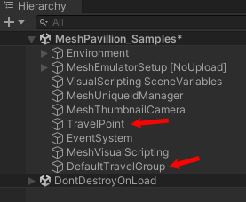
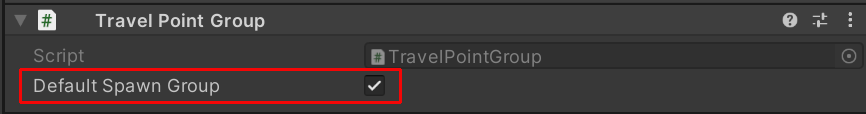

# Create avatar spawn and travel points

## Travel Point Overview

*Travel Point* is a component in the Mesh toolkit that can be used to define where an attendee's avatar is placed when it joins an Event and also to teleport  avatars during an Event using Visual Scripting.

If a Travel Point isn't present in an Environment, and there's a GameObject that represents a floor at the origin, the avatar will be grounded on the floor when spawned. If no floor is present near the origin, the avatar will spawn above the origin, fall for a little while, and then respawn in a loop.

### Travel Point Group Overview

All Travel Points must belong to a Travel Point Group. If you add a Travel Point without first assigning it to a group ...

... when you enter Play Mode, a Travel Point Group will be automatically created and the Travel Point will be assigned to it.

Every Travel Point Group must have a unique name. 

The *Default Spawn Group* is the group you want avatars to spawn into when they initially join an event. If you only have one Travel Point Group, it'll be selected as the Default Spawn Group by default. If you have two or more Travel Point Groups, you can select which you group you want as the Default Spawn Group.

### Create a Travel Point Group

1. Create an empty GameObject.
1. In the **Inspector**, click the **Add Component** button.
1. Search for and then select **Travel Point Group.**

1. If you want the group to be the one that avatars spawn into when initially joining an event, select **Default Spawn Group**. Otherwise, leave it unselected.  

### Create Travel Points

**To add a Travel Point to a Travel Point Group**:

1. Add an empty GameObject as a child of the Travel Point group, and then rename it to something that shows it'll contain a Travel Point.

    

1. In the **Inspector**, click the **Add Component** button.
1. Search for and then select **Travel Point.**

    
    
### Settings

**Travel Point component**

- **Look At Transform:** the point you want the camera to look at after spawning into that transform. This will default to CenterTransform forward.  
- **Radius:** the size of the travel area. It’s a circle around the center transform.  
- **Single Travel:** If this is true, only one avatar at a time will spawn into this point unless there are no more points to choose from.

**Travel Point Group component**

- **Default Spawn Group:** When true, this group will be used for finding the default spawn point for an avatar entering a space.

### Visual Scripting

- **Travel Point Methods**

- **TravelToPoint()**: Transport the local avatar directly to a specific Travel Point.

- **Travel Point Group Methods**

- **TravelToRandomTravelPoint()**: Transport the local avatar to a random point in the group.

## Next steps

[Grab, attach and throw with Interactables](./interactables.md)
[Triggers, anchors and tethers](./triggers-anchors-and-tethers.md)
[Physics interactions](../physics/mesh-physics-overview.md)
[Enhanced features overview](../enhanced-features-overview.md)
