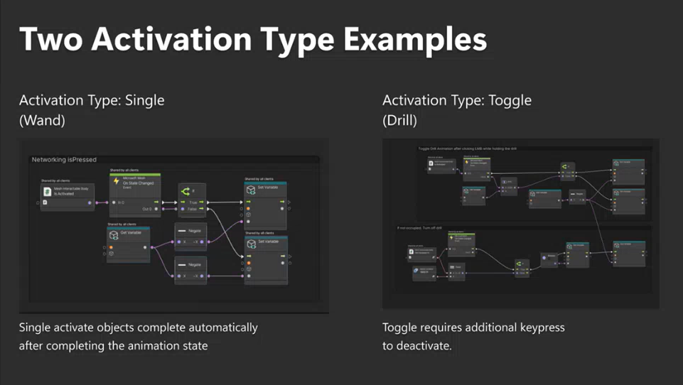

# Grab and manipoulate objects realistically

## Equippables

The Toybox sample contains ten different Equippable prefabs. In Unity in the **Scene** window, they're located on a table against the back wall.

In the **Hierarchy**, they're nexted prefabs to **Equipable Interactable Samples**, which is connected to a prefab named *toybox_Equipable_Interactable_Samples*.

For each Equippable, there are two activation types.

Examples:

- The Wand has the activate type *Single*.  You grab the Wand and click; the Wand raises and throws off some fireworks, and then returns to its default position.
- The Wineglass has the activation type *Toggle*. There are two states, and the avatar controls the transition between them. You grab the glass--that's the first state. You click--the glass raises, and that's the second state. To lower the glass to its default position, you must click again.

The Equippable prefabs live in subfolders of the *Runtime* folder. These folders start with *Toybox_* followed by the name of the prefab. For example, the Wineglass prefab is stored in the *Toybox_Wineglass* folder.

**Tip**: To quickly find a prefab in the **Project** folder, in the **Hierarchy**, select the prefab, and then, in the **Inspector**, click the **Select** button.

## Equippable behaviors

### Wineglass

Activation mode: toggle

When an attendee grabs a Wineglass, their hand holds the glass by the stem. To raise the glass in a toast, press the left mouse button (Windows) or (TBD) (Quest 2).

NOTES:

Brandon said Equippables well be moving to an Assets/Equippables folder sometime soon.

For 3P developers (from David Wilson): when they go into Play mode they get no avatars spawned. They can't see what's going on with the interaction with the Equippable. They're 100% when trying to set up an object. They can only get to a result after they save, publish, and then create an enter an event. At that point they can't edit anything live. 7:52

Wineglass raise: the Animator is on the avatar. There are signals from the Interactable to the avatar via the Mesh Interactable Body component. With the Wineglass: 
Body type is Equippable (the object will be attached to the hand of the avatar.)
The dev can change the activation type via "Activate Target Poses." It's currently set to Toggle. Other choices: None and Single.
Dev can change the object type to "Throwable."

Wand, under the hood: it has an onHold() event. (?) It changes its state when it goes from not being held to being held. When it's activated, it's a "single instance" activation. It plays the VFX and audio and changes the avatar pose. 

To change the state, the avatar can click the screen anywhere except on the Equippable they're holding. 

There can be more than one pose that's incorporated into a transition. For example, with the Wand, it's not just a linear transition from A to B; there can be a wrist flick and the durtation of that transition can be adjusted in the Animation Curve.

