# Hold objects realistically with Equippables

## Overview

The Mesh toolkit contains prefabs that are a type of [Interactable](./interactables.md) known as *Equippable*. When you pick up an Equippable object, your avatar knows how to adjust your hand and arm position so they can hold and handle the object in a realistic way. This is called *equipping an object to your hand*.

An object is made equippable by adding the *Mesh Interactable Setup* component to it and then choosing the *Equippable* type. There are [many settings](../avatar-and-object-interactions/interactable-setup-types/equippable-setup.md) in this component that you can adjust. There are also ten [presets](../avatar-and-object-interactions/interactable-setup-types/equippable-setup.md#presets) available; you can try these out and see if they fit your object, or at least come close enough to work with some additional fine-tuning. 

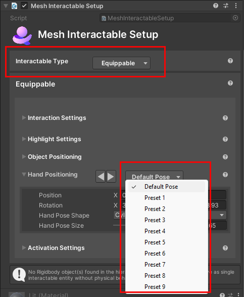

## Equippables in the Mesh toolkit

Here's a look at the Equippables that you can add from the Mesh toolkit:

***

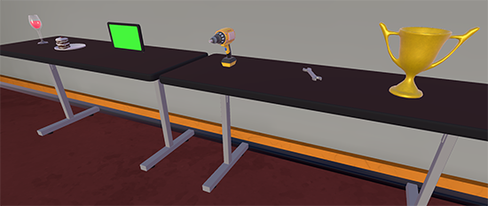

***

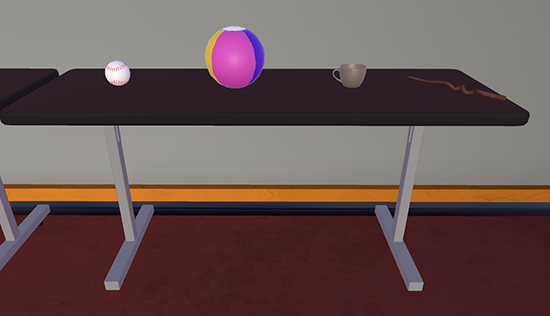

***

The Equippables are located in the **Project** window's **Microsoft Mesh Toolkit Toybox** > **Runtime** folder.

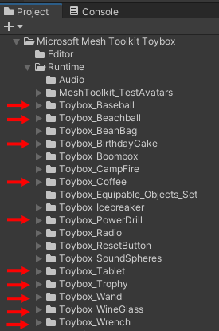

Note that two of the objects shown here--the Baseball and Beach Ball--are [*throwables*](./interactables.md#throwable). A *throwable* object is an Equippable with the additional ability to be thrown.

**Tip**: To quickly find a prefab in the **Project** folder, in the **Hierarchy**, select the prefab, and then, in the **Inspector**, click the **Select** button.

**To add an Equippable to your scene**:

1. Expand the folder that contains the Equippable prefab.
1. Drag the Equippable prefab from the **Project** to your scene.

    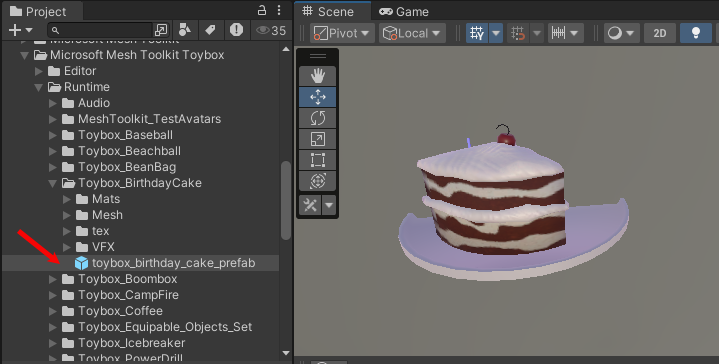

## Position of objects

There are different ways of holding an Equippable object. Some objects, when picked up, are designed to be held away from the body and high enough to be in your field of view (for example, the Wineglass or Trophy). Other objects are designed to be held closer to the body and *not* in your field of view (for example, the Wrench).

## Equippable behaviors

For some Equippables, you can pick them up and then press the left mouse button (PC) or controller button (Quest) to trigger an action that's appropriate for that Equippable. Examples:

- Raise and lower a Wine glass.
- Generate sparkles from the end of a Wand.
- Turn a drill off and on.

This is called *activating* the object. You can see the possible activate types in the object's *Mesh Interactable Setup* component. There are three activate options: *Single*, *Toggle*, and *None*.

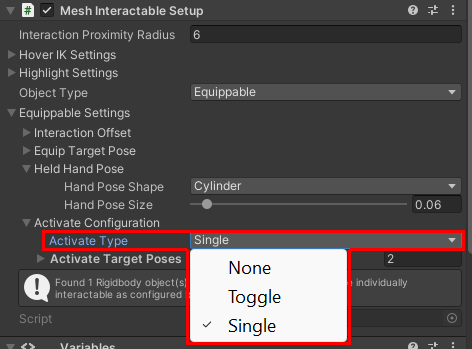

**Single**: The object has a single "state", or set of behaviors. Example: the Wand. Think of this as turning the object "on" and "off" with one click. When you pick up the Wand, it's in its default (non-activated) state. When you click, the Wand runs through its behaviors and then immediately returns to its default state. If you click again, the object repeats the same set of behaviors.

**Toggle**: The object has two "states." When you pick it up, it might be in its activated or non-activated state. When you click, it toggles from whatever state it's in to its second state. This state, and the behaviors it triggers, remain active until you click again. This second click toggles the object back to the original state. Examples: the Wine Glass and the Drill. This should become more clear when we examine individual object behaviors in the sections below.

**None**: The object can't be activated. Example: the Birthday Cake. After you pick it up, there's nothing further you can do with it; you just hold it until you decide to release it.

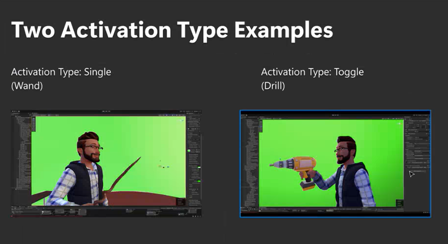

## Release an Equippable

To release an Equippable, press the Space bar. This causes the Equippable to drop downwards.

## How each Equippable prefab works

### Wine glass

**Activation mode**: toggle

After you pick up the Wine glass, you click, and the glass raises--that's the activated state. To lower the glass to its default position and non-activated state, you must click again.

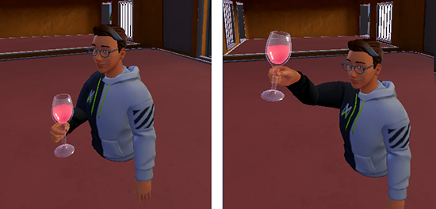

### Birthday Cake

**Activation mode**: None

### Drill

**Activation mode**: toggle

When you pick up the drill, it's automatically activated--it's held out in front of you and turned on. When you click, the drill turns off and your arm moves the drill down to your side. When you click again, the drill goes back into its turned-on state. This is a good example of the "toggle" activate type, which always toggles between two states.

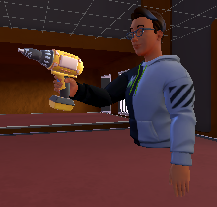

### Wrench

**Activation mode**: toggle

When you pick up the Wrench, it's automatically activated--it's held out in front of you almost chest high. When you click, the wrench is lowered to your side and de-activated. Click again to activate it again.

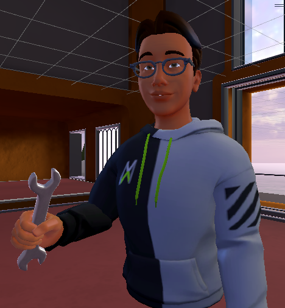

### Trophy

**Activation mode**: toggle

When you pick up the Trophy, you hold it out in front of you chest high. Click to activate it; this raises the Trophy above your head in a "salute" position. Click again to lower (and de-activate) the Trophy.

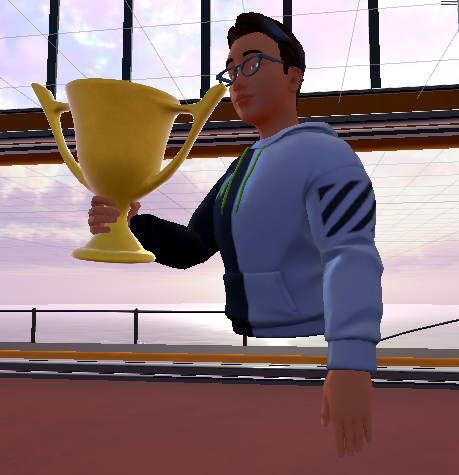

### Tablet

**Activation mode**: toggle

The Tablet is viewed by many as one of the more useful Equippables because you can attach a UI object with buttons or a [WebSlate](../web-content/webcontent.md) to its screen and then move around the scene with it. When you pick up the Tablet, you hold it out in front of you chest high. Click once to activate the Tablet--this raises it up to almost eye level, but leaves you with an unobstructed view if you wish to look around the room. Click again to lower it back to its initial position (and de-activate it).

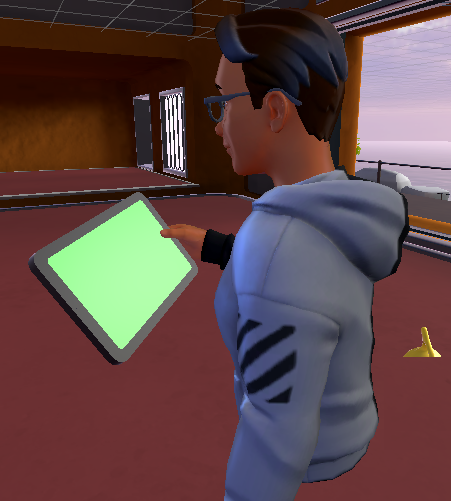

## Coffee cup

**Activation mode**: none

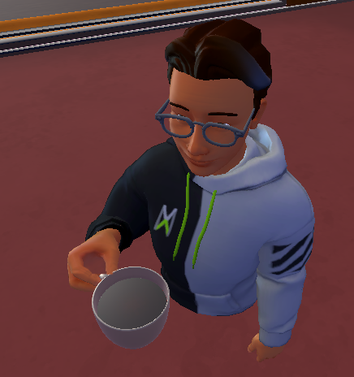

## Wand

**Activation mode**: single

When you pick up the Wand, you hold it out in front of you almost chest high. The tip of the Wand displays a sparkly vapor particle effect. 

:::image type="content" source="../../../media/enhance-your-environment/equips-in-detail/wand-holding1.gif" alt-text="GIF that shows an event attendee holding the Wand in its non-activated state.":::

Click to activate the Wand; your arm thrusts forward and the tip of the Wand emits fireworks that are generated through another particle effect. 

:::image type="content" source="../../../media/enhance-your-environment/equips-in-detail/wand-thrusting1.gif" alt-text="GIF that shows an event attendee activating the Wand which then generates fireworks.":::

Since the Wand has the *single* activate type, as soon as it runs through its behaviors, it de-activates and your arm returns to its initial position. Click again to repeat the behaviors.

## Create a custom Equippable

If you have a model that's similar in size and orientation to one of our Equippable prefabs, you can replace the Equippable model with your model. Each prefab has a child object named "Artwork" which is where you can insert your custom model.

## Next steps

> [!div class="nextstepaction"]
> [Equippables&#8212;How the Wand works](./how-the-wand-works.md)