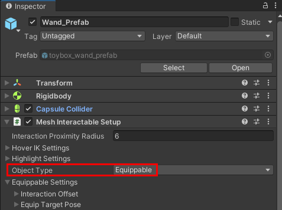
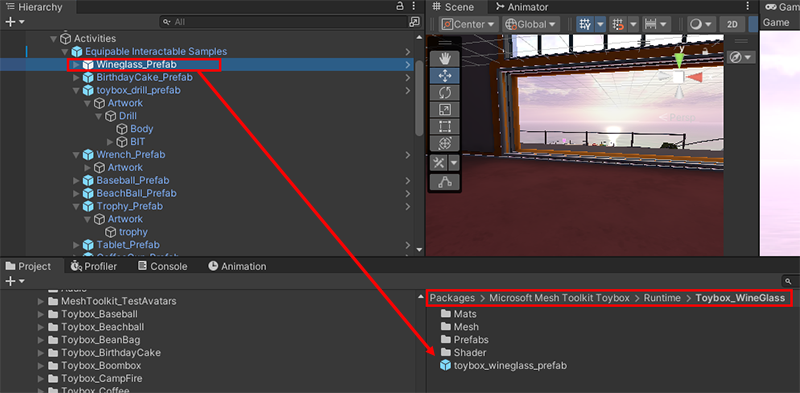
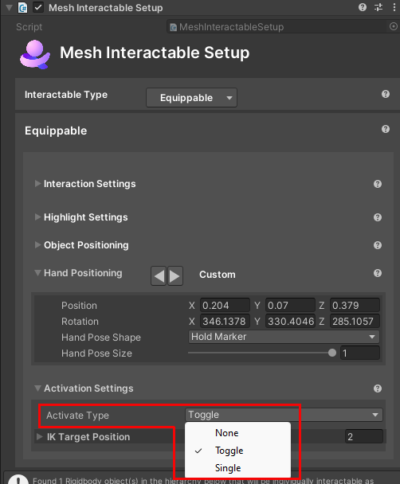
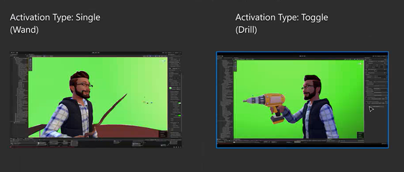
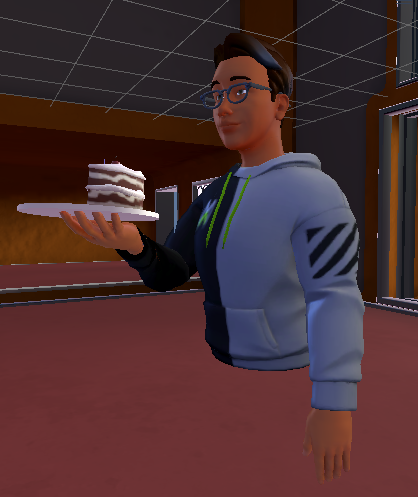
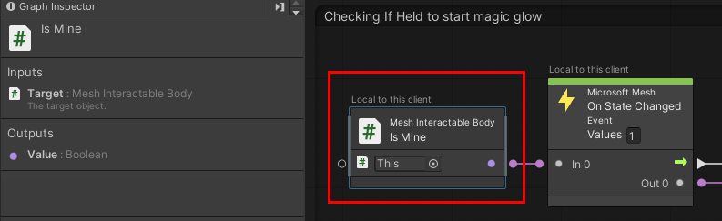

# Equippables: Picking up objects realistically

## Overview

In the Toybox sample, certain prefabs are classied as *Equippables*. When you pick up such an object, your hand and arm position adjust so that the object is held in a realistic way. This is called *equipping an object to your hand*.  

There are eight Equippables:

Wine glass
Birthday cake
Drill
Wrench
Trophy
Tablet
Coffee Cup
Wand

To see the Equippables in Unity, in the **Scene** window, navigate into the building with a fish on the front. The Equippables are on two tables against the back wall.

Note that not all the objects on the tables are Equippables--the Baseball and Beach Ball are [*throwables*](./interactables.md#throwable). To determine an object's type, view the **Object Type** setting in the object's *Mesh Interactable setup* component.

## Where to find Equippables

In the **Hierarchy**, the Equippables re nested prefabs to **Equipable Interactable Samples**, which is connected to a prefab named *toybox_Equipable_Interactable_Samples*.

The Equippable prefabs live in subfolders of the *Runtime* folder. These folders start with *Toybox_* followed by the name of the prefab. For example, the Wineglass prefab is stored in the *Toybox_Wineglass* folder.

**Tip**: To quickly find a prefab in the **Project** folder, in the **Hierarchy**, select the prefab, and then, in the **Inspector**, click the **Select** button.

## Equippable behaviors

For some Equippables, you can pick them up and then press the left mouse button (PC) or controller button (Quest 2) to trigger an action that's appropriate for that Equippable. Examples:

- Raise and lower a Wine glass.
- Generate sparkles from the end of a Wand.
- Turn a drill on and off. 

This is called *activating* the object. You can see the possible activate types in the object's *Mesh Interactable Setup* component.

**Single**: You click once to activate the object. Example: the Wand.

**Toggle**: You click once to activate the object, and then click again to return the object to its non-activated state. Examples: the Wine Glass and the Drill.

**None**: The object can't be activated. Example: the Birthday Cake. After you pick it up, there's nothing further you can do with it.

### Wine glass

Activation mode: toggle

After you pick up the Wine glass, you click, and the glass raises--that's the activated state. To lower the glass to its default position and non-activated state, you must click again.

### Birthday Cake

Activation mode: None

### Drill

Activation mode: toggle

When you pick up the drill, it's "ready for action"--it's held out in front of you and turned on. When you click, the drill turns off and your arm moves the drill down to your side. When you click again, the drill goes back into its "ready for action" state. This is a good example of the "toggle" activate type, which always toggles between two states.

### Wrench

Activation mode: toggle

When you pick up the Wrench, you hold it out in front of you almost chest high. You click once to move the Wrench to your side, and then click again to lower it back to its initial position.

### Trophy

Activation mode: toggle

When you pick up the Trophy, you hold it out in front of you chest high. You click once to raise the Trophy above your head in a "salute" position, and then click again to lower it back to its initial position.

### Tablet

Activation mode: toggle

The Tablet is viewed by many as one of the more useful Equippables because you can attach buttons or a [WebSlate](../webcontent.md) to its screen and then move around the scene with it. When you pick up the Tablet, you hold it out in front of you chest high. You click once to raise the Tablet up to eye level, and then click again to lower it back to its initial position.

## Coffee cup

Activation mode: none

## Wand

Activation mode: single

When you pick up the Wand, you hold it out in front of you almost chest high. The tip of the Wand displayed a particle effect. When you click, your arm thrusts the Wand forward and the Wand emits "sparkles" (generated through another particle effect). Your arm then returns to its initial position.

## Grab and throw behaviors

In real life, certain objects that are in the same general category but have different shapes and sizes--for example, a softball, football, and beach ball--are held and thrown in different ways. With Mesh Equippables, these objects are grouped together into one category of "tossable" objects; all objects in this category are held and thrown the same way. A tossable object connects with a specific pre-loaded animation contained in the avatar. Providing more variety presents a technical challenge because it calls for more animations to be pre-loaded which could result in decreased performance. Despite this, we're working on an inverse kinematics (IK) system which we expect will provide more realistic pick up-and-hold behaviors per object.

With this animation, you can look around the room--up, down, left or right 

Activation mode: toggle

An attendee may want to move around in an event and access a user interface that they can carry with them. The Tablet can provide this; you can attach events to objects on the screen of the Tablet, and then the attendee can trigger the events by touching the screen. One way to achieve this is by attaching a [WebSlate](../../enhance-your-environment/webcontent.md).

When the Tablet is activated, the attendee holds the Tablet up to their face but slightly lower than eye level. This means that the attendee has an unobstructed view if they look around the room. When the Tablet is deactivated, the Tablet is still held in front of the attendee but in a lower position.

### Coffee cup

### Wand

## Position of objects

There are different ways of holding an object. Some objects, when when picked up, are designed to be held away from the body and high enough to be in your field of view (for example, the Wineglass or Trophy). 

< TBD image>

Other objects are designed to be hold closer to the body and *not* in your field of view (for example, the Wrench). 

< TBD image>

NOTES:

Brandon said Equippables well be moving to an Assets/Equippables folder sometime soon.

For 3P developers (from David Wilson): when they go into Play mode they get no avatars spawned. They can't see what's going on with the interaction with the Equippable. They're 100% when trying to set up an object. They can only get to a result after they save, publish, and then create an enter an event. At that point they can't edit anything live. 7:52

Wineglass raise: the Animator is on the avatar. There are signals from the Interactable to the avatar via the Mesh Interactable Body component. With the Wineglass: 
Body type is Equippable (the object will be attached to the hand of the avatar.)
The dev can change the activation type via "Activate Target Poses." It's currently set to Toggle. Other choices: None and Single.
Dev can change the object type to "Throwable."

Wand, under the hood: it has an onHold() event. (?) It changes its state when it goes from not being held to being held. When it's activated, it's a "single instance" activation. It plays the VFX and audio and changes the avatar pose. 

To change the state, the avatar can click the screen anywhere except on the Equippable they're holding. 

There can be more than one pose that's incorporated into a transition. For example, with the Wand, it's not just a linear transition from A to B; there can be a wrist flick and the durtation of that transition can be adjusted in the Animation Curve.

Wand: The trigger is sent just before the last pose. If you're looking at the trigger activation that's sent by Mesh Interactable Setup, it sends it just before the last (pose?) there.

TO DO: David said there's a GIF available with the transition of the sizes of a ball pose for the hand. A Cylinder holding, and a pinch kind of pose. That's accessible in the old hand pose or in the throw hand pose or in the aim hand pose in the setup options. 21:00. The hand pose refers to the finger position (shows the avatar holding a coffee mug). Those are a series of dictated hand positions. Within the ball, pinch and cylinder, there's a flexible range that devs are able to tune. (Visual of the avatar holding a tea cup). This shows a small pinch vs. something else with a larger pinch. 

(David:)" We've created the prefabs in a way that devs can take their own art and if it's in a similar size and similar type of orientation, they can turn off ours (art?) and turn on theirs in the same structure. Each Equippable has a child object named "Artwork" which is where you can insert your custom model.  

Question: David mentioned that they're working on putting an avatar in the scene so devs have a basis of comparison for determining scale. He said it hasn't been approved yet. What's the status of that right now? Is this the object that Cameron talked about recently?

Brandon talks about the script graphs:

Nodes: IsMine, EquipLocation. If "EquipLocation" = None, that means the object was dropped. (I think you have to look for this in Mesh Interactable Setup). 39:42

Wand

The Wand is in the scene--it's static, it's just sitting there.

In the visual script attached to the Wand, we start in the group named **Checking if Held to start magic glow**.

<overview image>

The node that determines if the Wand is picked up or not is *Mesh Interactable Body: Is Mine*. It's a Boolean, and starts with a value of False.

When an avatar picks up the Wand, its state changes. The "true" value of *isMind* is passed to an *if* node and this causes a "pickup sound" to trigger.

<image>

... and it also changes the value of the object variable *StartGlowVFX* to "true."

<image>

Note that the text above the *isMind* and *On State Changed* nodes says "Local to this client." 

<image of nodes with text above it highlighted>

These nodes, and the sound that gets triggered, occur locally. However, we want the other attendees in the event to experience what happens with the Wand. This is achieved by inserting the *Set Object Variable* node which displays the text "Shared by all clients." 

< image of set object variable node with text above it >

**Tip**: The *isMine* variable is found in the *Mesh Interactable Body* script.

<image>

We pick up the flow in the node group named **Networking startMagic**.

<overview image>

The state change causes the "true" value of *startFLowVFX* to be passed to an *if* node ..

<image>

... and this causes the value of the *PersistentVFX* object variable to also be true, which triggers the *vfx_wand-ethereal_persistent_02* particle system effect.

<image>

## Activating the Wand

Let's assume the attendee clicks the left mouse button (PC) or controller trigger button (Quest). This is called "activating the Equippable." It causes the avatar's arm position to change, and in the node group named **Networking isPressed** ...

<overview image>

 ... the click is detected by the *Mesh Interactable Body: Is Activated* node. This node is a Boolean with a default value of false. The click changes *Is Activated* to "true"; the *On State Changed* node passes the "true" value on to the *If* node. This causes the *Set Variable* node to set the *isPressed* Boolean to the opposite of what it was before (so now it's "true").

<image>

**Tip**: The *isActivated* variable is found in the *Mesh Interactable Body* script.

<image>

We pick up the flow in the node group named **Spell cast on click**.

<overview image>

The "true" value of isPressed* causes an *if* node to trigger the *Set Variable: Object* node. This node sets the *startGlowVFX* variable to "false", and this triggers the nodes in the **Networking startMagic** node group again. This time, the "false" value of *startGlowVFX* causes the *PersistentVFX* particle effect to turn off.

<image>

Back to the **Spell Cast on click** node group. After a brief cooldown period, a sound is played, and then a different particle effect is triggered at the tip of the wand: *vfx_wand_blast_trail_spheres_01*, which is the value for the *ShootTrailVFX* object variable.

<image>

After another brief cooldown period, the *startGlowVFX** Boolean value is changed back to "true", which turns the *vfx_wand_ethereal_persistent_02* particle system effect back on in the **Networking startMagic** group.

<image>

At this point, the avatar's arm returns to the position it was in before the Wand was activated.

## Releasing the Wand

If the Wand had the activate type "toggle," when the attendee clicked again, it would trigger a second, different "state." However, the Wand's activate type is "single", and this means that every time the attendee clicks, the same "state", or series of actions and effects, is repeated.

To release the Wand, the attendee presses the Space key and the Wand drops to the ground. This causes the nodes in the **If not occupied, Turn off Wand** node group come into play. The purpose of this node group is to turn off the "glow" particle effect. 

<overview image>

While the Wand is being held, the value of the *Mesh Interactable Body: Get Equipped At** is "DefaultHand". The value of the *Equip Location* node (a Boolean) is "None." These two values are compared in the *Equal* node (also a Boolen); since they're not the same, the output of *Equal* is "false" and the *if* node isn't triggered.

When the Wand is dropped, the value of *Get Equipped At* changes to "None." This causes the *Equal* and *If* nodes to output "true." This triggers the *Set Variable: Object* node which turns the value of the *startGlowVFX* object variable to "false." This once again triggers the nodes in the **Networking startMagic** node group and turns off the particle effect--*vfx_wand_ethereal_persistent_02--*that's the value of the *PersistantVFX* object variable.

Suggestions for experimentation with the script

- Create different effects that could be triggered when one of the existing Equippables is picked up and held.
- Create new Equippables that could use some of the existing effects. For example, certain types of fireworks could use the "sparkle" effects that are currently used by the Wand.
- Create different effects and behaviors for a new Equippable that could be triggered when the Equippable is held and the left mouse button (PC) or controller button (Quest 2) is pressed. For example, instead of a Wand, you could have a fishing rod that casts out a lure when you press the button.
- Think about the difference between having an object move right into its "read for action" state when picked up (for example, the Drill) and having an object that starts off in "waiting" mode and moves into "ready for action" mode after the attendee clicks (for example, the Tablet). Make objects that take advantage of both approaches.

