# Equippables: How the Wand works

## Wand Overview

**Activation mode**: single

The Wand is an *Equippable* object found in the Toybox sample. When you pick up the Wand, you hold it out in front of you almost chest high and the Wand displays a sparkly vapor particle effect. 

:::image type="content" source="../../../media/enhance-your-environment/equips-in-detail/wand-holding1.gif" alt-text="GIF that shows an event attendee holding the Wand in its non-activated state.":::

Click to *activate* the Wand; your arm thrusts forward and the tip of the Wand emits fireworks that are generated through another particle effect. 

:::image type="content" source="../../../media/enhance-your-environment/equips-in-detail/wand-thrusting1.gif" alt-text="GIF that shows an event attendee activating the Wand which then generates fireworks.":::

The Wand's *activate type* is set to *single*. This means that as soon as it runs through its behaviors, it de-activates and your arm returns to its initial position. Click again to repeat the behaviors.

## The Wand script graph

Let's take a look at how the Wand works by examining the script graph that's attached to it.

1. In the **Hierarchy**, select the **Wand_Prefab** GameObject.

    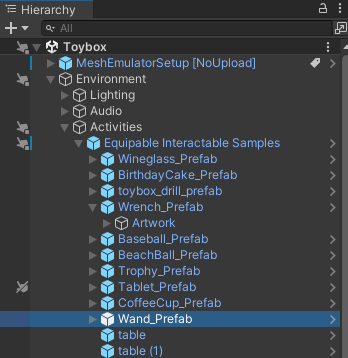

1. In the **Inspector**, navigate to the **Script Machine** component and note that it contains a script graph asset named **MagicWand**. Click the **Edit Graph** button.

    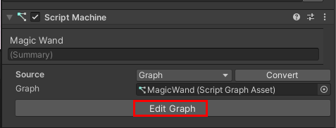

## Detect when the Wand is picked up

In the visual script attached to the Wand, we start our journey in the node group named **Checking if Held to start magic glow**.

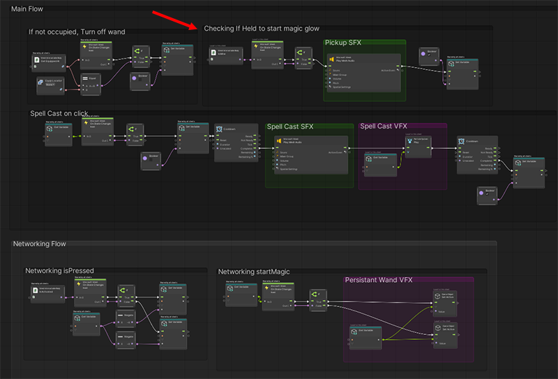

The node that determines if the Wand is picked up or not is *Mesh Interactable Body: Is Mine*. It's a Boolean, and starts with a value of False.

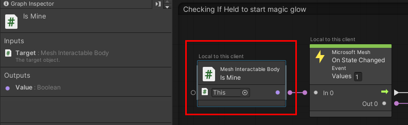

When an avatar picks up the Wand, its state changes. The value of *isMine* changes to "true" value and is passed to an *if* node. This causes a "pick-up sound" to trigger ...

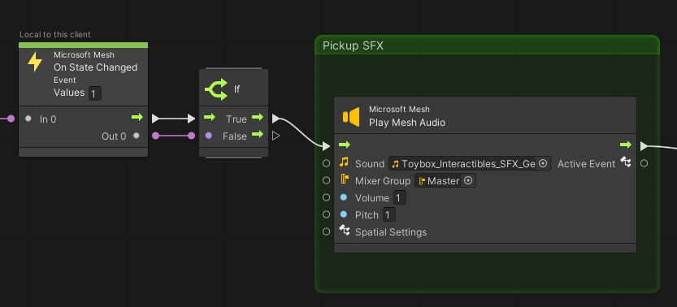

... and also changes the value of the object variable *StartGlowVFX* to "true."

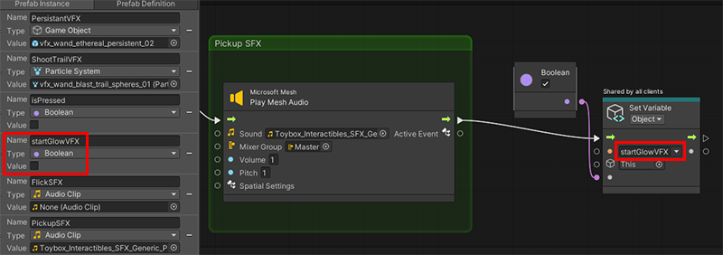

Note that the text above the *isMine* and *On State Changed* nodes says "Local to this client." 

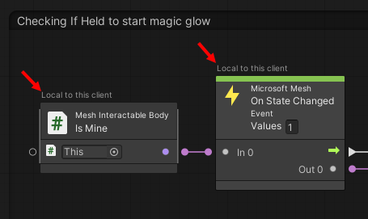

These nodes, and the sound that gets triggered, occur locally. However, we want the other attendees in the event to experience what happens with the Wand. This is achieved by inserting the *Set Object Variable* node which displays the text "Shared by all clients." 

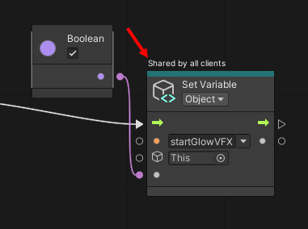

**Tip**: The *isMine* variable is found in the *Mesh Interactable Body* script.

## Turn on the non-activated state particle effect

We pick up the flow in the node group named **Networking startMagic**. The purpose of this node group is to turn the initial particle effect that appears at the tip of the Wand on and off. We'll call this effect "sparkly vapor".

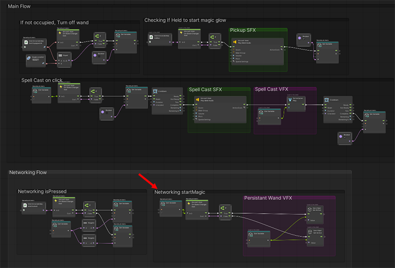

The state change causes the "true" value of *startFLowVFX* to be passed to an *if* node ..

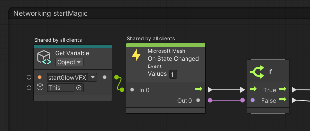

... and this causes the value of the *PersistentVFX* object variable to also be true, which triggers the *vfx_wand-ethereal_persistent_02* particle system ("sparkly vapor") effect.

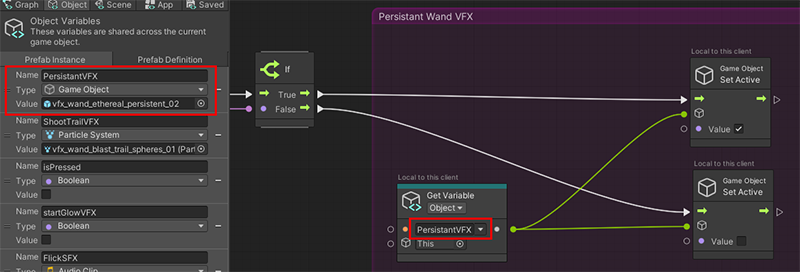

:::image type="content" source="../../../media/enhance-your-environment/equips-in-detail/wand-holding1.gif" alt-text="GIF that shows an event attendee holding the Wand in its non-activated state.":::

## Activate the Wand

Let's assume the attendee clicks the left mouse button (PC) or controller trigger button (Quest). This is called "activating the Equippable." It causes the avatar's arm position to change, and in the node group named **Networking isPressed** ...

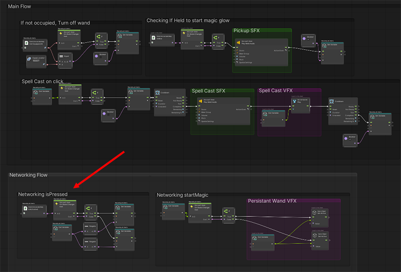

 ... the click is detected by the *Mesh Interactable Body: Is Activated* node. This node is a Boolean with a default value of false. The click changes *Is Activated* to "true"; the *On State Changed* node passes the "true" value on to the *If* node. This causes the *Set Variable* node to set the *isPressed* Boolean to the opposite of what it was before (so now it's "true").

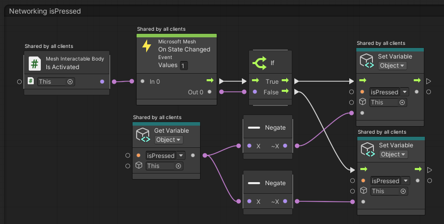

**Tip**: The *isActivated* variable is found in the *Mesh Interactable Body* script.

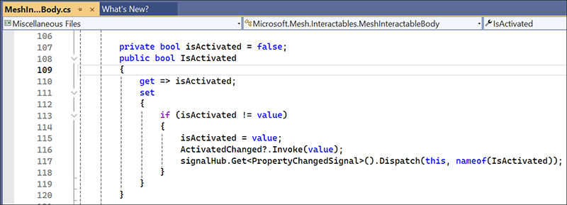

## Turn on the activated state particle effect

We pick up the flow in the node group named **Spell cast on click**. 

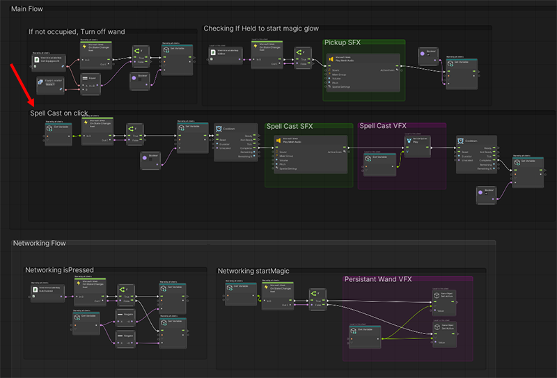

This node group triggers the fireworks particle effect at the end of the Wand that occurs when the attendee clicks the button and activates the Wand. After the Wand returns to its non-activated state, this node group turns the first particle effect ("sparkly vapor") back on.

In the graph, the "true" value of isPressed* causes an *if* node to trigger the *Set Variable: Object* node. This node sets the *startGlowVFX* variable to "false".

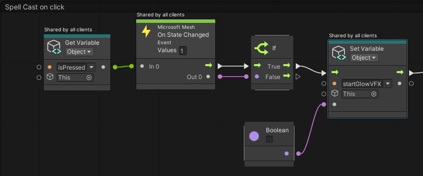

This triggers the nodes in the **Networking startMagic** node group again. This time, the "false" value of *startGlowVFX* causes the *PersistentVFX* particle effect to turn off.

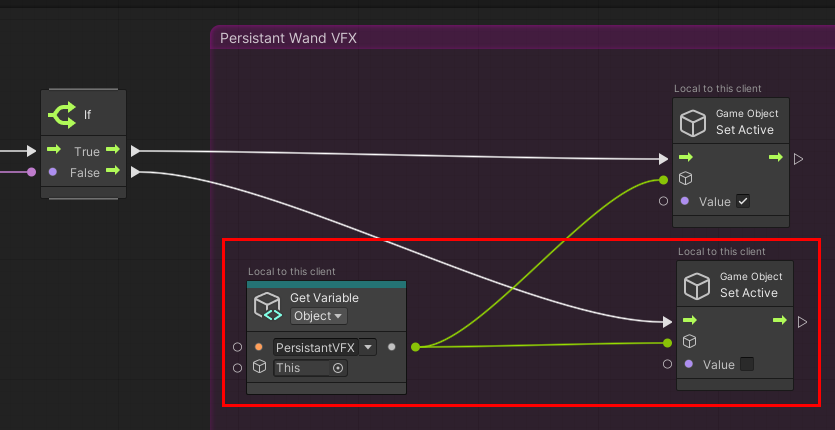

Back to the **Spell Cast on click** node group. After a brief cooldown period, a sound is played, and then a different particle effect is triggered at the tip of the wand: *vfx_wand_blast_trail_spheres_01* ("fireworks"), which is the value for the *ShootTrailVFX* object variable.

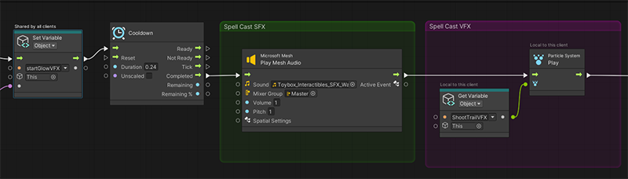

:::image type="content" source="../../../media/enhance-your-environment/equips-in-detail/wand-thrusting1.gif" alt-text="GIF that shows an event attendee activating the Wand which then generates fireworks.":::

## Turn the non-activate particle effect back on

After another brief cooldown period, the *startGlowVFX* Boolean value is changed back to "true", which turns the *vfx_wand_ethereal_persistent_02* particle system ("sparkly vapor") effect back on in the **Networking startMagic** group.

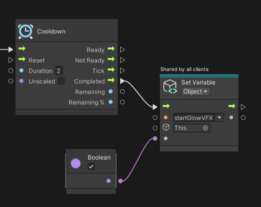

At this point, the avatar's arm returns to the position it was in before the Wand was activated and the sparkly vapor can be seen again.

:::image type="content" source="../../../media/enhance-your-environment/equips-in-detail/wand-holding1.gif" alt-text="GIF that shows an event attendee holding the Wand in its non-activated state.":::

## Release the Wand

If the Wand had the activate type "toggle," when the attendee clicked again, it would trigger a second, different "state", or set of behaviors. However, the Wand's activate type is "single", and this means that every time the attendee clicks, the same "state", or set of behaviors, is repeated.

To release the Wand, the attendee presses the Space key; this causes the Wand drops to the ground. When the Wand *isn't* being held, we don't want the sparkly vapor particle effect to run at the tip of the Wand. The nodes in the **If not occupied, Turn off Wand** node group turn off this particle effect.

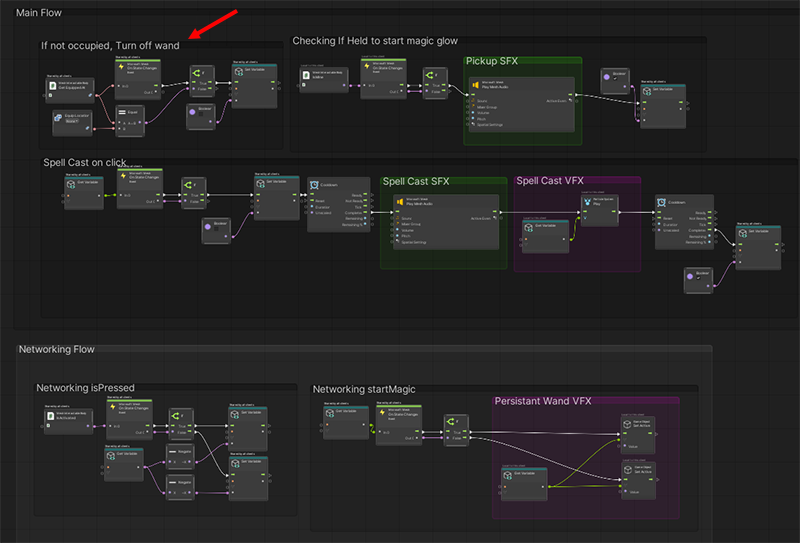

While the Wand is being held, the value of the *Mesh Interactable Body: Get Equipped At** is "DefaultHand". The value of the *Equip Location* node (a Boolean) is "None." These two values are compared in the *Equal* node (also a Boolean); since they're not the same, the output of *Equal* is "false" and the *if* node isn't triggered.

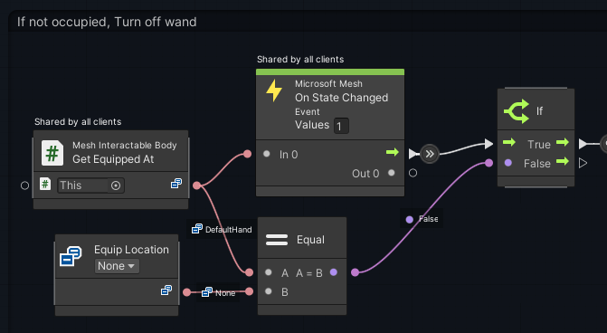

When the Wand is dropped, the value of *Get Equipped At* changes to "None." This causes the *Equal* and *If* nodes to output "true." This triggers the *Set Variable: Object* node which turns the value of the *startGlowVFX* object variable to "false." 

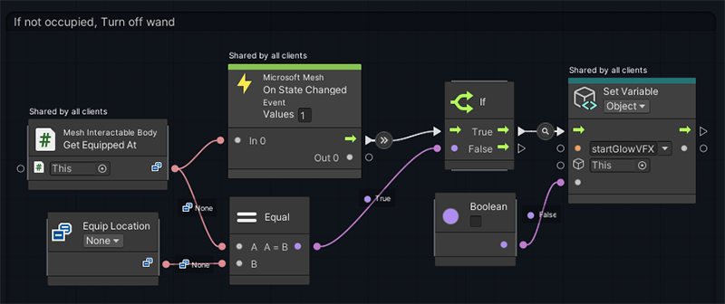

This once again triggers the nodes in the **Networking startMagic** node group and turns off the "sparkly vapor" particle effect--*vfx_wand_ethereal_persistent_02*--which is the value of the *PersistantVFX* object variable.

## Suggestions for experimenting with the script

- Create different effects that could be triggered when one of the existing Equippables is picked up and held.  
- Create new Equippables that could use some of the existing effects. For example, certain types of fireworks could use the "sparkle" effects that are currently used by the Wand.  
- Create different effects and behaviors for a new Equippable that could be triggered when the Equippable is held and the left mouse button (PC) or controller button (Quest 2) is pressed. For example, instead of a Wand, you could have a fishing rod that casts out a lure when you press the button.  
- Think about the difference between having an object move right into its activated state when picked up (for example, the Drill) and having an object that starts off non-activated and then moves into its activated state after the attendee clicks (for example, the Tablet). Make objects that take advantage of both approaches.