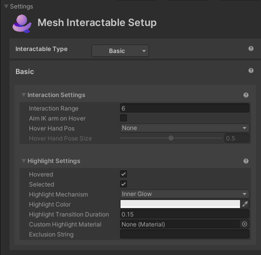

# Setup for Interactable type Basic

## Interaction Settings

- **Interaction Range**: Furthest distance the avatar can be to interact with this object.

- **Aim IK arm on Hover**: Whether or not the avatar's arm will reach towards the object while hovering using IK targeting.

- **Hover Hand Pos**: The hand pose shape to put the avatar's hand into when hovering over the object.

    

    - **Constrain IK Spherical**: If true, arm IK will be done on a sphere. This will cause the avatar arm to not stick straight out.

- **Hover Hand Pose Size:** Size of the hand pose from 0 – 1. Note that this setting is only adjustable for some of the positions listed in the **Hover Hand Pos** drop-down: *Pinch*, *Cylinder* and *Ball*. For the remaining positions, the setting is set to a default of 0.5 and is grayed out. 

## Highlight Settings

**Highlight Settings**
- **Hovered/Selected**: Whether or not to highlight the object if it's highlighted or selected.
- **Highlight Mechanism**

    - Menu item 1: **Shader Properties**
        - **Highlight Color**: The color to set the material's color properties when the object is highlighted.
        - **Highlight Transition Duration**: The amount of time to fade the highlight in/out when transitioning.
        - **Highlight Amount Properties**: The material's properties to set the amount of highlight when highlighted. This is a float value.
        - **Highlight Color Properties**: The material's properties to set the color of highlight when highlighted. This is a color value.

    - Menu item 2: **Mesh Outline**: Adds an automatic outline of the specified color/width to objects.
        
        - **Highlight Color**: The color of the outline.
        - **Highlight Transition Duration**: The amount of time to fade the outline in/out when transitioning.
        - **Highlight Outline Width**: How thick (in meters) should the outline be. Overrides the "Extrusion Value" in the Graphics Tools/Standard material.
        - **Custom Outline Material**: The material used to render the outline.
        - **Custom Stencil Write Material**: The material used write a value to the stencil buffer
        - **Outline Exclusion Mode**: Option to filter out renderers you don’t want included in the outline.

    - Menu item 3: **Inner Glow**: Applies a highlight with a glow effect using the given properties.

        - **Highlight Color**: The color of the inner glow.
        - **Highlight Transition Duration**: The amount of time to fade the inner glow in/out when transitioning
        - **Custom highlight material**: Override option specific to this object to set the material used for the glow. If this isn't set, the default material from the settings asset will be used.
        -  **Exclusion string:** If this is set then any Game Object with a name containing the exclusion string will be excluded from the highlight.

