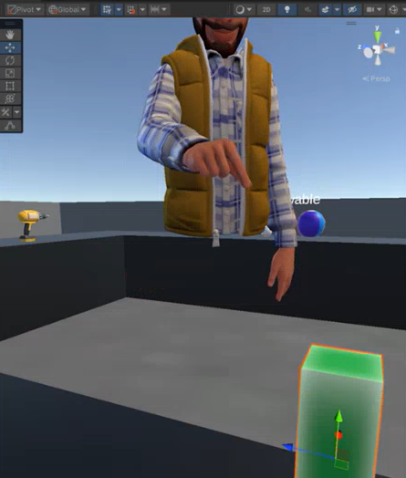
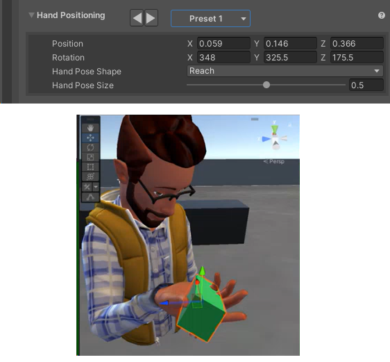
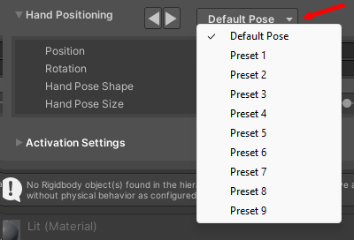
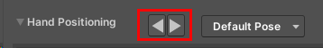
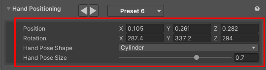
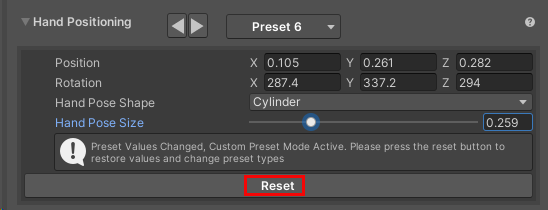
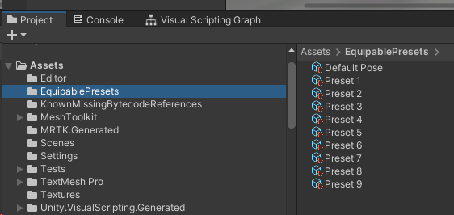
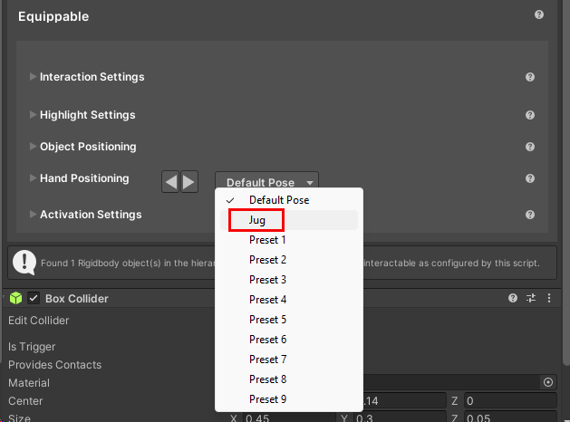
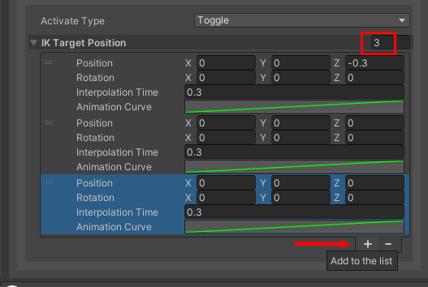

# Setup for Interactable type Equippable

## Terminology

In this article, "hover" means "when the cursor (PC or Mac) or controller pointer (Quest) is over the object."

## Interaction Settings

- **Interaction Range**: Furthest distance, in meters, the avatar can be to interact with this object.

- **Aim IK arm on Hover**: Whether or not the avatar's arm will reach towards the object while hovering using IK targeting.

- **Hover Hand Pos**: The hand pose shape to put the avatar's hand into when hovering over the object.

    

    For example, if you choose *Pinch*, when the avatar reaches for the object, its hand will assume the pinch position.

    

## Highlight Settings

**Highlight Settings**
- **Hovered/Selected**: Whether or not to highlight the object if it's highlighted or selected.
- **Highlight Mechanism**

    - Menu item 1: **Shader Properties**
        - **Highlight Color**: The color to set the material's color properties when the object is highlighted.
        - **Highlight Transition Duration**: The amount of time to fade the highlight in/out when transitioning.
        - **Highlight Amount Properties**: The material's properties to set the amount of highlight when highlighted. This is a float value.
        - **Highlight Color Properties**: The material's properties to set the color of highlight when highlighted. This is a color value.

    - Menu item 2: **Mesh Outline**: Adds an automatic outline of the specified color/width to objects.
        
        - **Highlight Color**: The color of the outline.
        - **Highlight Transition Duration**: The amount of time to fade the outline in/out when transitioning.
        - **Highlight Outline Width**: How thick (in meters) should the outline be. Overrides the "Extrusion Value" in the Graphics Tools/Standard material.
        - **Custom Outline Material**: The material used to render the outline.
        - **Custom Stencil Write Material**: The material used write a value to the stencil buffer
        - **Outline Exclusion Mode**: Option to filter out renderers you don’t want included in the outline.

    - Menu item 3: **Inner Glow**: Applies a highlight with a glow effect using the given properties.

        - **Highlight Color**: The color of the inner glow.
        - **Highlight Transition Duration**: The amount of time to fade the inner glow in/out when transitioning
        - **Custom highlight material**: Override option specific to this object to set the material used for the glow. If this isn't set, the default material from the settings asset will be used.
        -  **Exclusion string:** If this is set then any Game Object with a name containing the exclusion string will be excluded from the highlight.

## Object Positioning

- **Position** and **Rotation**: Use these settings to fine-tune the position and rotation of the object relative to the avatar's hand. Small adjustments here can significantly improve the realism of how the object is held.

    Use these settings to fine-tune how the object looks when the avatar is holding it.

## **Hand Positioning**

These settings determine the position of the avatar's hand (specifically, the wrist) relative to the position of its chest. 

### Presets

In addition to the *default* pose for the avatar's hand, there are nine presets that give you a variety of pose choices. For example, if you choose *Preset 1*, the avatar will hold the object with its palm facing up.

**To select a preset**:
Do one of the following:

- Click the button that displays **Default Pose**, and then select a preset from the list.

-or-

- Click the forward/backward arrows to the right of **Hand Positioning**.

### Change a preset's settings

Navigate through the preset list using the forward/backward buttons and note that each preset has its own unique settings.

- **Position**: The distance from the avatar's hand to its chest when an object is equipped.  
- **Rotation**: The amount to rotate the wrist when an object is equipped.  
- **Hand Pose Shape:** This is a drop-down that provides a range of hand pose shapes to put the avatar's hand into when equipped. You can also choose *none*.
- **Hand Pose Size:** Size of the hand pose from 0 – 1.  

### Reset to the default preset settings

If you find that a preset doesn't give you the precise pose you're looking for, you can change these settings for further improvement. As soon as you make any changes, a message appears telling you that you can restore the default preset settings by clicking the **Reset** button.

### Create your own presets

If you have an object in your scene that doesn't quite look right with any of the existing presets, you can make your own custom preset. You can't copy a file that's located in a package, so our first step will be to copy the whole *EquipablePresets* folder and work with the files in that copied folder. This will be the folder that the presets drop-down looks in for its presets. 

1. In the **Project** tab, navigate to the **Packages** > **Microsoft Mesh Interactables** > **Interactables Core** > **Resources** > **EquipablePresets** folder.

        Note that the presets are stored in this folder as [Scriptable Objects](https://docs.unity3d.com/Manual/class-ScriptableObject.html).

1. Drag the folder and drop it on the **Assets** folder to copy it there.

    

1. Select the preset you want to copy--in this example, we'll use *Preset 9*--and then press Ctrl + D to make a copy, which is automatically named *Preset 10*.
1. Rename the copied preset to something more descriptive. In our example, we intend to apply the preset to a jug in the scene, so we'll rename the preset to "Jug".
1. With *Jug* selected, in the **Inspector**, make the changes you want. The changes will be persistent; if you click another preset and then click *Preset 10* again, you'll see that it still retains the changes you made.
1. In the **Hierarchy** or the **Scene** window, select the GameObject you want to apply the preset to.
1. In the **Inspector**, navigate to the GameObject's **Mesh Interactable Setup** component.
1. Click the presets drop-down (it displays **Default Post**), and then choose *Jug* from the list.

    

## Activation Settings**  

Activation is explained in detail in the [Hold objects realistically with Equippables](../equippables-in-detail.md/#equippable-behaviors) article.

- **Activate Type:** When to set the item as active. Throwable objects cannot be activated and will always have activated type set to none.
    - **None**: This item can't be activated.  
    - **Toggle:** This item toggles between active/not active every time the activate control is clicked.  
    - **Single:** This item is activated when the activate control is clicked and then automatically deactivated once it reaches its last target pose.

- **IK Target Position**

This section contains a list of one or more target poses used to place the avatar's hand when an item is activated. Each pose consists of four properties: **Position**, **Rotation**, **Interpolation time**, and **Animation Curve**. The position and rotation offsets are relative to the avatar's chest. The avatar will interpolate using the animation curve from the previous pose to the current one sequentially down the list for the amount of time defined in the **Interpolation time** property, staying at the final pose until deactivated. When deactivated, the avatar hand pose will move backwards through the list.

You can add or remove poses by clicking the "+" or "-" buttons located below the list. The number to the right of **IK Target Position** tells you how many poses are in the list.

    

