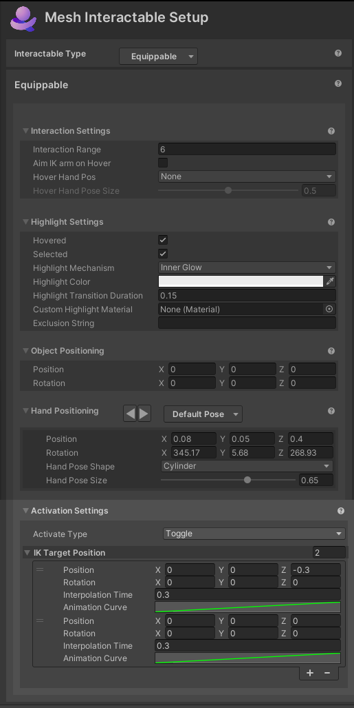

# Setup for Interactable type Equippable

## Interaction Settings

- **Interaction Range**: Furthest distance the avatar can be to interact with this object.

- **Aim IK arm on Hover**:

- **Hover Hand Pos**: TBD

    

## Highlight Settings

**Highlight Settings**
- **Hovered/Selected**: Whether or not to highlight the object if it's highlighted or selected.
- **Highlight Mechanism**

    - Menu item 1: **Shader Properties**
        - **Highlight Color**: The color to set the material's color properties when the object is highlighted.
        - **Highlight Transition Duration**: The amount of time to fade the highlight in/out when transitioning.
        - **Highlight Amount Properties**: The material's properties to set the amount of highlight when highlighted. This is a float value.
        - **Highlight Color Properties**: The material's properties to set the color of highlight when highlighted. This is a color value.

    - Menu item 2: **Mesh Outline**: Adds an automatic outline of the specified color/width to objects.
        
        - **Highlight Color**: The color of the outline.
        - **Highlight Transition Duration**: The amount of time to fade the outline in/out when transitioning.
        - **Highlight Outline Width**: How thick (in meters) should the outline be. Overrides the "Extrusion Value" in the Graphics Tools/Standard material.
        - **Custom Outline Material**: The material used to render the outline.
        - **Custom Stencil Write Material**: The material used write a value to the stencil buffer
        - **Outline Exclusion Mode**: Option to filter out renderers you don’t want included in the outline.

    - Menu item 3: **Inner Glow**: Applies a highlight with a glow effect using the given properties.

        - **Highlight Color**: The color of the inner glow.
        - **Highlight Transition Duration**: The amount of time to fade the inner glow in/out when transitioning
        - **Custom highlight material**: Override option specific to this object to set the material used for the glow. If this isn't set, the default material from the settings asset will be used.
        -  **Exclusion string:** If this is set then any Game Object with a name containing the exclusion string will be excluded from the highlight.

## Object Positioning

- **Position** and **Rotation**: The position and rotation offset relative to the avatar's hand to place the object. (TBD--this is a little different from the previous version. Verify with SMEs.)

- **Hand Positioning**

    Presets: TBD

    - **Position**: The distance from the avatar's chest to place the hand when an item is equipped.  
    - **Rotation**: The amount to rotate the wrist when an item is equipped.  
    - **Hand Pose Shape:** This is a drop-down that provides a range of hand pose shapes to put the avatar's hand into when equipped. You can also choose *none*.
    - **Hand Pose Size:** Size of the hand pose from 0 – 1.  

- **Activation Settings**  

    - **Activate Type:** When to set the item as active. Throwable objects cannot be activated and will always have activated type set to none.
        - **None**: This item can't be activated.  
        - **Toggle:** This item toggles between active/not active every time the activate control is clicked.  
        - **Single:** This item is activated when the activate control is clicked and then automatically deactivated once it reaches its last target pose.
