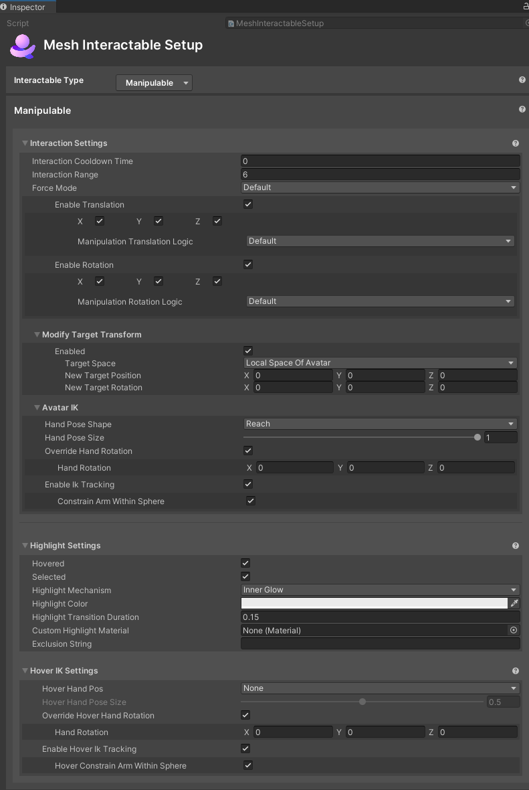

# Setup for Interactable type Manipulable

## Interaction Settings

- **Interaction Cooldown Time:** TBD

- **Interaction Range:** TBD

- **Force Mode:** The mode to use to force the object through space.

    - **Default:** Default MRTK behavior that moves the object using its center.  

        - **Enable Translation:** Whether or not the object can be translated while manipulating. Each axis can be set individually.

        - **Enable Rotation:** Whether or not the object can be rotated while manipulating. Each axis can be set individually. 

        Manipulable Rotation Logic TBD

        - **Default**: When manipulating an object, it will rotate around the camera and stay at the same orientation relative to the camera (actual transform values will rotate).  
        - **Restrictive**: When manipulating an object, it will not rotate its transform and will not stay at the same orientation relative to the camera. 

- **Scale All:** TBD

    - **Point Spring:** Alternative behavior that moves the object by applying force at a grab point (works only for rigidbodies).

        - **Spring strength:** The force of the spring which pulls the object. The higher the value, the faster it will reach the target point.  
        - **Damping Factor:** How much damping is applied to prevent oscillation around the grab point.  

- **Modify Target Transform:** Gives user the option to override the default transform and set the desired position and rotation of object relative to camera/avatar while object is selected. When this is set to **Enabled**, you get the following three properties:

    - **Target Space:**  

        - **Local Space Of Camera:** Whether to specify position and rotation in the camera local space.

        - **Local Space Of Avatar:** Whether to specify position and rotation in the avatar local space.

    - **New Target Position:** New target position (z component is the direction where camera/avatar is facing)
    - **New Target Rotation:** New target rotation

- **Avatar IK**

    - **Hand Pose Shape**: The hand pose shape to put the avatar's hand into when manipulating the object.  
    - **Hand Pose Size**: Size of the hand pose from 0 – 1.  
    - **Override Hand Rotation:** TBD  
    - **Enable IK Tracking**: Whether or not the avatar's arm will reach towards the object while manipulating using IK targeting.
        -   **Constrain IK Spherical**: If true, arm IK will be done on a sphere. This will cause the avatar arm to not stick straight out.

## Highlight Settings

- **Hovered** and **Selected**: Whether or not to highlight the object if it's highlighted or selected.

- **Highlight Mechanism**

    - Menu item 1: **Shader Properties**
        - **Highlight Color**: The color to set the material's color properties when the object is highlighted.
        - **Highlight Transition Duration**: The amount of time to fade the highlight in/out when transitioning.
        - **Highlight Amount Properties**: The material's properties to set the amount of highlight when highlighted. This is a float value. (TBD--this has apparently changed. It's now an integer value which determines the number of elements that are listed for the property.)
        - **Highlight Color Properties**: The material's properties to set the color of highlight when highlighted. This is a color value. (TBD--this has apparently changed. It's now an integer value which determines the number of elements that are listed for the property.)

    - Menu item 2: **Mesh Outline**: Adds an automatic outline of the specified color/width to objects.
        
        - **Highlight Color**: The color of the outline.
        - **Highlight Transition Duration**: The amount of time to fade the outline in/out when transitioning.
        - **Highlight Outline Width**: How thick (in meters) should the outline be. Overrides the "Extrusion Value" in the Graphics Tools/Standard material.
        - **Custom Outline Material**: The material used to render the outline.
        - **Custom Stencil Write Material**: The material used write a value to the stencil buffer
        - **Outline Exclusion Mode**: Option to filter out renderers you don’t want included in the outline.

    - Menu item 3: **Inner Glow**: Applies a highlight with a glow effect using the given properties.

        - **Highlight Color**: The color of the inner glow.
        - **Highlight Transition Duration**: The amount of time to fade the inner glow in/out when transitioning
        - **Custom highlight material**: Override option specific to this object to set the material used for the glow. If this isn't set, the default material from the settings asset will be used.
        -  **Exclusion string:** If this is set then any Game Object with a name containing the exclusion string will be excluded from the highlight.

## Hover IK Settings

IK settings to be used when hovering over an object.
- **Hand Pose Shape**: The hand pose shape to put the avatar's hand into when hovering over the object
- **Hand Pose Size**: Size of the hand pose from 0 – 1.
- **Enable IK Tracking**: Whether or not the avatar's arm will reach towards the object while hovering using IK targeting.
    - **Constrain IK Spherical**: If true, arm IK will be done on a sphere. This will cause the avatar arm to not stick straight out.
