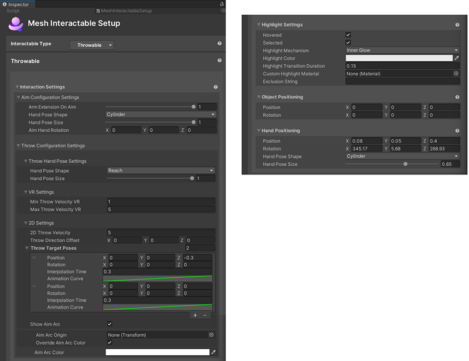

# Setup for Interactable type Equippable

## Interaction Settings

- **Aim Configuration Settings**  
        - **Use Aim Animation System:**: TBD  
        - **Release Time:** TBD  
        - **Arm Extension on Aim** – The amount to extend the arm when in aim mode.  
        - **Hand Pose Shape:** The hand pose shape to put the avatar's hand into when aiming.  
        - **Hand Pose Size:** Size of the hand pose from 0 – 1.
        - **Aim Hand Rotation:** The rotation of the hand while aiming  

- **Throw Configuration Settings**

    - **Throw Hand Pose Settings:**  
        - **Hand Pose Shape:** The hand pose shape to put the avatar's hand into when the throw is released  
        - **Hand Pose Size:** Size of the hand pose from 0 – 1.

    - **VR Settings**

        - **Min Throw Velocity VR:** The minimum velocity to apply to an object when thrown on the Quest.
        - **Max Throw Velocity VR:** The maximum velocity to apply to an object when thrown on Quest. This is the velocity value used on PC. On Quest the velocity will be scaled based on the user's physical arm movement.

        **Note**: On the Quest, the velocity applied when an object is thrown will be scaled between the minimum and maximum values using the real velocity of the user's arm movement.

    - **2D Settings**

        - **2D Throw Velocity**: The velocity to apply to an object when it's thrown on PC.
        - **Throw Direction Offset**: A directional offset to apply to an object when it's thrown on PC.
        - **Throw Target Poses:** A list of target poses used to place the avatar's hand when an item is thrown. The position and rotation offsets are relative to the position of the avatar's hand when the throw was initiated. The avatar will interpolate using the animation curve from the previous pose to the current one sequentially down the list for the amount of time defined in interpolation time. The object will be released and the throw hand pose will be used at the second to last target.
        - **Show Aim arc::** TBD  
            - **Aim Arc Origin:** TBD
            - **Override Aim Arc Color:** TBD

**Highlight Settings**

- **Hovered/Selected**: Whether or not to highlight the object if it's highlighted or selected.
- **Highlight Mechanism**

    - Menu item 1: **Shader Properties**
        - **Highlight Color**: The color to set the material's color properties when the object is highlighted.
        - **Highlight Transition Duration**: The amount of time to fade the highlight in/out when transitioning.
        - **Highlight Amount Properties**: The material's properties to set the amount of highlight when highlighted. This is a float value.
        - **Highlight Color Properties**: The material's properties to set the color of highlight when highlighted. This is a color value.

    - Menu item 2: **Mesh Outline**: Adds an automatic outline of the specified color/width to objects.
        
        - **Highlight Color**: The color of the outline.
        - **Highlight Transition Duration**: The amount of time to fade the outline in/out when transitioning.
        - **Highlight Outline Width**: How thick (in meters) should the outline be. Overrides the "Extrusion Value" in the Graphics Tools/Standard material.
        - **Custom Outline Material**: The material used to render the outline.
        - **Custom Stencil Write Material**: The material used write a value to the stencil buffer
        - **Outline Exclusion Mode**: Option to filter out renderers you don’t want included in the outline.

    - Menu item 3: **Inner Glow**: Applies a highlight with a glow effect using the given properties.

        - **Highlight Color**: The color of the inner glow.
        - **Highlight Transition Duration**: The amount of time to fade the inner glow in/out when transitioning
        - **Custom highlight material**: Override option specific to this object to set the material used for the glow. If this isn't set, the default material from the settings asset will be used.
        -  **Exclusion string:** If this is set then any Game Object with a name containing the exclusion string will be excluded from the highlight.

## Object Positioning

- **Position** and **Rotation**: The position and rotation offset relative to the avatar's hand to place the object. (TBD--this is a little different from the previous version. Verify with SMEs.)

- **Hand Positioning**

    - **Position**: The distance from the avatar's chest to place the hand when an item is equipped.  
    - **Rotation**: The amount to rotate the wrist when an item is equipped.  
    - **Hand Pose Shape:** This is a drop-down that provides a range of hand pose shapes to put the avatar's hand into when equipped. You can also choose *none*.
    - **Hand Pose Size:** Size of the hand pose from 0 – 1.  
