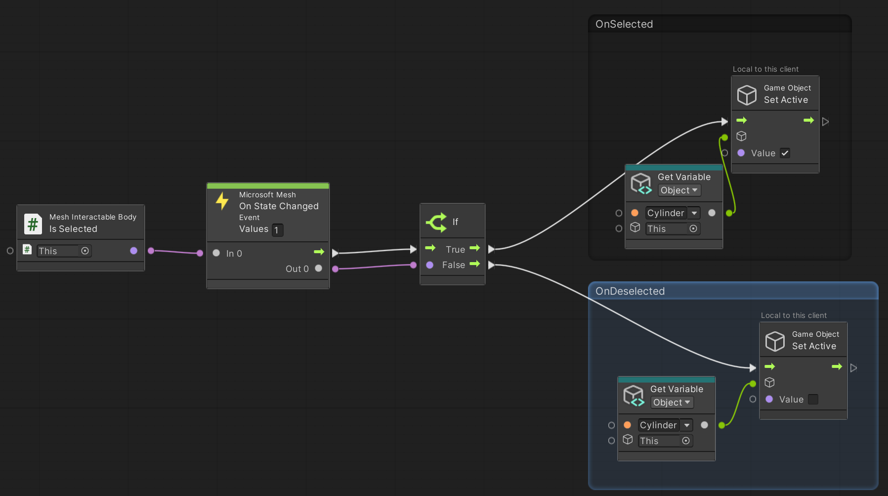
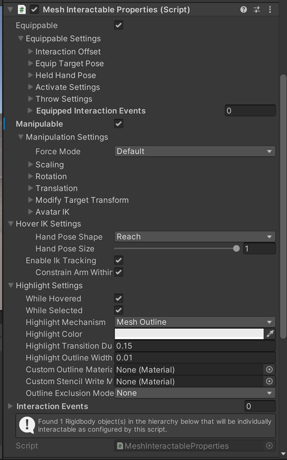

# Grab, attach and throw with Interactables

Mesh Interactables is a system for configuring objects with Unity scripts that defines interaction with an object or avatar behavior at runtime. The Interactables package contains scripts of different object types that can be defined. When a project runs, it sets up all the necessary prefabs and settings required for objects or the avatar to behave as defined. If you intend to use Interactables in [Playmode](../../debug-and-optimize-performance/playmode.md) during content development, include the Playmode Setup prefab in your scene. This sets everything up automatically so that all you have to do is click Play to test your objects. Note that the IK functionality seen in the Mesh app isn’t available in Playmode.

For objects you want the avatar to interact with, add a *MeshInteractableSetup* script. The properties for a group of objects that all behave the same can be set up with a parent *MeshInteractableSetup* script. The properties will be applied to all children with rigidbodies at runtime by automatically adding a *MeshInteractableBody* script. **MeshInteractableBody** will allow each interactable to behave independently. If you want to set up reactions to an object’s interactions with [Visual Scripting](../../script-your-scene-logic/visual-scripting/visual-scripting-overview.md), you can add the *MeshInteractableBody* yourself and create a script graph with a node to an available property, such as *OnHovered* or *OnSelected*, hooked up to an *OnStateChanged* node. For example, the following script graph will enable the cylinder while the button is pressed and disable it when the button is released. The button is fully interactable just by adding the script and a collider and you don't have to do anything else.

Another option for interactable objects is to make them manipulable. Manipulable objects will move through space on the end of your interactor ray. Shortcut controls are available to rotate or translate the object. To turn this feature on, select the Manipulable box and then choose your desired settings. When manipulating objects in the MeshBrowser app you can turn on IK settings for the avatar hand to follow the object. Manipulable objects don’t require a rigidbody, but you should add one if you want the objects to have physics capabilities.

Interactable objects can also be equippable (with or without also being manipulable). Equippable objects will attach to your avatar's hand when you equip them. The PC controls for equip are clicking the object or pressing ‘F’ while the object is selected. The Quest controls for equip are pressing the 'Grip' button while the object is selected. Equippable objects contain settings for IK targets for your avatar’s arm pose while the object is equipped. The IK targets are an offset from the avatar’s chest; this determines where the hand goes while the object is held or activated. Equippables also have the option of being *throwable*. When a throwable object is equipped, you can enter into aim mode by pressing and holding the left mouse button. This will allow your avatar’s arm to follow your mouse target and the object will be thrown when you release the left mouse button.

All the Interactables components have interaction properties and methods available to Visual Scripting so you have an unlimited amount of ways to make them work together. 

## *MeshInteractableSetup*

Setup script for defining the properties of an object that can be interacted with using XRI interactors.

### Settings

**[Recommended Component]** Rigidbody: A rigidbody must be added if you want this object to be physics enabled.

**Interaction Proximity Radius** Furthest distance the avatar can be to interact with this object

**Equippable:** Whether or not this object can be equipped in the avatar's hand.

- **Interaction Offset:** The position and rotation offset relative to the avatar’s hand to place the object.  
- **Equip Target Pose**  
    - *Position*: The distance from the avatar’s chest to place the hand when an item is equipped.  
    - *Rotation*: The amount to rotate the wrist when an item is equipped.  
- **Held Hand Pose:**
    - **Hand Pose Shape:** The hand pose shape to put the avatar's hand into when equipped.  
    - **Hand Pose Size:** Size of the hand pose from 0 – 1.  
- **Throw Settings**  
    - **Throwable:** Whether or not the object can be thrown. Throwable objects will enter the avatar into an aim state when the left mouse button is held  
    - **Min Throw Velocity:** The minimum velocity to throw an object. This is only used on Quest.
    - **Max Throw Velocity:** The maxiumum velocity to throw an object. This is the velocity value used on PC. On quest the velocity will be scaled based on the user's physical arm movement.
    - **Arm Extension on Aim** – The amount to extend the arm when in aim mode.  
    - **Aim Hand Pose:**  
        - **Hand Pose Shape:** The hand pose shape to put the avatar's hand into when aiming.  
        - **Hand Pose Size:** Size of the hand pose from 0 – 1.
    - **Aim Hand Rotation:** The rotation of the hand while aiming  
    - **Throw Hand Pose:**  
        - **Hand Pose Shape:** The hand pose shape to put the avatar's hand into when the throw is released  
        - **Hand Pose Size:** Size of the hand pose from 0 – 1.  
    - **Throw Target Poses:** A list of target poses used to place the avatar’s hand when an item is thrown. The position and rotation offsets are relative to the position of the avatar's hand when the throw was initiated. The avatar will interpolate using the animation curve from the previous pose to the current one sequentially down the list for the amount of time defined in interpolation time. The object will be released and the throw hand pose will be used at the second to last target.
- **Activate Settings**  
    - **Activate Type:** When to set the item as active. Throwable objects cannot be activated and will always have activated type set to none.
        - **None**: This item can't be activated.  
        - **Toggle:** This item toggles between active/not active every time the activate control is clicked.  
        - **Single:** This item is activated when the activate control is clicked and then automatically deactivated once it reaches it's last target pose.
    - **Activate Target Poses:** A list of target poses used to place the avatar’s hand when an item is activated. The position and rotation offsets are relative to the avatar's chest. The avatar will interpolate using the animation curve from the previous pose to the current one sequentially down the list for the amount of time defined in interpolation time, staying at the final pose until deactivated. When deactivated, the avatar hand pose will move backwards through the list.  

**Manipulable:** Whether or not the object can be manipulated through space along the XR ray interactors.

- **Force Mode:** The mode to use to force the object through space  
    - **Default:** Default MRTK behavior that moves the object using its center.  
    - **Point Spring:** Alternative behavior that moves the object by applying force at a grab point (works only for rigidbodies)  
- **Rotation  (Only available for Default mode)**
    - **Enabled**: Whether or not the object can be rotated while manipulating. Each axis can be set individually.  
    - **Manipulation Rotation Logic**
        - **Default**: When manipulating an object, it will rotate around the camera and stay at the same orientation relative to the camera (actual transform values will rotate).  
        - **Restrictive**: When manipulating an object, it will not rotate its transform and will not stay at the same orientation relative to the camera.  
- **Translation (Only available for Default mode) =Enabled**: Whether or not the object can be translated while manipulating. Each axis can be set individually.  
- **Point Spring (Only available for Point Spring mode)**  
    - **Spring strength:** The force of the spring which pulls the object. The higher the value, the faster it will reach the target point.  
    - **Damping Factor:** How much damping is applied to prevent oscillation around the grab point.  
- **Modify Target Transform:** Gives user the option to override the default transform and set the desired position and rotation of object relative to camera/avatar while object is selected:  
    - **Target Space:**  
        - **Local Space Of Camera:** Whether to specify position and rotation in the camera local space.
        - **Local Space Of Avatar:** Whether to specify position and rotation in the avatar local space.
    - **New Target Position:** New target position (z component is the direction where camera/avatar is facing)
    - **New Target Rotation:** New target rotation
- **Avatar IK**
    - **Hand Pose Shape**: The hand pose shape to put the avatar's hand into when manipulating the object
    - **Hand Pose Size**: Size of the hand pose from 0 – 1.
    - **Enable IK Tracking**: Whether or not the avatar's arm will reach towards the object while manipulating using IK targeting.
        -   **Constrain IK Spherical**: If true, arm IK will be done on a sphere. This will cause the avatar arm to not stick straight out.

**Hover IK Settings** – IK settings to be used when hovering over an object
- **Hand Pose Shape**: The hand pose shape to put the avatar's hand into when hovering over the object
- **Hand Pose Size**: Size of the hand pose from 0 – 1.
- **Enable IK Tracking**: Whether or not the avatar's arm will reach towards the object while hovering using IK targeting.
    - **Constrain IK Spherical**: If true, arm IK will be done on a sphere. This will cause the avatar arm to not stick straight out.

**Highlight Settings**
- **Hovered/Selected**: Whether or not to highlight the object if it’s highlighted or selected.
- **Highlight Mechanism**
    - **Inner Glow** Applies a highlight with a glow effect using the given properties.
        - **Custom highlight material**: Override option specific to this object to set the material used for the glow. If this isn’t set, the default material from the settings asset will be used.
        -  **Exclusion string:** If this is set then any Game Object with a name containing the exclusion string will be excluded from the highlight.
    - **Mesh Outline:** Adds an automatic outline of the specified color/width to objects.
    - **Shader Properties**
        - **Highlight Color**: The color to set the material's color properties when the object is highlighted.
        - **Highlight Transition Duration**: The amount of time to fade the highlight in/out when transitioning.
        - **Highlight Amount Properties**: The material's properties to set the amount of highlight when highlighted. This is a float value.
        - **Highlight Color Properties**: The material's properties to set the color of highlight when highlighted. This is a color value.

## Mesh Interactable Body

This component is added automatically at runtime to interactable bodies; developers don’t need to use it. You may want to add it manually to use Mesh interactables with Visual Scripting, such as with interaction events or to modify the manipulable target transform through the visual script.

### Visual Scripting

**For all interactable bodies:**

- **Properties**
    - **IsHovered (read only)** – Whether or not your local avatar is hovering the object.  
    - **IsSelected (read only)** – Whether or not any avatar is selecting the object. When running in MeshBrowser this will be networked.
    - **IsSelectedLocally** – Whether or not the local avatar is selecting the object.
    - **IsMine (read only)** – True for the last avatar to select or equip the object.  

**For equippables:**

- **Properties**
    - **EquippedAt (read only)** - Where this object is equipped – None, DefaultHand, RightHand, LeftHand. When running in MeshBrowser this will be networked.
    - **EquipTime (read only)** – What time this object was equipped. When running in MeshBrowser this will be networked.
    - **IsActivated (read only)** – If this object is in the activated state. Only valid for objects that are not throwable. When running in MeshBrowser this will be networked.
    - **IsAiming (read only)** – If the local avatar is in the aiming state while holding this object. Only valid for throwables.
    - **IsThrowing (read only)** – If the local avatar is in actively throwing the object. Only valid for throwables.
    - **IsEquipped (read only)** (read only) – If this object is currently equipped by an avatar. When running in MeshBrowser this will be networked.
    - **IsThrowable** – if this object is throwable.
    - **ThrowVelocity** – The velocity to throw the object when it’s released.

**For manipulables to modify the Target Position:**

- **Target Position (read only)**: Target position of the body when using Default Force Mode in Mesh Interactable Properties  
- **Target Rotation (read only)**: Target rotation of the body when using Default Force Mode in Mesh Interactable Properties  
- **Ray Hit Position (read only)**: Position of the ray-cast hit of the interactor on the body  
- **Ray Hit Rotation (read only)**: The rotation of the interactor around the direction of the ray  
- **Modified Target Position (read and write)**: Used to set the new target position by the visual script. This will override the default target position. Best practice is to override this property:  
    - Using On State Changed of Target Position. In this case, the visual script will fire a flow only when the interactor and the new position has changed.  
    - Using On Late Update. If you require to change the target transform in every frame, do it in late update so that the new target transform is available immediately in the next frame.  
- **Modified Target Rotation (read and write)**: Used to set the new target rotation by the visual script. This will override the default target position.

### Settings

**Modify With Visual Script:** Enable this to modify target transform for manipulable bodies using visual script. 

## Next steps

[Triggers, anchors and tethers](./triggers-anchors-and-tethers.md)
[Create avatar spawn and teleport points](./create-avatar-spawn-and-teleport-points.md)
[Physics interactions](../physics-interactions.md)
[Enhanced features overview](../enhanced-features-overview.md)
