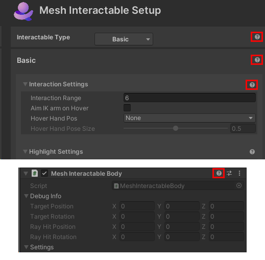

# Grab, hold and throw with Interactables

## Overview

Mesh Interactables is a system for configuring objects with Unity scripts that defines interaction with an object or avatar behavior at runtime. The scripts define the properties of the object that can be interacted with using XRI interactors. The [Mesh toolkit](../../build-your-basic-environment/add-the-mesh-toolkit-package.md) contains scripts of different object types that can be defined. When a project runs, it sets up all the necessary prefabs and settings required for objects or the avatar to behave as defined. If you'd like to see an approximate preview of what your interactable objects will look and feel like when they run in the Mesh app, be sure to [set up Play Mode with Mesh Emulation](../../debug-and-optimize-performance/mesh-emulator.md). Note that the IK functionality seen in the Mesh app isn't available in Play Mode with Mesh Emulation.

## The Mesh Interactable Setup component

To make an object interactable, you must add the *Mesh Interactable Setup* component.

1. In the **Hierarchy**, select the object.
1. In the **Inspector**, click the **Add Component** button and then select **Mesh Interactable Setup**.

    

The component is added with its default **Interactable Type** property set to **Basic**. (Object types will be explained in the next section.)

The properties for a group of objects that all behave the same can be set up with a parent *Mesh Interactable Setup* component. The properties will be applied to all children with rigidbodies at runtime by automatically adding a *Mesh Interactable Body* component to each child object. You may want to add *Mesh Interactable Body* manually to use Mesh interactables with [Visual Scripting](#make-objects-interactable-with-visual-scripting), such as with interaction events or to modify the manipulable target transform through the visual script.

**Notes**:

- *Mesh Interactable Body* will allow each interactable to behave independently.

- A rigidbody must be added to an object if you want it to be physics enabled.

## Getting help

In the *Mesh Interactables Setup* and *Mesh Interactable Body* components, you can click the "?" button to navigate to a page in the Mesh documentation that contains help for the feature the button is connected to.

## Interactable Object Types

There are four object types:

- Basic  
- Manipulable  
- Equippable  
- Throwable  

**To choose an object type**:
- In the **Mesh Interactable Setup** component, click the **Interactable Type** drop-down and then select one of the four options.

### Basic

As mentioned above, this is the default type. When the user hovers over or selects the object, it can invoke callbacks and other scripts can react.  For example, if you have a button that you want to use to enable another object, add this Interactable type to the button with an *OnSelected* callback to enable that other object. The button will be fully interactable just by adding this type and a collider; you won't have to do anything else.

**Note**: The other three Interactable types--Manipulable, Equippable, and Throwable (explained below), have the same attributes as the Basic type but with additional features.

[Learn more about Basic object type settings](./interactable-setup-types/basic-setup.md)

### Manipulable

You can move an object of this type from a distance; specifically, you manipulate its transform at runtime and move it through space on the end of an interactor ray. Shortcut controls are available to rotate or translate the object. For manipulation of objects in the Mesh app, you can turn on IK settings for the avatar hand to follow the object. Manipulable objects don't require a rigidbody, but you should add one if you want the objects to have physics capabilities.

[Learn more about Manipulable object type settings](./interactable-setup-types/manipulable-setup.md)

### Equippable

You can grab an object of this type. In Mesh terms, we say that you "equip" the object to your avatar's hand. To equip an object on the PC, click the object or press <kbd>F</kbd> while the object is selected. To equip an object on the Quest, press the 'Grip' button while the object is selected. Equippable objects contain settings for IK targets for your avatar's arm pose while the object is equipped. The IK targets are an offset from the avatar's chest; this determines where the hand goes while the object is held or activated.

[Learn more about Equippable object type settings](./interactable-setup-types/equippable-setup.md)

### Throwable

As the name implies, you can grab and throw an object of this type. After grabbing, you can enter *aim mode* by pressing and holding the left mouse button. This will allow your avatar's arm to follow your mouse target; to throw the object, release the left mouse button.

[Learn more about Throwable object type settings](./interactable-setup-types/throwable-setup.md)

## Make objects interactable with Visual Scripting

All the Interactables components have interaction properties and methods available to [Visual Scripting](../../script-your-scene-logic/visual-scripting/visual-scripting-overview.md) so you have an unlimited amount of ways to make them work together. To take advantage of this, use the *Mesh Interactable Body* component inside a script graph with a node to an available property, such as *OnHovered* or *OnSelected*, hooked up to an *OnStateChanged* node. For example, the following script graph will enable the cylinder while the button is pressed and disable it when the button is released. The button is fully interactable just by adding the script and a collider; you don't have to do anything else.

### Visual Scripting properties

**For all interactable bodies:**

- **IsHovered (read only)** – Whether or not your local avatar is hovering the object.  
- **IsSelected (read only)** – Whether or not any avatar is selecting the object. When running in MeshBrowser this will be networked.
- **IsSelectedLocally** – Whether or not the local avatar is selecting the object.
- **IsMine (read only)** – True for the last avatar to select or equip the object.  

**For Equippables:**

- **EquippedAt (read only)** - Where this object is equipped – None, DefaultHand, RightHand, LeftHand. When running in MeshBrowser this will be networked.
- **EquipTime (read only)** – What time this object was equipped. When running in MeshBrowser this will be networked.
- **IsActivated (read only)** – If this object is in the activated state. Only valid for objects that are not throwable. When running in MeshBrowser this will be networked.
- **IsAiming (read only)** – If the local avatar is in the aiming state while holding this object. Only valid for throwables.
- **IsThrowing (read only)** – If the local avatar is in actively throwing the object. Only valid for throwables.
- **IsEquipped (read only)** (read only) – If this object is currently equipped by an avatar. When running in MeshBrowser this will be networked.
- **IsThrowable** – if this object is throwable.
- **ThrowVelocity** – The velocity to throw the object when it's released.

**For manipulables to modify the Target Position:**

- **Target Position (read only)**: Target position of the body when using Default Force Mode in Mesh Interactable Properties  
- **Target Rotation (read only)**: Target rotation of the body when using Default Force Mode in Mesh Interactable Properties  
- **Ray Hit Position (read only)**: Position of the ray-cast hit of the interactor on the body  
- **Ray Hit Rotation (read only)**: The rotation of the interactor around the direction of the ray  
- **Modified Target Position (read and write)**: Used to set the new target position by the visual script. This will override the default target position. Best practice is to override this property:  
    - Using On State Changed of Target Position. In this case, the visual script will fire a flow only when the interactor and the new position has changed.  
    - Using On Late Update. If you require to change the target transform in every frame, do it in late update so that the new target transform is available immediately in the next frame.  
- **Modified Target Rotation (read and write)**: Used to set the new target rotation by the visual script. This will override the default target position.

## Next steps

> [!div class="nextstepaction"]
> [Triggers, anchors and tethers](./triggers-anchors-and-tethers.md)

> [!div class="nextstepaction"]
> [Create avatar spawn and teleport points](./create-avatar-spawn-and-travel-points.md)

> [!div class="nextstepaction"]
> [Physics interactions](../physics/mesh-physics-overview.md)

> [!div class="nextstepaction"]
>[Enhanced features overview](../enhanced-features-overview.md)
