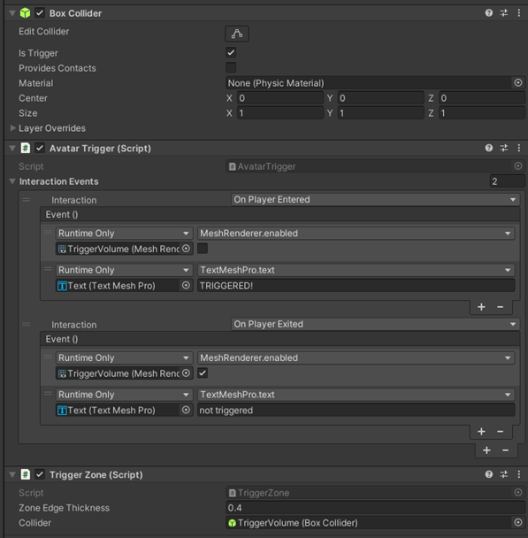

# Track when avatars trigger events

## AvatarTrigger

An object that tracks when the local avatar enters and exits its trigger volume.

### Settings

**[Required Component] Collider:** A Collider is required to know what the trigger volume is. This should have **IsTrigger** set to true.

### Visual Scripting
- **Properties:** 
    - **LocalAvatarInTrigger** – true when the local avatar is inside the trigger
