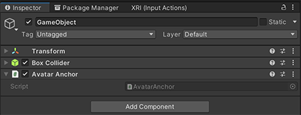
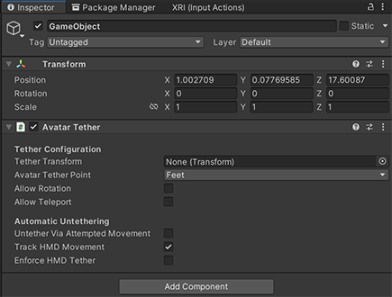

# Triggers, anchors and tethers

## Avatar Trigger

An object that tracks when the local avatar enters and exits its trigger volume.

### Settings

**[Required Component] Collider:** A Collider is required to know what the trigger volume is. This should have **IsTrigger** set to true.

### Visual Scripting
- **Properties:** 
    - **LocalAvatarInTrigger** – true when the local avatar is inside the trigger

To ensure that an avatar moves along smoothly with a moving object, you can add an *AvatarAnchor* component to the object. Two instances where this would be useful are moving the avatar along a zipline or in an elevator. Movement can occur both locally and for other avatars’ views across the network.

## Avatar Anchor

An object that the avatar will anchor to when they’re inside the object’s trigger volume so that the avatar moves along with the object. Inherits from AvatarTrigger. Networked avatars will anchor as well so movement is smooth across the network. Any number of players can be anchored to a single object.

### Settings

**[Required Component] Collider:** A Collider is required to know what the trigger volume is. This should have IsTrigger set to true.

## Avatar Tether

If you want an avatar to be attached to an object that’s stationary (for example, a seat or podium) or one that has various settings for locomotion, you could add an *AvatarTether* component. This “tethers” the avatar to the object. AvatarTethers first transport the local avatar to their location (this is a one-time position change), and then follow the tether settings you’ve chosen to restrict movement while the avatar is tethered. Only one avatar at a time can be tethered.

A MeshInteractableBody can attach an OnStateChanged node to its **OnSelected** property that calls the **TetherLocalAvatar** method on an AvatarTether to tether an avatar. The AvatarTether could have its tether located on the same object as a moving AvatarAnchor so the avatar will start moving along with that object as soon as they’re tethered. At the end of the anchor's journey you could have an AvatarTrigger that untethers the avatar from its anchor object when they reach the zone; they are then free to move about as they please.

### Settings

- **Tether Transform:** The point to tether the avatar to. Will default to the transform the component is attached to.  
- **Avatar Tether Point:** The point on the avatar to place them at the transform.  
- **Allow Rotation:** Whether or not the avatar can rotate when they’re tethered.  
- **Allow Teleport:** Whether or not the avatar can teleport when they’re tethered.  
- **Untether Via Attempted Movement:** Whether or not the avatar will untether after a small amount of time trying to locomote.  
- **Track HMD Movement:** Whether or not the avatar will untether after physically walking away.  
- **Enforce HMD User Tether:** What to do when the avatar exceeds physical movement range. If true, the avatar will be teleported back to tether position; if false, the avatar will be untethered.  

### Visual Scripting

- **Properties:** 
    - **AvatarIsTethered** – Whether or not any avatar is tethered  
    - **LocalAvatarIsTethered** - Whether or not the local avatar is tethered  
- **Methods:**
    - **TetherLocalAvatar(bool)** – Tether or untether the local avatar to this tether  
    - **ToggleTether()** – Tether the avatar when they are not tethered or untether when they are

## *Billboard2D*

Script to make an object always face the camera.

## Next steps

[Grab, attach and throw with Interactables](./interactables.md)
[Create avatar spawn and teleport points](./create-avatar-spawn-and-travel-points.md)
[Physics interactions](../physics/mesh-physics-overview.md)
[Enhanced features overview](../enhanced-features-overview.md)

