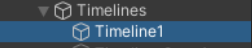
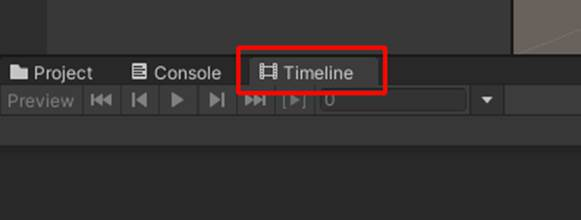
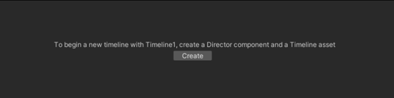
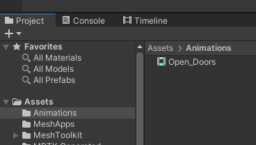
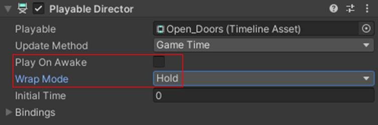

# Multi-room sync (animations, timelines and video)

## Overview

With Mesh, you can set up [single-room or multi-room events](../../events-guide/create-event-mesh-portal.md#considerations-before-your-event).  Your co-organizers who are hosting an event at showtime can then use the Control Panel to trigger video, audio, playables (timeline animations) and object visibility in a consistent way across all rooms.

## Single-room sync vs. multi-room sync

By default, any scene changes triggered with visual scripts, cloud scripts, interactables or physics (for example, button presses, avatar triggers, grabbing and moving objects) will stay independent to the room where that change occurred.  This is true even if a co-organizer is the one taking the action.

To sync changes across multiple rooms, a co-organizer will need to use the Control Panel to trigger a Controllable that you've added to your environment in Unity.

## Controllables

The Mesh toolkit includes key components called **Controllables** that you use to tag a **Video Player**, **PlayableDirector**, **AudioSource** or other object in your scene so that event hosts can control it across all rooms of an event at showtime.

The list of Mesh **Controllable** components includes:

- **Unity Playable Controllable:** For controlling a Unity **PlayableDirector** (timelines, animations)

- **Embedded Audio Controllable**: For controlling a Unity **AudioSource** playing audio included in your environment's asset bundle

- **Embedded Video Controllable:** For controlling a Unity **Video Player** playing video included in your environment's asset bundle

- **Streamed Video Controllable:** For controlling a Unity **Video Player** playing video streamed from a URL

- **Object Controllable**: For controlling the enabled/disabled state of any Unity **GameObject**

The following sections talk about how to add a **Controllable** component to various
objects in your Unity scene.  Each object you put a **Controllable** on will appear at showtime in Control Panel for event co-organizers to control.

## Controlling a Timeline animation in an event

In Unity, a **Timeline** lets you sequence animations, audio
and other content in your Unity scene.  A Timeline is one kind of **Playable**, a Unity object that can be played, paused, looped, and stopped.

By adding a **Unity Playable Controllable** next to your **Timeline** or other **Playable**, an event host can control it from the Control Panel at showtime, synchronizing an animation across multiple rooms.

Co-organizers hosting an event can then select *play* to start your
animation, *pause* it, and select *play* again to resume the animation.
They can also select *stop* to reset the animation to the beginning or
set your animation to *loop*.

For example, if you have a door-opening animation, selecting the *play*
button will open the door in your scene. Selecting *stop* will reset the
animation back to its original position. A Playable will not animate in
reverse; to do this, you'll need to create a different animation.

If you're unfamiliar with how **Timelines** work in Unity, we recommend that you watch this
[Unity Tutorial series on Timelines](https://learn.unity.com/project/up-to-speed-with-timeline).

To learn more about the Unity Playables API in general, see [Playables in the Unity Manual](https://docs.unity3d.com/Manual/Playables.html).

### To create and control a Timeline for Mesh

1. In the **Hierarchy**, add an empty GameObject and then rename it
    "Timelines."

1. Add another empty GameObject, make it a child to **Timelines**, and
    then rename it "Timeline1."

    

    **Notes**:

    - For an actual project you're working on, we suggest that you give this GameObject a more descriptive
        name---for example, *1_Entrance_Doors*. For this learning scenario, we'll
        stick with the name "Timeline1."

    - A Playable will *not* animate in reverse. Let's say, for example, that you have a door-opening animation. Selecting the Play button will open the door in your scene, and selecting the Stop button will reset the animation back to its original position. To animate in reverse, you'll need to create a different animation.

        **IMPORTANT**: Multiple timelines on a single GameObject will *not*
        work and will cause issues in events.

1. In the **Project** tab, navigate to the **Assets** folder and then
    create a new folder named *Animations*.

1. In the **Hierarchy**, select **Timeline1**, and then select **Window** > **Sequencing** > **Timeline**.

1. We recommend that you move the **Timeline** tab next to the
    **Project** and **Console** tabs. This allows you to view the
    **Timeline** and the **Scene** or **Game** windows simultaneously.

    

1. Select **Create**.

    

1. In the **Save** window, change the name of the Playable to
    *Open_Doors* and then save it to the **Assets** > **Animations** folder.

    

1. You can now animate or customize your Timeline---for example, add
    animation clips, activation clips, and more. To learn more about this, [see the Timeline tutorial](https://learn.unity.com/tutorial/introduction-to-timeline-2019-3#) on the Unity Learn website.
    
    A Timeline with several tracks might look something like this:

    

1. Once you're done animating, in the **Hierarchy**, select the
    **Timeline1** GameObject, and then in the **Inspector**, navigate to
    the **Playable Director** component.

1. In most cases you'll want to choose these settings:

    **Play On Awake** = not selected

    The timeline will be active when you upload it.

    **Wrap Mode = Hold**

    The last frame of your animation will be on hold indefinitely;
    otherwise, your timeline will reset to the start. There's also a
    **Wrap Mode** option named **Loop** which you may want to use in some
    instances.

    

1. Finally, in the Inspector, use **Add Component** to add a **Unity Playable Controllable** component on the same object as the **Playable Director**.

    Give this controllable the name **Timeline1** and set its Director property to the **Playable Director** component on this object.

Once added, this timeline will appear in **Control Panel** for events and templates that use this environment.
Hosts can then control this timeline in sync across all rooms.

Now you can upload your Environment to Mesh using the **Mesh toolkit
Uploader** and then see how it looks in Mesh. To learn more,
see [Prepare content with the Control Panel](../../events-guide/customize-event.md#prepare-content-with-the-control-panel).

## Controlling a Video Player in an event

Synchronized video playback triggered by the Control Panel can be done using the Unity Video
Player.

1. You'll first need to add a **Video Player** component in your Unity scene.
    
    If using video embedded into your environment, assign that video to this component.

2. Then, in the Inspector, use **Add Component** to add either the **Embedded Video Controllable** or **Streamed Video Controllable** component to that same object.

    Give this controllable the name you want to see in Control Panel and set its Video Player property to the **Video Player** component on this object.
    
    If using streaming video, set the controllable's **Default URL** to the URL you want to play.

Once added, this video will appear in **Control Panel** for events and templates that use this environment.
Hosts can then toggle it **on/off** or **play/stop/seek** in sync across all rooms.

To learn more about the Unity Video Player component, see [Unity -
Manual: Video Player component
(unity3d.com)](https://docs.unity3d.com/Manual/class-VideoPlayer.html).

## Testing your controllables in Mesh

To try using the Control Panel to operate your controllables in a real event, you'll first need to publish your environment to Mesh.  See [Build and publish your environment](../make-your-environment-available/build-and-publish-your-environment.md) for more information on uploading your environment.

Once your environment is uploaded, you can then customize a template or event to set up Control Panel.  See [Prepare content with the Control Panel](../../events-guide/customize-event.md#prepare-content-with-the-control-panel) for more information.

## Save your work as a template

Once you create an Environment + Control Panel combination that you think
organizers may want to repeat in the future, you can save the
combination as a template. To learn more about templates, see [Create event template](../../events-guide/create-template.md).

