# Mesh Physics

In a Mesh experience, physics simulation is key to enabling engaging dynamic content. In order to provide Mesh participants with high quality shared physics experiences and offer developers a productive workflow in creating custom content, we've created the *Mesh Physics* system. Mesh Physics is based on local authoritative simulation, which results in a very simple architecture. There's no need for server-side logic and special logic on the clients. Most importantly, this approach results in a very responsive and low-latency experience for each player interacting with their environment, even when connected to a high-latency network.

Here's a sampling what you can do with Mesh Physics features:

* Allow participants to grab and carry objects.

* Control how gravity affects objects.

  

* Make an object “sticky”—it sticks to whatever it hits. Examples: throwing a dart at a dart board, attaching a picture to a wall.

  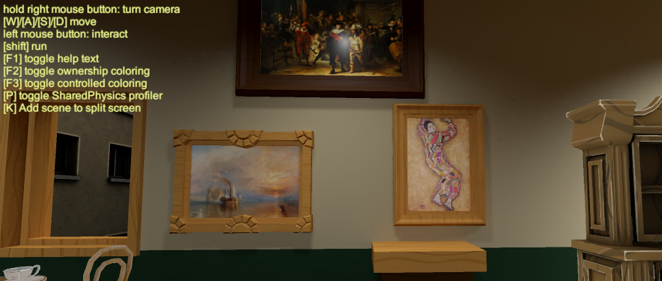

* Add auto-play animations that interact with physics bodies.

  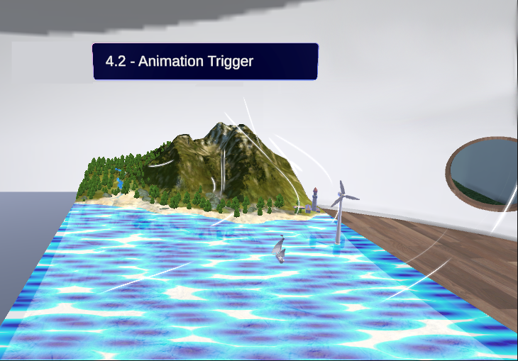

* Allow participants to reset objects (for example, reset a chess board, or clean up a room after objects have been scattered about).

  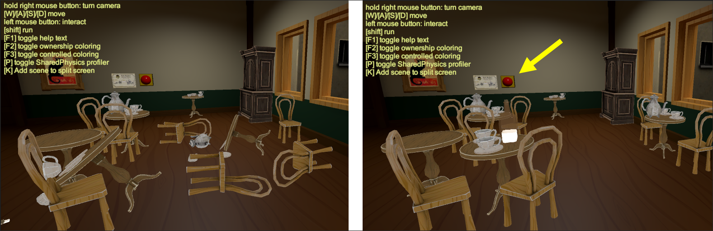

* Fire events when an object enters a trigger collider.

  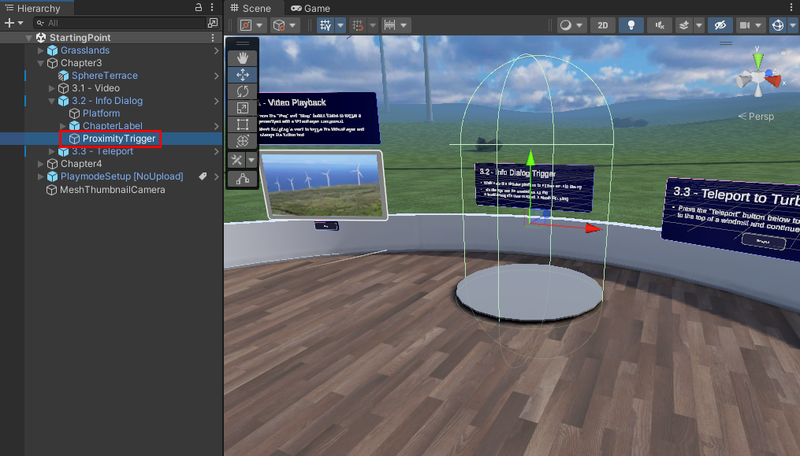

* Create a containment field. Objects will stay within the boundaries of the field.

  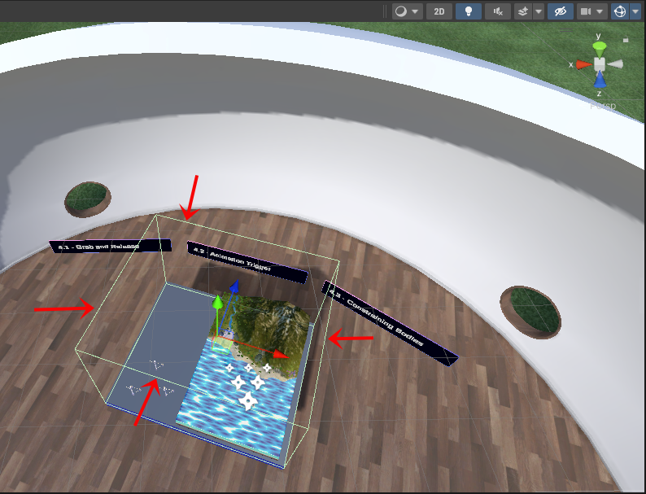

* Control the velocity of an object.

* Control the buoyancy of objects&mdash;for example, make boats and other seagoing objects “float.”

  

* Control the angular velocity of an object.

* Create an explosion, causing nearby objects to move outward or in a specific direction.

* Create “bouncy” objects that bounce off each other with a predefined velocity.

  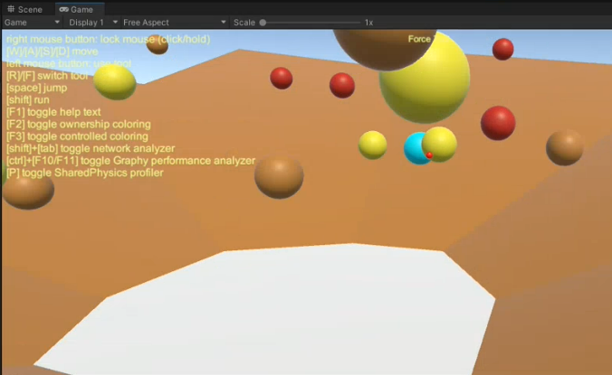

* Teleport an object to a new position and (optional) new rotation.

  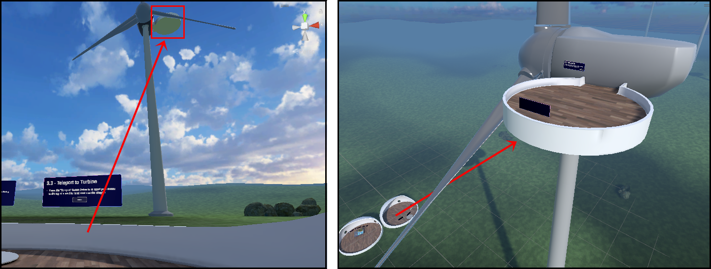

## Sample Projects that use Mesh Physics

In the Mesh Toolkit Samples folder, you'll find several projects that contain scenes that use Mesh Physics.

### DartRoom

The *DartRoom* project (scene: *DartRoom*) uses most physics features. In this project, you'll find:

* **Cups:** Simple objects to pick up.

* **Tables:** When grabbed, they try to align themselves with gravity.

* **Cupboards:** These should feel heavy. They use physics constraints.

* **Reset buttons (red):** Resets the transforms of a sub-scene.

* **Clock pendulums:** Powered by a physics hinge and velocity field.

* **Darts:** You can throw these in the camera direction. They're "sticky," so they'll stay attached to anything they hit.

* **Globe:** The globe rotates, demonstrating a motored hinge. The globe also has a gravity field which influences small objects entering a spherical trigger volume. Drag some cups close to the globe and watch them rotate around it like satellites.

  

This is a beautifully rendered scene that demonstrates the power of combining appealing visuals with the creative use of Mesh Physics features. Feel free to inspect the scene and play with it!

### Mesh 101 Tutorial

In the Mesh 101 tutorial (sample name: *Mesh101*), [Chapter 4](../getting-started/mesh-101-tutorial/mesh-101-04-physics.md) walks you step-by-step through the process of setting up three Mesh Physics features: grabbing and releasing objects, triggering an animation using a trigger volume, and constraining an object with a containment field. 

### Other projects with Mesh Physics

As you explore our other sample projects, you'll find various instances of Mesh Physics. For example, if you wander around in our *ScienceBuilding* project (scene: *ScienceBuilding*), you'll eventually encounter the **Mass & Buoyancy** exhibit which uses the **Buoyancy Field** and **Buoyancy Field Waves** components.

## Terminology

Throughout this article, "body" is used as shorthand for "Rigidbody."

## Overview

Mesh physics synchronizes the positions of rigid bodies and should work out-of-the-box, assuming all clients share the same scene. It also offers interaction and additional physics-related functionalities such as:

* various fields to physically influence bodies inside (buoyancy, gravity)
* various components to modify the behavior of individual bodies (magnetic, sticky, throwable)
* the ability to reset bodies to their startup positions (selective scene cleanup)
* Play Mode support for multi-user testing of the features above

## Distributed physics simulation

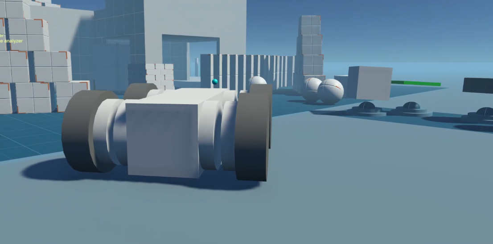

Most Unity physics features will be synchronized without extra developer effort:

* Rigidbodies, colliders, materials, constraints, etc.

**Notes:**

* Only rigidbody positions & orientations are synchronized with interpolation
* Discrete state changes (for example, breakable constraints) and trigger events must be avoided

Each client is responsible for simulating some of the bodies, called the distributed simulation "ownership". When a player touches a rigid body, simulation ownership is immediately transferred to allow low-latency interaction. For neighboring bodies, the physics synchronization engine performs local prediction, interpolation, and automatic ownership redistribution to minimize visual artifacts.

## Development

### Download the Dart Room sample

1. In your browser, navigate to the [Mesh Toolkit samples on GitHub](https://github.com/microsoft/Mesh-Toolkit-Unity/tree/main).

1. Click the green **Code** button and click **Download ZIP**.

1. Extract the ZIP file. This gives you a folder named **DartRoom** which contains your sample Unity project.

1. Open the sample project in Unity.

### Run the Project in "Play Mode"

The project is already configured to use Mesh Play Mode.

1. Open the project in Unity.
1. Navigate to the **Assets > Scenes** folder, and then load the **DartRoom** scene.
1. Click Play to try out the scene. When you're finished, exit Play mode.

### Run Split Screen with multiple players

By default, Mesh Playmode runs with a single player. To add a second player with emulated networking:

1. In the **Hierarchy**, select **PlaymodeSetup [NoUpload]**.
1. In the **Inspector**, navigate to the **Playmode Setup** component, then increase the Inital Screen Count 2.

  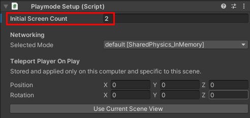

## General tips for building Mesh Physics experiences

You can start with [scanning the Unity physics docs](https://docs.unity3d.com/Manual/PhysicsOverview.html). There are plenty of resources available on how to optimize physics in Unity.

Mesh Physics comes with some extra challenges:

* **Make thick walls:** Network synchronization might move rigid bodies slightly. As a result, you will see some extra penetration between objects. Small dynamic bodies might get pushed through thin walls. For thicker objects and walls, these tunneling effects are less likely. So, if possible:
* Use convex hull or a small set of convex hulls for dynamic bodies
* Whenever possible, use thick convex pieces for static geometry. Try to avoid meshes, especially highly dense meshes.

* **Realistic masses in kg:** Content from various sources might interact in the same scene. This works well if the mass ratios between the objects are reasonable. A good starting point is to assign realistic masses to bodies using kg.

## Developing enhanced Mesh Physics content

### Auto-play animations

You can add auto-play animations to the scene that interact with physics bodies. Those animations are automatically synchronized across clients by temporarily adjusting their playback speed (slowing them down or speeding them up) on each client until all clients are in the same animation state at the same time.

**Settings**

* **Play Automatically** enabled.
* **Animate Physics** recommended (but not required) if the animation affects colliders that interact with physics bodies.
* **Culling Type** set to "Always Animate" (automatically enforced by Mesh Physics) because the animation might affect physics bodies even when they're off-screen.

The animation clip used by the auto-play animation can use any **Wrap Mode**. Useful choices are "Loop" and "Ping Pong".

Optionally, you can add the Shared Animation script to control the potential speed adjustment range. We recommend that you set the minimum relative speed to significantly less than 1 and the maximum relative speed to signficantly greater than 1 to allow Mesh Physics to quickly approach the synchronized state and to get insight into which colliders and kinematic rigid bodies Mesh Physics views as part of the animation.

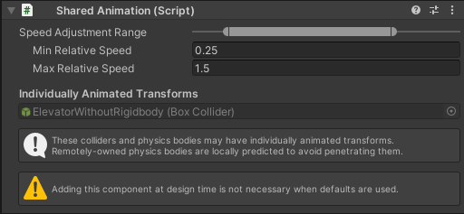

## Other (shared) physics behaviors

Adding one of the following `MonoBehaviour` components to an object will add the specific behavior to this object.

### Sticky Body

Makes bodies stick to other bodies. It could be used to throw darts at other bodies or to attach a picture on a wall. This is implemented by creating a fixed constraint between the two bodies involved.
**Note:** This operation is performed on all clients and therefore is implemented as a special network message.

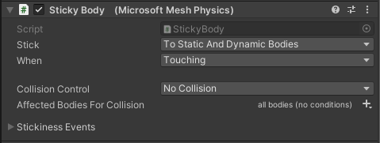

**Settings**

* **Stick:** Defines if the body will stick to dynamic or/and static bodies.
* **When:** Sometimes you want to stick a fast body when it just touches another body, and sometimes you want to stick a body when it is held against another body for a given time, like waiting for glue to harden when you glue a button on a wall.
* **Collision Control** To disable specific collisions between one body and another. Normally you can/should use collision layers. However, since there are only 32 hard-coded collision layers in Microsoft Mesh, this might not be an option. Here you can disable specific bodies.
* **Affected Bodies For Collision** Body filter applied for **Collision Control**.
* **Stickiness Events** Allows for triggering events in response to stick/unstick events.

### Containment Field

Ensures that rigid bodies stay within the boundaries of one or several trigger colliders.

For this component to work, it needs to be attached to one or several trigger colliders. (These trigger colliders can also be nested in the transform hierarchy below the `GameObject` that has this component attached.)

The rigid bodies affected by this component must already be within the boundaries of its trigger colliders (the "trigger volume") when the scene starts. The center of mass of each of these rigid bodies will then be constrained to stay within the boundaries of the trigger volume – it won't be possible to pull or otherwise move the centers of mass of these rigid bodies anywhere outside.

**Settings:**

* **Max Deviation From Containment** allows the center of mass of an affected rigid body to slightly go outside of the trigger volumes before it snaps back in. This is a performance optimization trade-off: if the allowed max deviation is large, the body might visibly leave the trigger volume and snap back, but the code can avoid having to check and verify the body's position very often when it's resting or moving slowly inside of the trigger volume.

* **Affected Bodies** defines [optional filtering conditions](#common-settings-body-filters) for the bodies affected by this component. (By default, all bodies are affected.)

### Velocity Vector Field

Allows to accelerate/decelerate a rigid body until it reaches a specific target velocity.

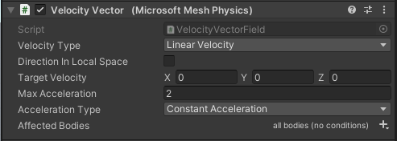

This component controls both the magnitude and the direction of velocity. See [Velocity Magnitude Field](#velocity-magnitude-field) to control only magnitude and [Velocity Direction Field](#velocity-direction-field) to control only direction.

This component has two modes of operation:

* If attached to a rigid body, this rigid body will be controlled.
* If attached to a trigger collider, all rigid bodies entering this trigger volume will be affected.

**Settings:**

* **Velocity Type** defines whether we are working on linear or angular velocity.  
* **Direction in Local Space** defines whether target velocity is specified in the local space of the object the component is attached to.  
* **Target Velocity** sets the desired velocity vector in meters/second (or radians/second in case of angular velocity).  
* **Max Acceleration** defines the maximum acceleration applied to reach target velocity.  
* **Acceleration Type** defines a type of acceleration to reach a target velocity.  
  * **Instantaneous** will reach the target velocity immediately (Same as **Constant Acceleration** with **Max Acceleration** = Infinity).  
  * **Constant Acceleration** will ensure the body reaches target velocity no matter what within the limits of the **Max Acceleration** setting.  
  * **Smooth Approach** reduces acceleration the closer you get to target velocity. This means that, in practice, you will never reach the target velocity. Also, should there be any external influence, like going uphill or downhill, this extra influence will not be completely overridden, resulting in going faster downhill than uphill.  
* **Affected Bodies** defines [optional filtering conditions](#common-settings-body-filters) for the bodies affected by this component. (By default, all bodies are affected.)

### Scaled Gravity Field

Changes how gravity affects rigid bodies within the boundaries of one or several trigger colliders.

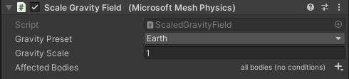

For this component to work, it needs to be attached to one or several trigger colliders. (These trigger colliders can also be nested in the transform hierarchy below the `GameObject` that has this component attached.)

Any rigid bodies that touch or overlap the trigger colliders (the "trigger volume") behave according to the gravity settings of this component rather than global physics gravity. Rigid bodies that have **Use Gravity** disabled are ignored.

There is an interesting relationship between the perception of the player's own size in the world and gravity:

* If gravity is **less** than what we're used to (objects are slower when they fall), the player perceives themselves to be larger – like a giant.
* If gravity is **greater** than what we're used to (objects are faster when they fall), the player perceives themselves to be smaller – like a mouse.

**Settings:**

* **Gravity Preset** allows the selection of several interesting and useful presets for the **Gravity Scale** property: various celestial bodies (Moon, Mars, Earth, Jupiter), no gravity (Outer Space), or inverted gravity (Upside Down). You can always overwrite the **Gravity Scale** with any value you like.
* **Gravity Scale** sets the local gravity inside the trigger volume in relation to the default physics gravity affecting the scene. The default gravity scale of 1 leaves gravity unaffected; larger values increase gravity; 0 removes gravity; negative values switch the direction of gravity.
* **Affected Bodies** defines [optional filtering conditions](#common-settings-body-filters) for the bodies affected by this component. (By default, all bodies are affected.)

### Orbital Gravity Field

Simulates the gravity of a "toy planet" in your scene.

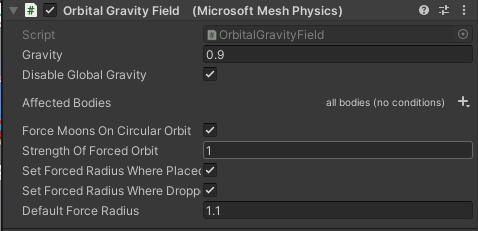

For this component to work, it needs to be attached to one or several trigger colliders. (These trigger colliders can also be nested in the transform hierarchy below the `GameObject` that has this component attached.)

Any rigid bodies that touch or overlap the trigger colliders (the "trigger volume") are pulled towards the position of the object that has this component attached.

**Settings:**

* **Gravity** defines the magnitude of gravity. This is the acceleration of the orbiting body (the "moon") towards the central body at a one-meter distance. Since the orbital velocity is sqrt(gravity/radius), this value describes the velocity² of a moon in a stable orbit at a radius of one meter.
* **Disable Global Gravity** disables the scene's global physics gravity setting for bodies affected by this component. By default, the global scene gravity will still affect your planet and its moons.
* **Affected Bodies** defines [optional filtering conditions](#common-settings-body-filters) for the bodies that can become moons in this gravity field.

* **Force Moons On Circular Orbit** is a cheat that applies some gentle forces to push the moon into a circular orbit. The motivation is that it is hard for a non-expert to set gravity and initial velocity of the bodies in a way to achieve a circular orbit. Additionally, if this option is enabled, any moons that are placed inside the gravity field in Unity Editor automatically start orbiting their central body when the scene is loaded.
* **Strength Of Forced Orbit** scales the acceleration applied to force the moon onto a circular orbit.
* **Set Forced Radius Where Placed** makes moons that are placed inside the gravity field in Unity Editor automatically adopt their initial distance from the central body as their preferred orbit.
* **Set Forced Radius Where Dropped** makes moons that are interactively grabbed and moved into the gravity field automatically adopt the distance from the central body at which they were dropped as their preferred orbit.
* **Default Force Radius** defines the default radius for the above cheat that's used unless overridden by any of the other options.

### Buoyancy Field

Simulates buoyancy of arbitrary rigid bodies on water: Bodies appear to float on the connected trigger volume.

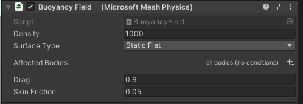

For this component to work it needs to be attached to one or several trigger colliders. (These trigger colliders can also be nested in the transform hierarchy below the `GameObject` that has this component attached.)

Any rigid bodies that touch or overlap the trigger colliders (the "trigger volume") experience buoyancy forces (upthrust) to keep them afloat.

This component uses the shape of the rigid body's colliders to calculate its density (in other words, volume divided by mass), buoyancy, drag, and friction.

### Buoyancy Colliders

**Benefit**: Performance. The compute cost of the buoyancy calculations scales linearly with the number of collider vertices. Typical physics colliders for bodies, even if already simplified, are often significantly more complex (in terms of number of vertices) than requiresd for buoyancy to work well enough.

**How to use**: Add one (or several) additional colliders (they can be disabled) to a body. Mark the colliders as explicit buoyancy hulls by assigning a physics material named `BuoyancyHull` (exact spelling matters!) to them. The configuration details of this physics material don't matter--a suitable physics material is supplied with the Mesh Physics package. If a body has any colliders marked like that, only these colliders are used for buoyancy calculations; all other colliders are ignored.

**Best practices**: Explicit buoyancy hull colliders to any Rigidbody that can possibly be thrown into a *BuoyancyField*. It's best (and easiest) to use Cube colliders because they have the fewest vertices (eight per collider). Matching the exact visual shape of the buoyant body usually isn't required for a good result; a very coarse approximation is usually totally sufficient.

**Settings:**

* **Density** is the density of the simulated liquid that "fills" the trigger volume in kilograms per cubic meter. (The default represents the approximate density of water at room temperature.)
* **Surface Type** specifies how the component samples the shape of the water surface to calculate buoyancy forces.
  * **Static Flat** assumes that the water surface is perfectly planar and never moves from its initial position in the scene. The position and orientation of the water surface is determined just once, when the scene starts. This is the computationally cheapest option.
  * **Dynamic Flat** assumes that the water surface is perfectly planar but allows that it can move (for example, the water level can rise or sink). The position and orientation of the water surface is determined once per frame.
  * **Dynamic Flat Per Body** supports a water surface that isn't planar (for example, it can be wavy). For each rigid body floating on the water surface, a local planar approximation of the water surface underneath the rigid body is determined once per frame, which is then used to calculate buoyancy forces for this rigid body.
* **Affected Bodies** defines [optional filtering conditions](#common-settings-body-filters) for the bodies that can float in this buoyancy field. (By default, all bodies are eligible.)
* **Drag** controls movement resistance as the rigid body hits the water (in other words, friction orthogonal to the body's surface).
* **Skin friction** controls movement resistance as the rigid body is moved through the water (in other words, friction parallel to the body's surface).

**Important!** To allow the component to access a rigid body's collider mesh triangles, the "Read/Write Enabled" checkbox must be set in the collider mesh's Import settings. Otherwise the body will be ignored by the buoyancy field and fall through the field without being affected by it.

**Important!** Make sure that your physics bodies have plausible masses to ensure they behave as expected in a buoyancy field:

* If the mass of a rigid body is implausibly high compared to its volume, it will sink to the bottom.
* If the mass of a rigid body is implausibly low compared to its volume (for example, Unity's `Rigidbody` default of one unit of mass), it will just sit on top of the simulated liquid.

By default, the buoyancy field samples the surface of the trigger volume to determine the shape of the water surface (subject to chosen the **Water Surface Type** setting). Surfaces animated in CPU memory can be sampled that way, but surfaces animated by a GPU vertex shader are not visible to the script at runtime. The `BuoyancyField` component provides a script-accessible callback delegate named `GetDistanceFromSurface` that allows external scripts to supply information about a GPU-animated water surface shape.

See the `BuoyancyFieldWaves` component below for how to get a wavy water surface with a no-code approach.

### Buoyancy Field Waves

Add-on to the `BuoyancyField` component that works with a specific vertex shader, `BuoyancyFieldWaves_VertexPosition` (available both as a sub-shader graph and an HLSL include file), to create the visual effect of a wavy water surface together with corresponding behavior of objects floating on the water surface.

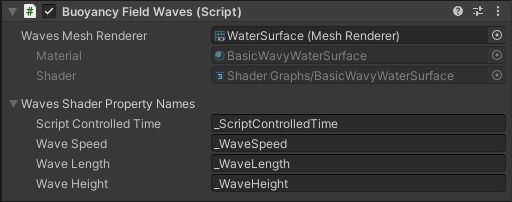

This component must be added to a game object that already has a `BuoyancyField` component added to it.

The water surface to be animated must be supplied as a flat, tesselated mesh whose boundaries are of the desired shape of the water surface when seen from the top down. The material used for the water surface must use a shader that incorporates the `BuoyancyFieldWaves_VertexPosition` sub-shader to determine the mesh's vertex positions. You can use the included sample `BasicWavyWaterSurface` material (and the shader graph with the same name) as a starting point for your own shader developments.

**Settings:**

* **Waves Mesh Renderer** references the `MeshRenderer` component that renders the water surface mesh.
  * **Material** shows which material is used by the renderer. This is for information only.
  * **Shader** shows which shader is used by the material. This is for information only.
* **Waves Shader Property Names** defines the names of required shader properties that must be exposed by the shader. These properties are accessed by this component at runtime to ensure that the buoyancy field's behavior stays in sync with the water surface visuals across all clients.
  * **Script Controlled Time** is the name of an exposed `float`-type shader property that will be *continually updated* by this component every frame with a continually increasing time (measured in seconds) that is synchronized across all clients. The `BuoyancyFieldWaves_VertexPosition` sub-shader uses this shared time to create a wave pattern that remains in sync on all clients and in sync with the behavior of the buoyancy field.
  * **Wave Speed** is the name of an exposed `float`-type shader property that determines the *base speed* at which the waves propagate horizontally. The property value itself must be set in the material applied to the wave surface mesh. Setting this to zero makes the wave surface become static and unmoving.
  * **Wave Length** is the name of an exposed `float`-type shader property that determines the *coarseness* of the wave pattern. The property value itself must be set in the material applied to the wave surface mesh. Smaller values produce short ripples; larger values produce long, sweeping waves.
  * **Wave Height** is the name of an exposed `float`-type shader property that determines the *base height* of the waves. The property value itself must be set in the material applied to the wave surface mesh. Setting this to zero makes the wave surface become completely flat.

The included sample `BasicWavyWaterSurface` shader graph (used by the material with the same name) uses the required `BuoyancyFieldWaves_VertexPosition` vertex sub-shader to produce the wavy 3D surface, but only includes a minimal stand-in implementation for the fragment shader, which makes it render the surface as an unshaded, plain-colored, semi-transparent mesh.

You can customize the **Fragment** path of a shader used with the `BuoyancyFieldWaves` component completely to your liking. However, it's essential that the **Vertex** path of your shader uses the `BuoyancyFieldWaves_VertexPosition` sub-shader graph and that it exposes the four inputs to this sub-shader graph as `float`-type shader properties of the overall shader graph so that the component can access them at runtime. If your shader fails to include the required sub-shader graph or if any of the required shader properties aren't exposed, the component's inspector will display an error message at design time and buoyancy will fail to work at runtime:

The sample `BasicWavyWaterSurface` shader graph can serve as a stand-in during content development and as a starting point for your own shader developments. Alternatively, you can take an existing water surface shader, keep its **Fragment** path, and only replace its **Vertex** path.

### Max Angular Velocity

Overrides the default maximum angular velocity of a physics body.

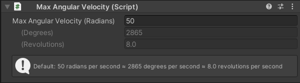

The physics engine won't allow the rigid body to exceed this angular velocity. This can be useful to either limit the rolling speed of a given rigid body or to allow it to roll faster than the physics default, which is 50 radians per second (approximately 8 revolutions per second).

The maximum angular velocity must be entered in radians per second. The entered value is also displayed in degrees per second (180 degrees ≈ 3.14 radians) and revolutions per second (1 revolution = 360 degrees ≈ 6.28 radians).

### Velocity Magnitude Field

Allows acceleration/deceleration of a rigid body until it reaches a speed that's within an allowable range.

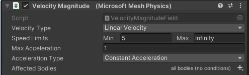

This component controls the magnitude of the velocity and keeps the current direction. Should the object be still, it chooses a random direction for the duration of one frame.

This component has two modes of operation:

* If attached to a rigid body, this rigid body will be controlled.
* If attached to a trigger collider, all rigid bodies entering this trigger volume will be affected.

**Settings:**

* **Velocity Type** defines whether we are working on linear or angular velocity.
* **Speed Limits** sets the desired limits of minimum and maximum speed in meters/second (or radians/second in case of angular velocity). If the current speed is below the minimum it will accelerate, if it is more than the maximum the body will decelerate. If the current speed is already within the limits, the script has no effect. To set a specific target speed, set minimum and maximum to the same value.
* **Max Acceleration** defines the maximum acceleration applied to reach target velocity.
* **Acceleration Type** defines a type of acceleration to reach a target velocity.
  * **Instantaneous** will reach the speed limit immediately (Same as **Constant Acceleration** with **Max Acceleration** = Infinity).
  * **Constant Acceleration** will ensure the body reaches target velocity no matter what within the limits of the **Max Acceleration** setting.
  * **Smooth Approach** reduces acceleration the closer you get to target velocity. This means that, in practice, you will never reach the target velocity. Also, should there be any external influence, like going uphill or downhill, this extra influence will not be completely overridden, resulting in going faster downhill than uphill.
* **Affected Bodies** defines [optional filtering conditions](#common-settings-body-filters) for the bodies affected by this component. (By default, all bodies are affected.)

### Align Field

Aligns the body to the specified axis.

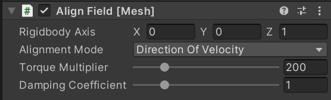

This component adds torque to the body to align it to a specific direction. Note that torque is always applied in the direction that rotates the body towards the target.

This component has two modes of operation:

- If attached to a rigid body, this rigid body will be aligned.
- If attached to a trigger collider, all rigid bodies entering this trigger volume will be aligned.

**Settings:**

- **Rigidbody Axis** sets the axis of the affected rigidbody which is to be aligned to the target.
- **Alignment Mode** provides different modes to specify target alignment:
  - **In Global Space** to specify target alignment in global Space.
  - **In Local Space** to specify target alignment in local Space (only makes sense with trigger volume).
  - **Direction Of Velocity** to align the body to its linear velocity.
  - **Towards Game Object** to align the body towards a target gameobject.
- **Target Alignment** sets the target direction of the alignment. (Only when **Alignment Mode** is set to **In Global Space** or **In Local Space**.)
- **Target Game Object** sets the target direction of the alignment. (Only when **Alignment Mode** is set to **Towards Game Object**.)
- **Torque Multiplier** scales the applied torque to reach the target alignment, higher multiplier rotates the body faster (between 1 and 1000).
- **Damping Coefficient** sets the damping factor (between 0 and 5). When set below 1, the body might oscillate around target orientation.
* **Affected Bodies** defines [optional filtering conditions](#common-settings-body-filters) for the bodies affected by this component. (By default, all bodies are affected.)

### Velocity Direction Field

Allows to steer a rigid body until the velocity reaches a target direction.

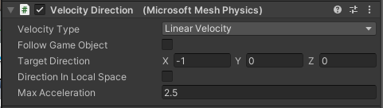

This component controls only the direction of the velocity and keeps the current speed.

This component has two modes of operation:

* If attached to a rigid body, this rigid body will be controlled.
* If attached to a trigger collider, all rigid bodies entering this trigger volume will be affected.

**Settings:**

* **Velocity Type** defines whether we are working on linear or angular velocity.
* **Follow Game Object** defines whether the target is a predefined direction or a direction towards a specific Game Object. Only works for linear velocity.
* **Target Body** sets the desired follow direction in case **Follow Game Object** is set to true.
* **Target Direction** sets the desired direction. This value is normalized, so magnitude has no effect.
* **Direction In Local Space** defines whether the direction is specified in a local transform of the explosion.
* **Max Acceleration** defines the maximum acceleration applied to reach target velocity.
* **Acceleration Type** defines a type of acceleration to reach a target velocity.
  * **Instantaneous** will reach the target direction immediately (Same as **Constant Acceleration** with **Max Acceleration** = Infinity).
  * **Constant Acceleration** will ensure the body reaches target velocity no matter what within the limits of the **Max Acceleration** setting.
  * **Smooth Approach** reduces acceleration the closer you get to target velocity. This means that, in practice, you will never reach the target velocity. Also, should there be any external influence, like going uphill or downhill, this extra influence will not be completely overridden, resulting in going faster downhill than uphill.
* **Affected Bodies** defines [optional filtering conditions](#common-settings-body-filters) for the bodies affected by this component. (By default, all bodies are affected.)

### Magnetic Body

Gives body a magnetic property which attracts or repels other bodies.

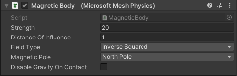

For this component to work, it needs to be attached to one or several colliders. (These colliders can also be nested in the transform hierarchy below the `GameObject` that has this component attached.)
Each collider exhibits a force on other rigidbodies that are close enough to this collider.

**Settings:**

* **Strength** defines the acceleration of the magnet at the point of contact (when the distance between colliders is zero).
* **Distance Of Influence** controls the range of the magnetic force. Magnetic force is applied only if the shortest distance between colliders is smaller.
* **Field Type** defines how the magnetic force weakens with the distance.
  * **Constant** assumes that the magnetic force is the same independent of the distance.
  * **Linear** assumes that the magnetic force drops linearly from **Strength** to zero (at the **Distance Of Influence**).
  * **Inverse** assumes an inversely proportional dependence to the distance.
  * **Inverse Squared** assumes an inversely proportional dependence to the distance squared (similar to a real magnet).
* **Magnetic Pole** controls which objects are attracted or repeled to this object.
  * **North Pole** attracts **South Pole** and repels **North Pole**.
  * **South Pole** attracts **North Pole** and repels **South Pole**.
  * **Magnetic** attracts both **South Pole** and **North Pole**.
* **Disable Gravity On Contact** If enabled **and** **Strength** of the magnet is two times bigger than gravity, gravity is disabled for bodies which are in contact with this magnet. One of the objects must be static for this to take an affect. This is often used to prevent sliding of bodies down the wall.

### Spherical Explosion

Creates an explosion which causes all bodies within a specific radius to move outwards.

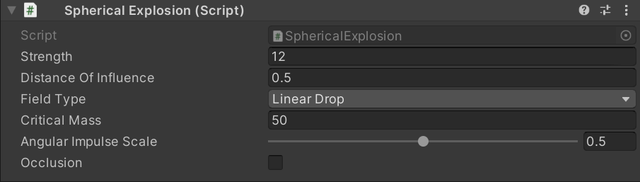

The explosion force depends on the mass of a rigid body (and potentially the distance from the explosion center).

**Settings:**

* **Strength** defines the effect of explosion on bodies in meters/second. The actual velocity change is less depending on the **Explosion Type** and **Critical Mass** (see below).
* **Distance Of Influence** controls the range of the explosion force.
* **Field Type** defines how the explosion effect weakens with the distance.
  * **Constant** assumes that the effect is independent from the distance.
  * **Linear Drop** assumes that the effect drops from maximum to zero (at the **Distance Of Influence**).
* **Critical Mass** defines the mass of the body not affected by the explosion. Heavier bodies feel less effect than ligher bodies. For example rigidbody that weighes one third of **Critical Mass** will feel two thirds of the **Velocity Change**.
* **Angular Impulse Scale** defines where the force is applied.If 0, force is applied at the centre of mass which means no rotation. If 1, force is applied at the closest point to the explosion.
* **Occlusion** If enabled, objects hidden behind other objects do not feel explosion. Only a single ray between the center of explosion and the center of mass is checked for occlusion.

### Directional Explosion

Creates an explosion which causes all bodies within a trigger to move in a specific direction.

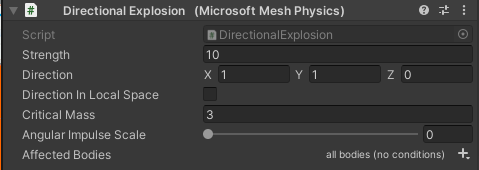

The explosion force depends on the mass of a rigid body.
For this component to work, it needs to be attached to a trigger colliders. All bodies within trigger collider are affected.

**Settings:**

* **Strength** defines the effect of explosion on bodies in meters/second. The actual velocity change is less depending on the **Critical Mass** (see below).
* **Direction** defines the direction of explosion. This value is normalized, so magnitude has no effect.
* **Direction In Local Space** defines whether the direction is specified in a local transform of the explosion.
* **Critical Mass** defines the mass of the body not affected by the explosion. Heavier bodies feel less effect than ligher bodies. For example rigidbody that weighes one third of **Critical Mass** will feel two thirds of the **Velocity Change**.
* **Angular Impulse Scale** defines where the force is applied.If 0, force is applied at the centre of mass which means no rotation. If 1, force is applied at the closest point to the explosion.
* **Affected Bodies** defines optional filtering conditions for the bodies affected by this component. (By default, all bodies are affected.)

### Joint Stabilization

Stabilizes constraint system by adjusting the rigidbody's inertia tensor.

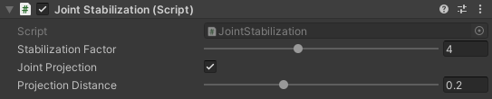

The script works on all children with Rigidbody and Joint component attached.

**Settings:**

* **Stabilization Factor** defines how much you sacrifice physical correctness for stability. For example, 1 -> mostly physics correct, 4 -> compromise, 10 -> stable with atifacts.
* **Joint Projection** enables constraint projection on all children, this can dramatically improve stability but sacrifices physical correctness. (Only works on Configurable and Character Joints.)
* **Projection Distance** defines maximum allowed violation of constraints, try to set this value as high as possible to avoid physics issues.

### Bouncing Surface

Creates a bouncing surface which causes all colliding objects to bounce off with a predefined velocity.

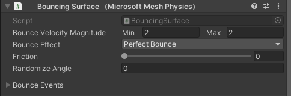

**Settings:**

* **Bounce Velocity Magnitude** defines the min and max velocity magnitude of the object after the bounce. See **Bounce Effect** for how direction is determined. Set min and max to equal value if you want to specify a single target velocity.
* **Bounce Effect** defines the intended behaviour of bouncing objects
  * **Perfect Bounce** the angle of incoming velocity to the collision plane normal is the same as the angle of outgoing velocity.
  * **Set Velocity Magnitude** the angle of the outgoing velocity to normal is affected by friction.
  * **Set Normal Velocity** similator to **Set Velocity Magnitude** but the **Bounce Velocity Magnitude** defines the magnitude of the velocity perpendicular to plane (normal velocity).
  * **Bounce Towards Target Body** the direction of outgoing velocity is directed towards a target Body.
* **Target Body** has to be set if **Bounce Effect** is equal to **Bounce Towards Target Body**.
* **Friction** controls how much tangential velocity is lost upon collision. When set to 0, the bouncing object retains tangential velocity. When set to 1, the object bounces in direction perpendicular to the surface (tangential velocity is 0). For values more than 1, object bounces backwards.

### Center Of Mass Offset

Offsets the center of mass of a rigidbody.

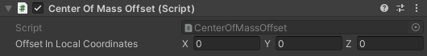

**Settings:**

* **Offset In Local Coordinates** defines the offset in local coordinates.

### Local Physics Scope

All rigidbodies in the scene hierarchy under this component will not be synced among clients.
This script should be added to rigidbodies whose positions or rotations are set through a visual script or an animation.

### Throw Trajectory

Calculates the rigidbody's future position in free space under the effect of gravity.

**Settings:**

- **Rigidbody Mode**: When set to true, the rigidbody position and velocity are taken as initial conditions. Enables real time future position calculation.
- **Rigidbody**: Defines which rigidbody is taken. This only applies when **Rigidbody Mode** is set to *true*.
- **Initial Velocity**: Defines the initial velocity (this applies only when **Rigidbody Mode** is set to false). The initial position is taken from the position of the GameObject this component is attached to.
- **Max Number Of Points** defines maximum number of calculated points.
- **Time Step**: Defines the time difference between the future positions.
- **Gravity** is the gravitational acceleration.
- **Line Renderer**: Specifies the line renderer the position of points are copied to. This displays the throw trajectory.

## Common Settings: Body Filters

Some components, such as Sticky Body, have a **Body Filter** setting (usually named **Affected Bodies**).

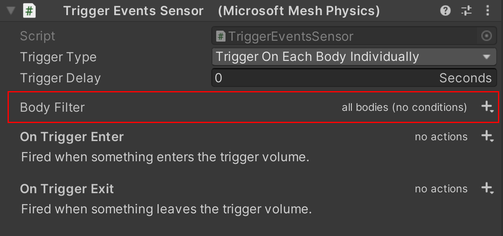

This setting makes only Game Objects that meet certain preconditions eligible to trigger events. There are four main preconditions&#8212;to view them, click the plus sign ("+") button to the right of **Body Filter:**

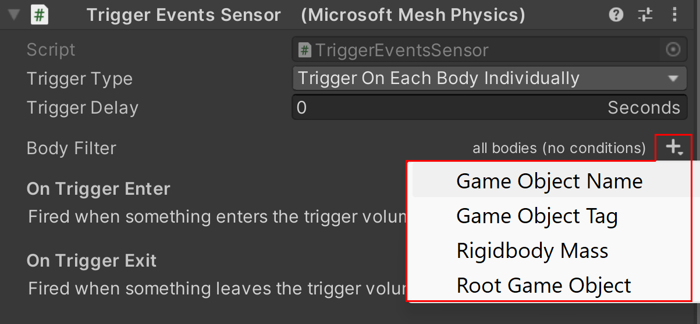

To understand the first precondition, **Game Object Name**, let’s imagine that there’s a dart game in your scene and you have numerous dart Game Objects that are named Dart01, Dart02, Dart03, and so on. You want any dart, but *only* darts, to be eligible to trigger events, so you filter for any Game Object that starts with the four letters "Dart".

1. Click the **Body Filter** "+" button and then select **Game Object Name**.  
1. In the text box next to **Starts With**, type in "Dart."

    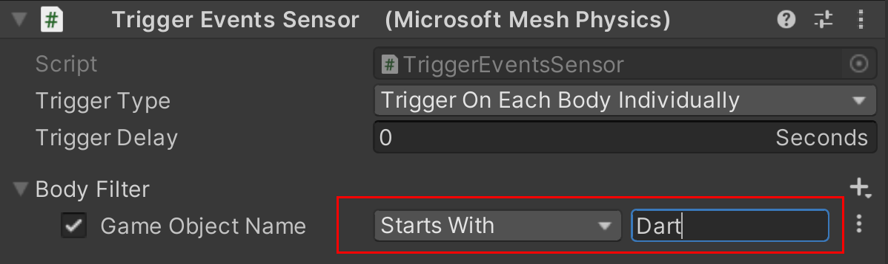

You aren’t restricted to just using **Starts With**. You can filter for exact names, or only names that *end* with certain letters, and more. To see all your options, click the **Starts With** drop-down.

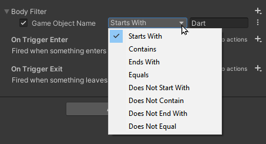

**Notes**

* Having multiple instances of the **Game Object Name** condition can make sense in certain situations&#8212;for example, to filter for names that have a given prefix *and* a given suffix.

* Text is case-sensitive.

**To filter for bodies based on their tag:**

* Click the **Body Filter** "+" sign and then select **Game Object Tag**.

The options for this condition are similar to the options for Game Object Name.

**Note:** Tag comparison is case-**in**sensitive.

**IMPORTANT:** Unity allows you to create custom tags, but you can’t use custom tags in Mesh. You must choose one of the pre-defined tags that Unity provides.

**To filter for bodies based on their mass:**

1. Click the **Body Filter** "+" sign and then select **Rigidbody Mass**.
1. Enter the minimum and maximum mass values a Game Object must have in order to trigger events.

**Important:** We recommend that you *don’t* have more than one instance of this condition active at any time. You can accommodate all potential Game Objects using a single Min/Max range.

**To filter for bodies based on their root Game Object:**
Let’s say you have a root Game Object named "Robot" in your scene. Robot has numerous child objects&#8212;arms, legs, and so on&#8212;and these have their own child objects. You want Robot and any of the Game Objects in its hierarchy to be eligible to trigger events.

1. Click the **Body Filter** "+" sign and then select **Root Game Object**.
1. Do one of the following:

* Drag the Game Object from the **Hierarchy** and then drop it in the **Root Game Object** field.

    -or-

* Click the round button in the **Root Game Object** field …

    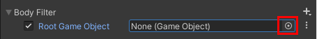

    … then, in the **Select GameObject** window, type in the name of Game Object you want to add, and then, in the resulting list, double-click the name of the Game Object.

    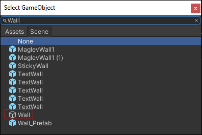

Note that in this example, there are two animal robot types in the scene. If you wanted *all* robots to be eligible for triggering, you could add a **Game Object Name** condition that contains the text "Robot" anywhere in the name.

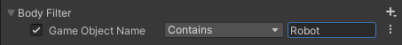

**Important:** We recommend that you *don’t* have more than one instance of this condition active at any time. This can cause conflicts.

**Filtering with Multiple Conditions**

You can have more than one filter in your condition. For example, let’s say you want only larger or heavier robots&#8212;ones with a higher Mass value&#8212;to trigger events. You could search for Game Object names that contain "Robot" that have a minimum mass value of 100:

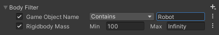

**Note:** If multiple conditions are defined, a body must match *all* of the conditions to be eligible for triggering events.

**Options on the 3-dot menu**

Each condition has a 3-dot menu with several options.

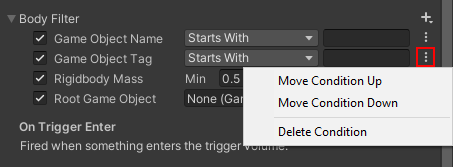

**Move Condition Up:** Moves the condition one position higher in the **Body Filter** list.

**Move Condition Down:** Moves the condition one position lower in the **Body Filter** list.

**Delete Condition:** Removes the condition from the **Body Filter** list.

**To make a condition active or inactive:**
Select or clear the checkbox to the left of the condition name.

## Next steps

> [!div class="nextstepaction"]
> [Multi-room sync (animations, timelines, and video)](multi-room-sync.md)
