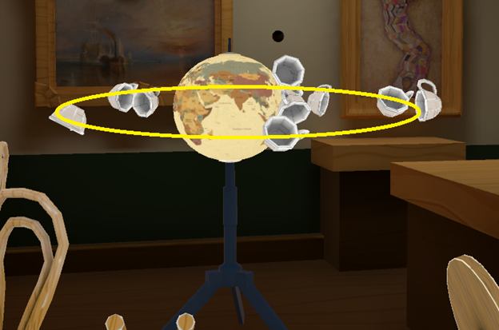
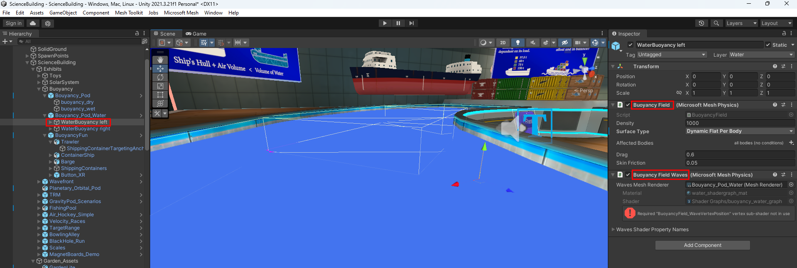
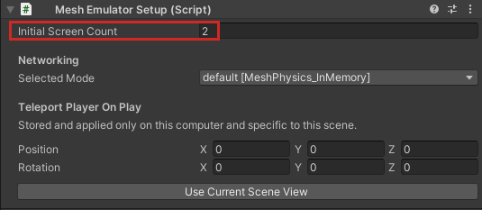

# Explore Mesh Physics in sample projects

In the Mesh toolkit Samples folder, you'll find several projects that contain scenes that use Mesh Physics.

## DartRoom

The *DartRoom* project (scene: *DartRoom*) uses most physics features. In this project, you'll find:

* **Cups:** Simple objects to pick up.

* **Tables:** When grabbed, they try to align themselves with gravity.

* **Cupboards:** These should feel heavy. They use physics constraints.

* **Reset buttons (red):** Resets the transforms of a sub-scene.

* **Clock pendulums:** Powered by a physics hinge and velocity field.

* **Darts:** You can throw these in the camera direction. They're "sticky," so they'll stay attached to anything they hit.

* **Globe:** The globe rotates, demonstrating a motored hinge. The globe also has a gravity field which influences small objects entering a spherical trigger volume. Drag some cups close to the globe and watch them rotate around it like satellites.

This is a beautifully rendered scene that demonstrates the power of combining appealing visuals with the creative use of Mesh Physics features. Feel free to inspect the scene and play with it!

## Mesh 101 Tutorial

In the Mesh 101 tutorial (sample name: *Mesh101*), [Chapter 4](../../getting-started/mesh-101-tutorial/mesh-101-04-physics.md) walks you step-by-step through the process of setting up three Mesh Physics features: grabbing and releasing objects, triggering an animation using a trigger volume, and constraining an object with a containment field. 

## Other projects with Mesh Physics

As you explore our other sample projects, you'll find various instances of Mesh Physics. For example, if you wander around in our *ScienceBuilding* project (scene: *ScienceBuilding*), you'll eventually encounter the **Mass & Buoyancy** exhibit which uses the **Buoyancy Field** and **Buoyancy Field Waves** components.

## Exploring Mesh physics in the Dart Room sample

### Download the Mesh toolkit

1. In your browser, navigate to the [Mesh toolkit samples on GitHub](https://github.com/microsoft/Mesh-Toolkit-Unity/tree/main).

1. Click the green **Code** button and click **Download ZIP**.

1. Extract the ZIP file. This gives you a folder named **DartRoom** which contains your sample Unity project.

1. Open the sample project in Unity.

### Run the Project in Mesh Emulation Mode

The project is already configured to run in [Mesh Emulation Mode](../../debug-and-optimize-performance/mesh-emulator.md).

1. Open the project in Unity.
1. Navigate to the **Assets > Scenes** folder, and then load the **DartRoom** scene.
1. Click Play to try out the scene. When you're finished, exit Play mode.

### Run Split Screen with multiple players

By default, Mesh Emulation Mode runs with a single player. To add a second player with emulated networking:

1. In the **Hierarchy**, select **MeshEmulatorSetup [NoUpload]**.
1. In the **Inspector**, navigate to the **Mesh Emulator Setup** component, then increase the Inital Screen Count to 2.

    

  ## Next steps

> [!div class="nextstepaction"]
> [Mesh Physics Programmer's Guide](mesh-physics-programmers-guide.md)