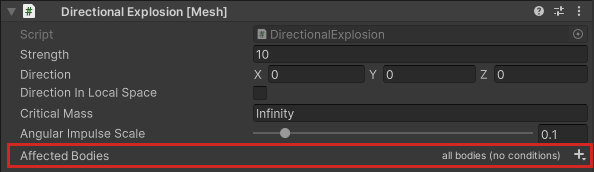
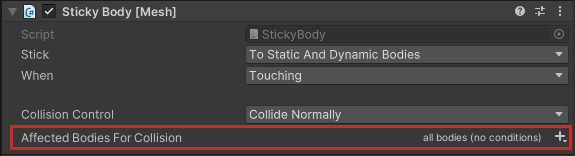
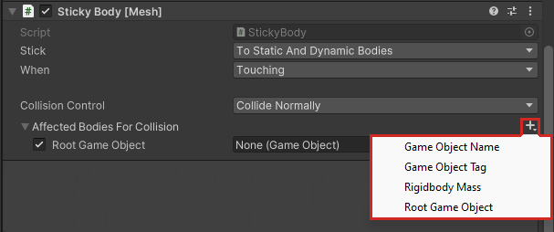
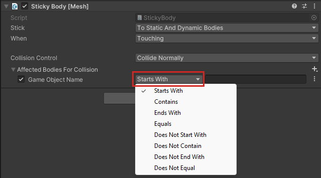
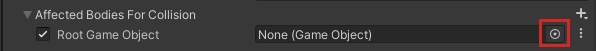
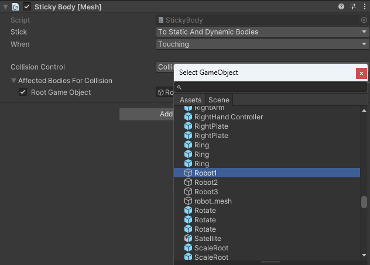
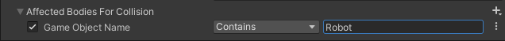
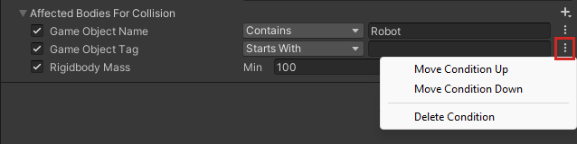

# Set conditions for affecting Rigidbodies

In the Mesh component UIs, and in this article, we use "body/bodies" as shortcuts for "Rigidbody/Rigidbodies."

Some components have a property named **Affected Bodies** ...

... or **Affected Bodies for Collision**.

This setting makes only bodies that meet certain preconditions affected by the component (in the case of "Affected Bodies") or affected when they collide with the body the component is attached to (in the case of "Affected Bodies for Collision"). There are four main preconditions:

1. **Game Object Name**
2. **Game Object Tag**
3. **Rigidbody Mass**
4. **Root Game Object**

To view the preconditions, click the plus sign ("+") drop-down.

To understand the first precondition, **Game Object Name**, let’s imagine that there’s a dart game in your scene and you have numerous dart GameObjects that are named Dart01, Dart02, Dart03, and so on. You want any dart, but *only* darts, to be affected by the component, so you filter for any GameObject that starts with the four letters "Dart".

1. Click the **Body Filter** "+" drop-down and then select **Game Object Name**.  
1. In the text box next to **Starts With**, type in "Dart."

    

You aren’t restricted to just using **Starts With**. You can filter for exact names, or only names that *end* with certain letters, and more. To see all your options, click the **Starts With** drop-down.

**Notes**

* Having multiple instances of the **Game Object Name** condition can make sense in certain situations&#8212;for example, to filter for names that have a given prefix *and* a given suffix.

* Text is case-sensitive.

**To filter for bodies based on their tag:**  
* Click the **Body Filter** "+" drop-down and then select **Game Object Tag**.

The options for this condition are similar to the options for *Game Object Name*.

**Note:** Tag comparison is case-*in*sensitive.

**IMPORTANT:** Unity allows you to create custom tags, but you can’t use custom tags in Mesh. You must choose one of the pre-defined tags that Unity provides.

**To filter for bodies based on their mass:**  
1. Click the **Body Filter** "+" drop-down and then select **Rigidbody Mass**.
1. Enter the minimum and maximum mass values a GameObject must have in order to be affected.

**Important:** We recommend that you *don’t* have more than one instance of this condition active at any time. You can accommodate all potential GameObjects using a single Min/Max range.

**To filter for bodies based on their root GameObject:**  
Let’s say you have a root GameObject named "Robot1" in your scene. Robot1 has numerous child objects&#8212;arms, legs, and so on&#8212;and these have their own child objects. You want Robot1 and any of the GameObjects in its hierarchy to be affected by the component.

1. Click the **Body Filter** "+" drop-down and then select **Root Game Object**.
1. Do one of the following:

* Drag the GameObject from the **Hierarchy** and then drop it in the **Root Game Object** field.

    -or-

* Click the round button in the **Root Game Object** field …

    

    … then, in the **Select GameObject** window, search for GameObject you want to add, and then, in the resulting list, double-click the name of the GameObject.

    

Note that in this example, there are three robots in the scene: Robot1, Robot2 and Robot3. If you wanted *all* robots to be affected, you could add a **Game Object Name** condition that affects all objects with the text "Robot" anywhere in the name.

**Important:** We recommend that you *don’t* have more than one instance of this condition active at any time. This can cause conflicts.

**Filtering with Multiple Conditions**

You can have more than one filter in your condition. For example, let’s say you want only larger or heavier robots&#8212;ones with a higher Mass value&#8212;to be affected by the component. You could search for GameObject names that contain "Robot" that have a minimum mass value of 100:

**Note:** If multiple conditions are defined, a body must match *all* of the conditions to be affected by the component.

**Options on the three-dot menu**

Each condition has a 3-dot menu with several options.

**Move Condition Up:** Moves the condition one position higher in the **Affected Bodies** list.

**Move Condition Down:** Moves the condition one position lower in the **Affected Bodies** list.

**Delete Condition:** Removes the condition from the **Affected Bodies** list.

**To make a condition active or inactive:**
Select or clear the checkbox to the left of the condition name.

## Next steps

> [!div class="nextstepaction"]
> [Enhanced Features Overview](../enhanced-features-overview.md)
