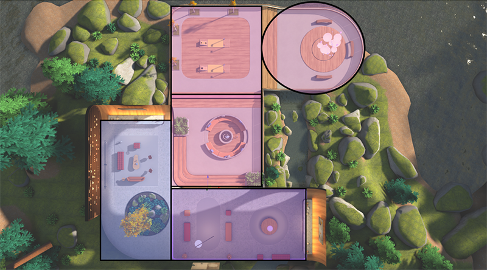
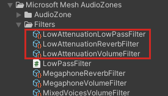

# Spatial audio customization in Mesh: overview

Collaboration happens when people meet in Mesh. Mesh uses a technique called *spatial audio* which enables you to customize the audio experience in an immersive space. Spatial audio creates a 360-degree "surround sound" experience for event attendees where audio directionality and proximity is perceived all around them, increasing the sense of immersion. This works for both voices and ambient sound in the space.

In the past, the default spatialization settings allowed for multiple group interactions in an environment, but it limited the variety of scenarios you could achieve. For example, you might have an event in a large room where you want attendees to be able to form small groups and have individual conversations, but you also want to support larger discussions where everyone could hear each other. A single fade-out (or "[attenuation](#attenuation)") couldn't accommodate both. Another example is an event where there's a large table and attendees at the extreme ends of the table are far enough apart that they can't hear each other. In real life, if you're far away, you can speak louder, but in a Mesh event all voice volumes are *normalized* so this doesn't work. In some cases, there are workarounds (for example, make everyone in the event an *Organizer* so they can push the *megaphone* button to make themselves heard by everyone) but these limitations and workarounds can detract from immersion and presence.

With our latest Mesh toolkit update, you have much more control over how sound behaves in your environment; you can now [customize the sound settings for the whole environment](./create-zones-and-environment-audio.md#choose-custom-environment-acoustics). You can also create [*Audio Zones*](./create-zones-and-environment-audio.md#create-an-audio-zone) or [*Acoustic Zones*](./create-zones-and-environment-audio.md#create-an-acoustic-zone). These are individual areas in the environment, such as a meeting room or outdoor patio area, with customized audio settings that override the default Mesh app audio settings for the whole environment. For example, you could have an environment that has five different rooms, with each room serving a different purpose and each one having its own unique Audio Zone.

In a sense, this gives you audio "super powers; you can provide event attendees with audio experiences beyond what they could have in real life. For example, no matter how large the space is, you can give certain attendees the ability to be heard throughout the entire space. Another example is that Attendees can have multi-directional conversations without interrupting each other.

**Three levels of audio control**

There are three different approaches to adding audio control to your environment. From the most powerful to the least, these are:

[*Audio Zones*](./create-zones-and-environment-audio.md#create-an-audio-zone)  
[*Acoustic Zones*](./create-zones-and-environment-audio.md#create-an-acoustic-zone)  
[*Custom environment acoustics*](./create-zones-and-environment-audio.md#choose-custom-environment-acoustics)

To fully understand these, we recommend that you first become familiar with three basic Mesh spatial audio features: [*Voice Settings*, *Voice Setting Collections*, and *Filters*](./spatial-audio-basic-features.md). You'll then be better equipped to choose and implement these various approaches.

Since *Audio Zones* give you the most extensive control over sound, our documentation focuses primarily on their use.

## Audio Zone benefits and scenarios

- Increase productivity in various ways. You can now have improved multiple group collaborations that support the following scenarios:

    - Expos and showrooms  
    - Townhalls and conferences
    - Virtual workshops and small groups
    - Learning/skill-building events
    - Various breakout session types

- Decrease miscommunication.

- You can set up Audio Zones to be very visible to attendees by using [properties](./audio-zone-properties.md) such as a glow sound at borders or short messages called *toasts* that display when an attendee enters or exits the Zone. However, you can also design Audio Zones to work "behind the scenes" without any of these visual cues.

- Use the natural environment to signal to your users how to interact with the space.

- In an environment, create a small "discussion area" with a few chairs or couches. Place an Audio Zone over the area. Select the Audio Zone *Default Voice Selection* property named "low attenuation." Anyone inside of this Audio Zone will hear anyone else inside the Zone clearly. You can also choose a setting called "Muffle Voices Outside", which muffles the voices of anyone outside the Audio Zone, making it easier for people inside the Zone to hear each other.

- Set up walls and create distinct separations between rooms. Users can have more private or contained conversations outside of the larger group(s). Use voice settings that add greater realism for rooms or areas with physical barriers.

- Provide a more realistic ambience to a large room or tunnel by increasing reverberation.

- Have distinct acoustic features for different areas. For example, you can have an "outdoor space" where there's no echo and things sound flat, and an "indoor space" where concrete and glass surfaces cause more echo.

- Create a "production booth" for people who are in the event who are tasked with helping the host (for example, running the lights). When they talk normally, no one outside the booth can hear them, but they can hear voices and sounds from outside the booth.

- If you need to have a "stage" in an event where anyone on the stage can be heard by everyone in the event, [create a "stage" Audio Zone](./create-zones-and-environment-audio.md#common-audio-zone-use-cases). This is perfect for townhalls, question-and-answer sessions, DJ booths for virtual parties, hosts, and emcees.

## Audio terminology

In order to fully understand how you can control sound with Audio Zones, it's useful to be familiar with a few audio terms that we use for Mesh spatial audio.

### attenuation

A decrease in the intensity of certain elements of a sound. For our purposes, that means a lowering of volume, a lessening of reverb, or a lessening of high frequencies (["low pass"](https://en.wikipedia.org/wiki/Low-pass_filter)). The names of the [ScriptableObjects](https://docs.unity3d.com/Manual/class-ScriptableObject.html) indicate which elements of the sound they're affecting.

For example, if you create an Audio Zone and you want the sounds outside of the Zone to barely be audible inside the Zone, you can *attenuate* those incoming sounds using the *LowAttenuation VolumeFilter* ScriptableObject. Pairing the volume, low pass, and reverb filters can create more natural sounding spaces where attendees can have multiple conversations in the same space without interrupting each other while also being aware of other conversations around them. You can also use gaze to focus in and out of conversations. The result of all this is sometimes called the ["cocktail party effect"](https://en.wikipedia.org/wiki/Cocktail_party_effect).

You'll see "low" in the names of a number of sound-related ScriptableObjects; for example, "LowAttenuationVolumeFilter" or "LowAttenuationReverbFilter". In normal attenuation, the further away you get from a sound source, the more the element of the sound being attenuated decreases until it finally reaches zero. The inclusion of "Low" in the names here indicate that there is some attenuation, but it's a lower amount than usual; the element of the sound being attenuated decreases somewhat but never quite reaches zero.

### frequency

The property of sound that determines its pitch. We perceive tones coming from a bass guitar as having low frequencies, while tones from a flute are perceived as high frequency.

### low pass filter

This is a filter that you can apply to a Voice Setting. Lower frequencies in a sound will *pass through* the filter and be audible, while higher frequencies will be *attenuated*.

### reverb 

(short for "reverbation"): The amount of echo in a sound. Sounds in a cave, tunnel or large room typically have noticeable reverb; sounds in a small room have little to no reverb.

### Megaphone

This is a Mesh term. When an attendee in an event has their *Megaphone* turned on, they can be heard by everyone in the event regardless of location.

## Audio Zone Package

The Mesh spatial audio features are located in the mesh.audiozones package which is included with the Mesh experimental toolkit.

## Next steps

> [!div class="nextstepaction"]
> [Spatial audio basic features](spatial-audio-basic-features.md)
