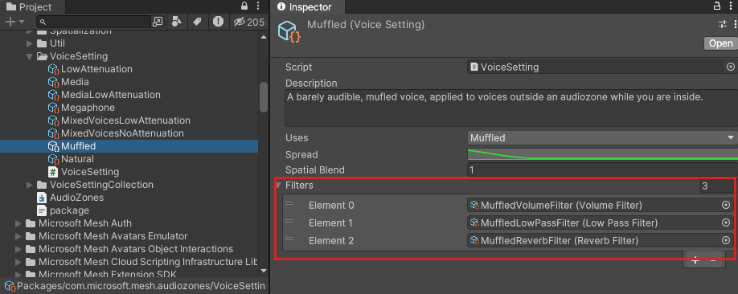

# Audio Zone properties

When you [create an Audio Zone in your environment](./create-zones-and-environment-audio.md#create-an-audio-zone), the process includes adding the *Audio Zone* component. This component includes a range of properties that are described below.

### Trigger Collider 

This property contains the GameObject that has an attached Trigger Collider that defines the boundary of the Audio Zone. In most cases, this will be the GameObject the Audio Zone component is attached to. You can set this by dragging the GameObject from the **Hierarchy** and dropping it onto the **Trigger Collider** property, or clicking the round button in the property and then selected a GameObject in the **Select Collider** window.

### State

Leave this set to **Uninitialized**.

### Zone type 

Leave this set to **Normal**.

### Priority 

You can assign a priority value to the Audio Zone which can be useful if there are several Audio Zones in the scene. For more details, hover the cursory over this property and read the informational popup.

### Applicability

- **When both inside**: the Zone's rules apply only if the attendee *and* the source of the audio are both inside the Audio Zone.
- **When Audio Source inside**: the Zone's rules apply if the source of the audio is inside the Audio Zone. (this is how a stage works, for example. When the presenter is on the stage, the stage's Audio Zone settings go into effect.) 

### Voices

Select the Voice Settings Collection that contains the Voice Setting you want for this Audio Zone. To do so, in the **Project** window, navigate to the Voice Setting you want, and then drag it to the **Voices** field in the **AudioZone** component. 

**Note**: This is optional. You can use the Voice Setting Collection assigned to the environment or to other Audio Zones or Acoustic Zones that overlap with this Audio Zone. In either case, leave this property set to "None*.

### Default Voice Selection

The drop-down for this property contains a list of various *uses* you may be interested in. If, for example, you want the Audio Zone to use the settings for the *Natural* use, select *Natural* here and the Audio Zone will look for and use a Voice within the Collection you chose that has *Natural* set for its use. If no Voices with that use can be found in the Collection and there are nested Audio Zones, the Audio Zone will look in the Collections for other Audio Zones (going from highest Priority to lowest Priority) for a Voice with that use. If no Audio Zones have such a Voice, the Audio Zone looks to the Environment for such a Voice. If it still can't be found, the default settings for all environments are used.

The standard default voice is **Natural**. However, if you want everyone inside the Zone to be heard easily, then **Low Attenuation** might be a better option.

### Muffle Voices Outside 

Allows attendees inside the Audio Zone to hear voices outside the Zone and applies settings that make those voices sound muffled. The "Muffled" Voice Setting uses three filters.

Much of the "muffled" effect from this voice is due to the strong influence of the [Low Pass Filter](https://docs.unity3d.com/Manual/class-AudioLowPassFilter.html).

 

### Can Audio Exit** and **Can Audio Enter 

These properties are useful for controlling privacy. Let's say this current Audio Zone is for Room #1, and Room #2 next To it has an Audio Zone with its "Muffle Voices Outside" property selected. 

**To allow sounds from Room #1 to be heard in Room #2 (or any area outside the room)**:
Select **Can Audio Exit**. 
    
**To prevent sounds from Room #1 from being heard outside the room**:
Make sure **Can Audio Exit** is unselected. 
    
**To allow sounds from outside of Room #1 to be heard inside the room**:
Select **Can Audio enter**.
    
**To prevent sounds from outside Room #1 from being heard inside the room**:
Make sure **Can Audio Enter** is unselected.

### Glow Sound at Border 

This works best when you have some sort of visual representation for the border of the Audio Zone. When this property is selected, a sound triggers when an attendee gets close to the border. For example, you could create an Audio Zone that has an electric fence as its border, and then when an attendee approaches the fence, they hear a crackling electrical sound.

### Attenuate Voices at Border 

As an attendee approaches the border of the Audio Zone, overall volume of voices is lowered.

### Walla Murmur 

This is another property that's useful when you want a certain level of privacy. Let's say that for this room/Audio Zone, you have **Can Audio Exit** deselected, meaning you don't want attendees outside the room to hear what's being said inside the room. However, in this instance, you *do* want attendees outside the room to detect that attendees are inside the room and talking. With **Walla Murmur** selected, when attendees inside the room talk, attendees outside the room will hear what *sounds* like conversation coming from the room but is actually just a sound effect that mimics talking and doesn't represent the actual conversation.

**Tip**: **Glow Sound at Border**, **Attenuate Voices at Border**, and **Walla Murmur** are designed to work together. Imagine this scenario: you're in an open space, with attendees talking around you, and you walk towards Room #1 which has an Audio Zone with the three above-mentioned features turned on. As you approach the room, you can hear that attendees inside the room are talking (*Walla Murmur*). The volume levels of the voices around you fade to nothing (*Attenuate Voices at Border*). At the same time, you start to hear a sound that steadily increases in volume as you approach the border of the room (*Glow Sound at Border*). As you walk into the room, the glow sound gets quieter and the volume of the voices inside the room increases. The result is a smooth transition from the voices you were hearing outside the room to the voices inside it.

### Toasts

**Entry toast title:**  
**Entry toast body:**  
**Exit toast title:**  
**Exit toast body:**

A *toast* is a short message that pops up on the screen and then, after a brief period of time, disappears. You can create a toast that will be displayed when an attendee enters or exits the Audio Zone. 

## Next steps

> [!div class="nextstepaction"]
> [Spatial audio custom features](spatial-audio-custom-features.md)