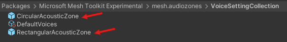
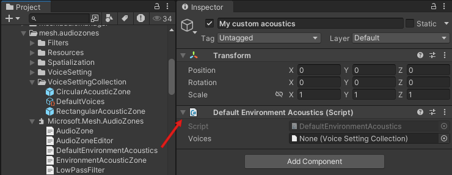
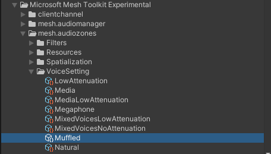

# Create Audio Zones, Acoustic Zones, or custom environment acoustics

## Create an Audio Zone

the *Audio Zone* component lets you indicate a specific area inside the environment, in the form of a trigger collider, that will have its own unique audio settings. You can choose a default Voice Setting for the Zone, a Voice Collection that gives the Zone a range of Voice Setting options to choose from depending on changing circumstances, and numerous customization properties.

1. Add an empty GameObject to the scene and select it.
1. In the **Inspector**, click the **Add Component** button and then search for and add the "Audio Zone" component.

1. Click the **Add Component** button again and then add the collider that comes closest to the shape of the Audio Zone you have in mind. For example, for a rectangular room, your best choice is probably the "Box Collider".
1. If needed, in the **Box Collider** component, click the **Edit Collider** button and then adjust the shape of the Collider.
1. In the **AudioZone** component, specify the settings you want. [Audio Zone properties are explained further below](#audio-zone-properties).

[Learn about Audio Zone properties](./audio-zone-properties.md)

[Learn about common Audio Zone use cases](#common-audio-zone-use-cases).

### Create an Acoustic Zone

An Acoustic Zone comes in the form of a prefab; you can think of it as a simplied Audio Zone. You get the trigger collider, default Voice, and Voice Collection choices, but not the more extensive customization properties.

 

An Acoustic Zone prefab comes with the *Environment Acoustic Zone* script.

 

1. Create an environment that will act as a large conference hall.
1. Add a Cube to the scene and then rename it "Meeting Room".
1. Adjust the dimensions of **Meeting Room** to give it a rectangular shape at the scale you want.
1. Drag the **RectangularAcousticZone** prefab from the **VoiceSettingCollection** folder and then drop it on the **Meeting Room** GameObject in the scene, making it a child to **Meeting Room**.

    

1. In the **Inspector**, edit the **Box Collider** for the **RectangularAcousticZone** prefab to have the same size and location as the **Meeting Zone** GameObject.
1. Follow the instructions in the **Description** for the prefab to choose a Voice Collection in the **Voices** property (we recommend that you drag the Voice Collection from the **Project** window). 

    

1. If desired, rename the prefab so its name is more descriptive.

### Choose custom environment acoustics

The Mesh app comes with its own default Voice Collection that provides the acoustics for an event. To override that Voice Collection with a different one:

1. In your scene, create an empty GameObject and then rename it to something meaningful. In this example, we'll use "My custom acoustics."
1. In the **Project** window, navigate to the *Default Environment Acoustics* script, and then drag it to the **Inspector** panel for the new GameObject.

    

1. In the **Project** window, navigate to the *Voice Setting Collection* you want, and then drag it to the **Voices** field in the **Default Environment Acoustics** component.

    

## How a Voice Setting gets chosen for Audio Zones, Acoustic Zones or Custom Environment Audio

As mentioned earlier, you can apply a Voice Setting Collection to an Audio Zone or Acoustic Zone or Custom Environment Audio, and the Collection can contain a varety of Voice Settings (the *DefaultVoices* Collection has seven). In this section, we'll assume you're working with an Audio Zone.

Why would you need this many Voice Setting options for one Audio Zone? Different circumstances, and different Objects in the Audio Zone, may require different sets of audio qualities.

You can set a default Voice Setting for an Audio Zone in the *Audio Zone* component. Let's say you apply an Audio Zone to a specific room in your experience and you want voices outside of the room to sound audible but muffled to anyone inside the room. For **Default Voice Selection*, we'll choose "Muffled".

However, if someone in the event turns on the Megaphone, we don't want attendees in our Audio Zone to hear that voice as sounding muffled; we want it heard clearly. Since we have the "Megaphone" Voice Setting the Collection that's chosen for our Audio Zone, the Zone switches to that Voice Setting if the Megaphone is turned on.

Also, let's say you have a Media Player Object in the Audio Zone. This Object requires different sound settings than the ones supplied by the default Voice Setting for the Zone. When the Player is turned on, the "Media" Voice Setting becomes the active setting for the Zone.

What makes this happen? Each Voice Setting has a **Uses** property. The Collection attached to the Audio Zone contains a Voice Setting named *Media*. The "Uses" property for this Voice Setting is set to "Media".

This property tells the Audio Zone to detect if a Media Player in the Zone gets turned on. If it does, the Zone switches to the "Media" Voice Setting.

In addition to the *Uses* property, a Voice Setting has the *VoiceSetting* script attached, a couple of control settings (*Spread* and *Spatial Blend*), and one or more *filters*.

## Common Audio Zone use cases

### Simple meeting room

In this example, our environment is a large conference hall. We want to add a smaller room with its own Audio Zone that attendees can go into for a more private conversation.

1. Create an environment that will act as a large conference hall.
1. Add an empty GameObject to the scene and then rename it "Meeting Room".
1. Add a child GameObject to "Meeting Room" and then rename it "Meeting Room Audio Zone".
1. In the **Hierarchy**, select **Meeting Room Audio Zone**.

    

1. In the **Inspector**, click the **Add Component** button and then search for and add the "Audio Zone" component.
1. In the Audio Zone component, click the **Default Voice Selection** drop-down and then select **Low Attenuation**.
1. Add the "Box Collider" component and then select its **Is trigger** property.
1. Choose a collection: click the round button in the **Voices** field and then, in the **Select Voice Setting Collection** window, search for and select the Voice Collection you want.

    

1. We want attendees in the room to hear if something is going on outside the room, but at a low volume. To make this happen, select **Muffle Voices Outside**. The Voice Setting Collection selected for this Audio Zone contains a "Muffled Voice" Voice Setting that makes this happen.

### Stage

1. Create an environment that will act as a meeting room as described in the previous section.
1. Add a GameObject that will act as a stage in front of the room.
1. Follow the steps in the previous section to add an Audio zone to the stage and choose its settings.
1. In the **Audio Zone** component attached to the stage, click the **Applicability** drop-down, and then select **When Audio Source inside**.

When an attendee in the event enters the Stage GameObject and speaks, everyone in the event will hear them.

