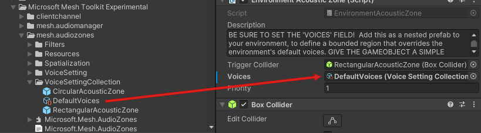
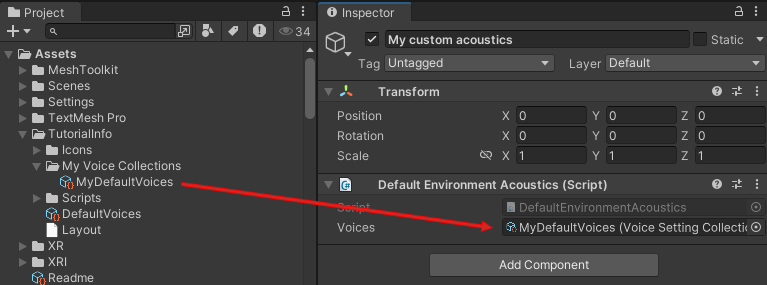
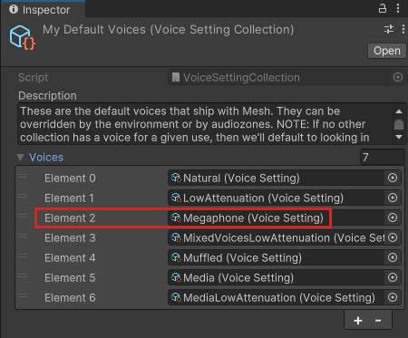
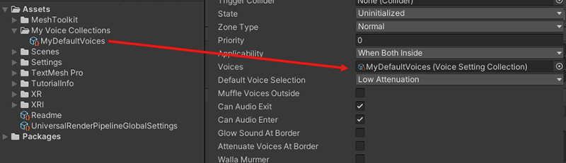

# Create Audio Zones, Acoustic Zones, or custom environment acoustics

## Create an Audio Zone

To create an Audio Zone, you add the *Audio Zone* component to a room or space in your environment that you want to have customized spatial audio settings. The *Audio Zone* component lets you indicate a specific area inside the environment, in the form of a trigger collider, that will have its own unique audio settings. You can choose a default [Voice Setting](./spatial-audio-basic-features.md#voice-setting) for the Zone and a [Voice Collection](./spatial-audio-basic-features.md#voice-settings-collection) that gives the Zone a range of Voice Settings to choose from, depending on changing circumstances. You can also adjust numerous properties.

1. Add an empty GameObject to the scene and then rename it something appropriate. For this example, we'll use the name "Room 1".
1. Add an empty child GameObject to Room 1 and then rename it "Room 1 Audio Zone".

    **Important**: No two GameObjects with Audio Zones attached can have the same name.

1. In the **Inspector**, click the **Add Component** button and then search for and add the "Audio Zone" component.

    

1. Click the **Add Component** button again and then add the collider that comes closest to the shape of the Audio Zone you have in mind. For example, for a rectangular room, your best choice is probably the "Box Collider".
1. If needed, in the **Box Collider** component, click the **Edit Collider** button and then adjust the shape of the Collider to conform to the dimensions of the room.
1. In the **AudioZone** component, click the button in the **Voices** property and then choose a Voice Setting Collection. You can also drag a Voice Setting Collection from the **Project** window and drop it in this field.

    **Note**: Choosing a Voice Setting Collection here is optional. If you want to use the Voice Setting Collection assigned to the environment or to other Audio Zones or Acoustic Zones that overlap with this Audio Zone, you can leave this setting at "None".
    
1. Click the [**Default Voice Selection**](./audio-zone-properties.md#default-voice-selection) drop-down and then choose one of the options in the menu.

The **Trigger Collider** property contains the GameObject that has an attached Trigger Collider that defines the boundary of the Audio Zone. In most cases, this will be the GameObject the Audio Zone component is attached to.

[Learn about Audio Zone properties](./audio-zone-properties.md)

[Learn about common Audio Zone use cases](#common-audio-zone-use-cases).

### Create an Acoustic Zone

Like with Audio Zones, you can add a component to a room or space in your environment that you want to have customized spatial audio settings (in this case, the component is called "Environment Acoustic Zone"). An Acoustic Zone is simpler than an Audio Zone; with the Environment Acoustic Zone component, you get the trigger collider and Voice Collection options, but no default Voice Setting and none of the additional customization properties.

1. Create an environment that will act as a large conference hall.
1. Add a Cube to the scene and then rename it something appropriate. For this example, we'll rename it "Room 2".
1. Add an empty child GameObject to Room 2 and then rename it "Room 2 Acoustic Zone".
1. In the **Inspector**, click the **Add Component** button and then search for and add the "Environment Acoustic Zone" component.

    

1. Click the **Add Component** button again and then add the collider that comes closest to the shape of the Acoustic Zone you have in mind. For example, for a rectangular room, your best choice is probably the "Box Collider".
1. If needed, in the **Box Collider** component, click the **Edit Collider** button and then adjust the shape of the Collider to conform to the dimensions of the room.
1. In the **Environment Acoustic Zone** component, specify the settings you want. You can choose a default [Voice Collection](./spatial-audio-basic-features.md#voice-settings-collection) that gives the Zone a range of Voice Settings to choose from, depending on changing circumstances.

    **Note**: Choosing a Voice Setting Collection here is optional. If you want to use the Voice Setting Collection assigned to the environment or to other Audio Zones or Acoustic Zones that overlap with this Acoustic Zone, you can leave this setting at "None".

The **Trigger Collider** property contains the GameObject that has an attached Trigger Collider that defines the boundary of the Acoustic Zone. In most cases, this will be the GameObject the Acoustic Zone component is attached to.

### Acoustic Zone prefabs

The Audio Zone package comes with two Acoustic Zone prefabs: *CircularAcousticZone* and *RectangularAcousticZone*. You can simply drag one of these into your scene to create an Acoustic Zone; each one comes with the Environment Acoustic Zone script and a trigger collider already attached. 

 

1. Create an environment that will act as a large conference hall.
1. Add a Cube to the scene and then rename it something appropriate. For this example, we'll rename it "Room 3".
1. Drag the **CircularAcousticZone** or **RectangularAcousticZone** prefab from the **VoiceSettingCollection** folder and then drop it on the **Room 3** GameObject in the **Hierarchy**, making it a child to **Room 3**.
1. In the **Inspector**, edit the **Box Collider** for the **RectangularAcousticZone** prefab to have the same size and location as the **Room 3** GameObject.
1. Click the button in the **Voices** property and then choose a Voice Setting Collection. You can also drag a Voice Setting Collection from the **Project** window and drop it in this field.

    

    **Note**: Choosing a Voice Setting Collection here is optional. If you want to use the Voice Setting Collection assigned to the environment or to other Audio Zones or Acoustic Zones that overlap with this Acoustic Zone, you can leave this setting at "None".

1. If desired, rename the prefab so its name is more descriptive.

### Choose custom environment acoustics

The Mesh app comes with its own default Voice Collection that provides the acoustics for an event. To override that Voice Collection with a different one:

1. In your scene, create an empty GameObject and then rename it to something meaningful. In this example, we'll use "My custom acoustics."
1. In the **Project** window, navigate to the *Default Environment Acoustics* script, and then drag it to the **Inspector** panel for the new GameObject.

    

1. In the **Project** window, navigate to the Voice Setting Collection you want, and then drag it to the **Voices** field in the **Default Environment Acoustics** component.

    

## How a Voice Setting gets chosen for Audio Zones, Acoustic Zones or Custom Environment Acoustics

As mentioned earlier, you can apply a Voice Setting Collection to an Audio Zone or Acoustic Zone or choose it to override the default Mesh app acoustics, and the Collection can contain a variety of Voice Settings (the *DefaultVoices* Collection has seven). In this section, we'll assume you're working with an Audio Zone.

Why would you need this many Voice Setting options for one Audio Zone? Different circumstances, and different Objects in the Audio Zone, may require different audio qualities. Let's say you apply an Audio Zone to a specific room in your experience and you want voices outside of the room to sound audible but muffled to anyone inside the room. In the **Audio Zone** component, you would select the **Muffle Voices Outside** property.

The Audio Zone would find a Voice Setting that has its **Uses** field set to "Muffled" and assign that Voice Setting to everyone outside the Zone.

However, if someone in the event turns on the Megaphone, we don't want attendees in our Audio Zone to hear their  voice as sounding muffled; we want it heard clearly. Since we have the "Megaphone" Voice Setting in the Collection that's chosen for our Audio Zone, the Zone switches to that Voice Setting if the Megaphone is turned on.

Also, let's say you have a Media Player Object in the Audio Zone. This Object requires different sound settings than the ones supplied by the default Voice Setting for the Zone. When the Player is turned on, the "Media" Voice Setting, which is available in the chosen Voice Collection, becomes the active setting for the Zone.

How is this Voice Setting chosen? The Audio Zone searches for a Voice Setting in its Voice Collection, if one is assigned, or in the Voice Collection for the environment, that has its **Uses** property set to "Media." In this example, that's the "Media" Voice Setting, so the Audio Zone assigns that Voice Setting to all Media-type Spatializers in the Zone that are configured to get their Voice Setting from the environment.

**Note**: You can have multiple spatializers (in other words, sound sources) inside an Audio Zone at the same time that are each assigned a different Voice Setting. For example:

1. A regular Avatar could have the Voice Setting that has its **Uses** property set to 'Natural'.
1. A Megaphoned Avatar could have the Voice Setting that has its **Uses** property set to 'Megaphone'.
1. A Media Object could have the the Voice Setting that has its **Uses** property set to 'Media'.

In addition to the *Uses* property, a Voice Setting has a couple of control settings (*Spread* and *Spatial Blend*), and one or more *filters*.

## Common Audio Zone use cases

### Simple meeting room

In this example, our environment is a large conference hall. We want to add a small meeting area to the hall with its own Audio Zone that attendees can go into for a more private conversation.

1. Create an environment that will act as a large conference hall.
1. Add an empty GameObject to the scene and then rename it "Meeting Room".
1. Add a child GameObject to "Meeting Room" and then rename it "Meeting Room Audio Zone".
1. In the **Hierarchy**, select **Meeting Room Audio Zone**.

    

1. In the **Inspector**, click the **Add Component** button and then search for and add the "Audio Zone" component.
1. In the Audio Zone component, click the **Default Voice Selection** drop-down and then select **Low Attenuation**.
1. Add the "Box Collider" component and then select its **Is trigger** property.
1. Choose a collection: in the **Project** window, navigate to the Voice Collection you want, and then drag it to the **Voices** field in the **Inspector.

    

    **Note**: Choosing a Voice Setting Collection here is optional. If you want to use the Voice Setting Collection assigned to the environment or to other Audio Zones or Acoustic Zones that overlap with this Audio Zone, you can leave this setting at "None".

1. We want attendees in the room to hear if something is going on outside the room, but at a low volume. To make this happen, select **Muffle Voices Outside**. The Voice Setting Collection selected for this Audio Zone contains a "Muffled Voice" Voice Setting that makes this happen.

### Stage

1. Create an environment that will act as a meeting room as described in the previous section.
1. Add a GameObject that will act as a stage in front of the room.
1. Follow the steps in the previous section to add an Audio zone to the stage and choose its settings.
1. In the **Audio Zone** component attached to the stage, click the **Applicability** drop-down, and then select **When Audio Source inside**.

    

    When an attendee in the event enters the Stage GameObject and speaks, everyone in the event will hear them.

## Next steps

> [!div class="nextstepaction"]
> [Audio Zone Properties](audio-zone-properties.md)

