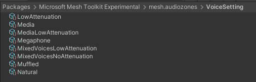
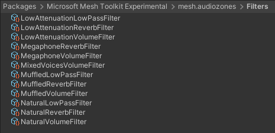
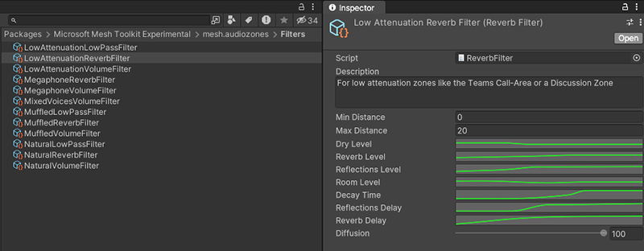

# Spatial audio basic features

There are three different approaches to adding audio control to your environment. From most powerful to least, these are:

[*Audio Zones*](./create-zones-and-environment-audio.md#create-an-audio-zone)  
[*Acoustic Zones*](./create-zones-and-environment-audio.md#create-an-acoustic-zone)  
[*Custom environment acoustics*](./create-zones-and-environment-audio.md#choose-custom-environment-acoustics)

To fully understand these, we recommend that you first learn about *Voice Settings*, *Voice Setting Collections*,  and *Filters*, explained below. You'll then be better equipped to choose and implement these various approaches.

### Voice Setting

You can think of a Voice setting as "the thing you apply to a sound to give it the qualities you want." Voice Settings are [ScriptableObjects](https://docs.unity3d.com/Manual/class-ScriptableObject.html) and are located in the *VoiceSetting* folder.

A Voice Setting ScriptableObject is defined by the VoiceSetting.cs script. It's made up of several properties and one or more [*filters*](#filters).

Voice Settings are contained in Voice Setting Collections. Each Audio Zone has a Voice Collection attached; the Zone determines the best Voice Setting for a given use and looks for that Voice Setting in the Collection attached to it.

### Voice Settings Collection

As the name implies, a Voice Setting Collection is a collection of Voice Settings. It's a [ScriptableObject](https://docs.unity3d.com/Manual/class-ScriptableObject.html), and its purpose is to make the voices it contains available for use for Audio Zones, Acoustic Zones, or Custom Environment Acoustics. 

The Voice Setting Collections are located in the **VoiceSettingCollection** folder.

The only VoiceCollection in the folder currently is *DefaultVoices*. It contains the default Voice Settings that ship with Mesh. If you select *DefaultVoices* in the **Project** folder, you can see the Voice Settings it contains listed as *Elements* in the **Inspector.

As mentioned earlier, each Audio Zone has a Voice Setting Collection attached, and the Zone determines the best Voice Setting for a given use and looks for that Voice Setting in the Collection attached to it. Note, however, that a Collection doesn't need to cover all possible uses. If a Voice Setting for a particular use can't be found in the Voice Collection attached to the Zone, an appropriate Voice Setting will be picked up from other another Audio Zone or from the environment. This is especially relevant if, for example, you only want to customize the Media voice in a given Audio Zone and leave the avatar voices free to be specified by the environment. In this case, you can assign the Audio Zone a Voice Setting Collection that contains a single Voice Setting that has the 'Media' use set on it.

### Filters

*Filters* are found in the **Filters** folder.

You can think of filters as the lowest level unit that affects the sound. Filters are typically added to a *Voice Setting* ScriptableObject; they play an important role in determining how that Voice Setting shapes the sound. 

There are four filter scripts and a variety of filter ScriptableObjects. Each instance of a ScriptableObject has a filter script attached and some control settings that are unique to the sound element being controlled. For example, the *LowAttenuationReverbFilter* has the *ReverbFilter* script attached plus controls for the amount of reverb, the amount of time it takes for the reverb to fade out, and more.

**Distance and Angle attenuation curves**

In each Volume Filter, you not only get a **Distance Curve** for attenuation (the sound volume decreases based on the attendee's distance from the sound source), you also get an **Angle  Curve** (the sound volume decreases based on the angle of the attendee's head relative to the sound source). For example, if you want something to sound much quieter when it's behind the attendee's head, you can control this by adjusting the Angle Curve.

**Note**: You get a lot more control over audio with the [Audio Zone properties](./audio-zone-properties.md) than by using Unity Spatial Audio source.

## Next steps

> [!div class="nextstepaction"]
> [Create Audio Zones and custom environment acoustics](create-zones-and-environment-audio.md)