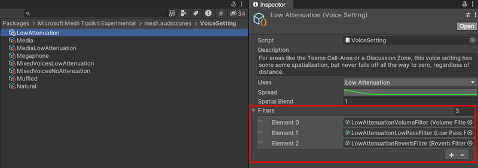
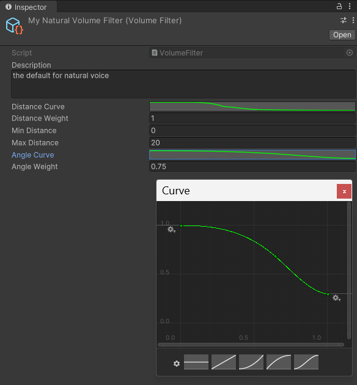

# Spatial audio basic features

There are three different approaches to adding audio control to your environment. From most powerful to least, these are:

[*Audio Zones*](./create-zones-and-environment-audio.md#create-an-audio-zone) 
[*Acoustic Zones*](./create-zones-and-environment-audio.md#create-an-acoustic-zone)  
[*Custom environment acoustics*](./create-zones-and-environment-audio.md#add-default-environment-acoustics)

To fully understand these, we recommend that you first learn about *Voice Settings*, *Voice Setting Collections*,  and *Filters*. You'll then be better equipped to choose and implement these various approaches.

### Voice Setting

You can think of a Voice setting as "the thing you apply to a sound to give it the qualities you want." the Voice Setting prefabs are located in the *VoiceSetting* folder.

A Voice Setting has the *VoiceSetting* script attached and is made up of several properties and one or more *filters*.

A Voice Setting can be applied to a Zone in several ways; you can choose it explicitly as the default VoiceSetting for the zone, or it can be chosen automatically from a collection of Voice Settings if it's seen to be the most appropriate VoiceSetting for a given use.

### Voice Settings Collection

As the name implies, a Voice Setting Collection is a collection of Voice Settings. The purpose of a Voice Collection is to make the voices it contains available for use for Audio Zones, Acoustic Zones, or Custom Environment Audio.

The Voice Setting Collections are located in the **VoiceSettingCollection** folder.

The only VoiceCollection in the folder currently is *DefaultVoices*. It contains the default VoiceSettings that ship with Mesh. These are listed as *Elements* in the **Inspector.

### Filters

You can think of filters as the lowest level unit that affects the sound.

Filters are typically added to a *VoiceSetting*; they play an important role in determining how that VoiceSetting shapes the sound. 

Filters are found in the **Filters** folder.

There are four filter scripts and a variety of filter prefabs. Each prefab has a Filter Script plus some control settings that are unique to the sound element being controlled. For example, the *LowAttenuationReverbFilter* has the *ReverbFilter* attached plus controls for the amount of reverb, the amount of time it takes for the reverb to fade out, and more.

**Distance and Angle attenuation curves**

In each Volume Filter, you not only get a **Distance Curve** for attenuation (the sound volume decreases based on the attendee's distance from the sound source), you also get an **Angle  Curve** (the sound volume decreases based on the angle of the attendee's head relative to the sound source). For example, if you want something to sound much quieter when it's behind the attendee's head, you can control this by adjusting the Angle Curve.

**Tip**: Voice Settings and Voice Setting Collections are *Scriptable Objects*. A Voice Setting Collection Scriptable Object can be added to the overall environment or to an Acoustic Zone or Audio Zone in the environment.

**Note**: You get a lot more control over audio with the Voice Setting properties than by using Unity Spatial Audio source.

