# Spatial audio custom features

The three core components, or what we call "features", for Mesh custom spatial audio, are [*Voice Settings*](./spatial-audio-basic-features.md#voice-setting), [*Voice Setting Collections*](./spatial-audio-basic-features.md#voice-settings-collection), and [*Filters*](./spatial-audio-basic-features.md#filters). However, you don't have to be limited to just the features that come with the Audio Zone package. You can copy any of these and then alter them to create your own customized features. In this example, we'll create new versions of each feature.

## Create new folders for your custom features

1. In your project, right-click the **Project** tab and then select **Add tab** > **Project**.
1. Relocate the second **Project** window so that it's to the right of the first **Project** window.

    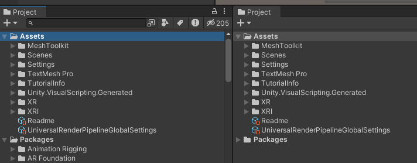

1. In the second **Project** window, right-click and then select **Create** > **Folder**.
1. Rename the folder to "My Voice Collections".
1. Create two more folders the same way. Rename them to "My Voice Settings" and "My Filters".

    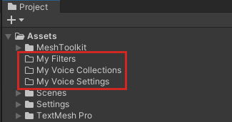

## Create a new custom Voice Setting Collection

1. Click the Lock button in the upper right corner of the second **Project** window to lock that window's view in place.

    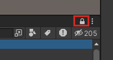

1. In the first **Project** window, navigate to the **Packages** > **Microsoft Mesh Audio Zones** > **VoiceSettingCollection** folder and then expand it.
1. Drag the **DefaultVoices** Voice Setting Collection prefab from Project window #1 and then drop it on the **My Voice Collections** folder in Project window #2.

    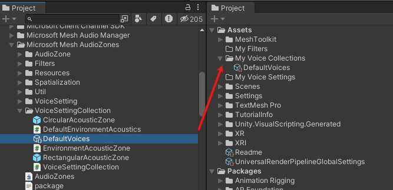

1. Rename the prefab to "MyDefaultVoices".

## Create a new custom Voice Setting

We don't want to use any of the existing Voice Settings in this Collection so we'll make a new Voice Setting and then add it to the Collection.

1. In Project window #1, navigate to the **Packages** > **Microsoft Mesh Audio Zones** > **VoiceSetting** folder and then expand it.
1. Drag the **LowAttenuation** Voice Setting prefab from Project window #1 and then drop it on the **My Voice Settings** folder in Project window #2.

    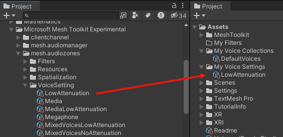

1. Rename the prefab to "MyLowAttenuation".

    We don't want the Reverb filter that's include with this prefab, so let's delete it. 

1. In Project window #2, ensure that the "MyLowAttenuation" prefab is selected.
1. In the **Inspector**, select **Element 2**, which contains the filter named "LowAttenuationReverbFilter", and then click the "-" button to delete it.

    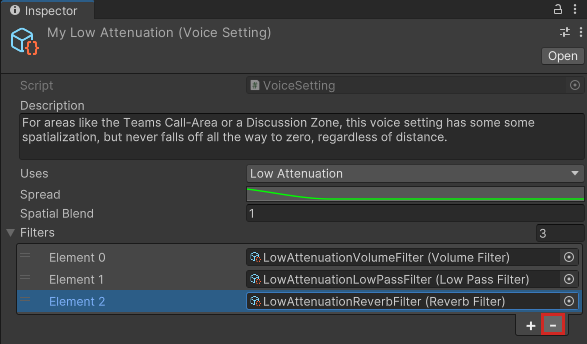

## Create a new filter

We'll add a new Reverb filter with settings more in line with our needs.

1. In the first **Project** window, navigate to the **Packages** > **Microsoft Mesh Audio Zones** > **Filters** folder and then expand it.
1. Drag the **NaturalReverbFilter** Filter prefab from Project window #1 and then drop it on the **My Filters** folder in Project window #2.

    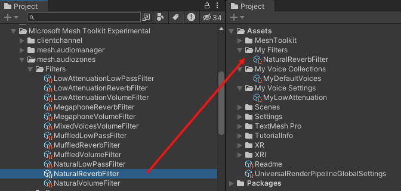

1. Rename the prefab to "MyNaturalReverbFilter".
1. Select this prefab, and then, in the **Inspector**, adjust any of the properties or curves needed to create the reverb you want. You can also change the **Description**.

    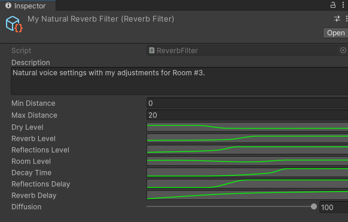

    **Tip**: to adjust any of the curve-based properties (the ones with the green lines), click the property, and then in the **Curve** window, choose a preset (see #1 in the image below), or drag the control points on the curve in the graph (this is similar to editing [Bezier curves](https://en.wikipedia.org/wiki/B%C3%A9zier_curve) in a graphics program)

    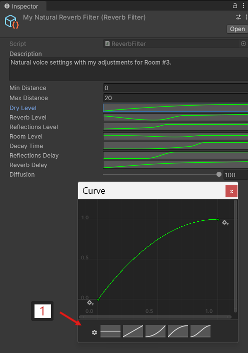

## Add the new reverb filter to the new Voice Setting

1. In Project window #2, select the **MyLowAttenuation** prefab.
1. In the **Inspector** in the **Filters** section, click the "+" button.
1. Click the round button in the newly added Element, and then, in the **Select Voice Filter** window, select **MyNaturalReverbFilter**.

    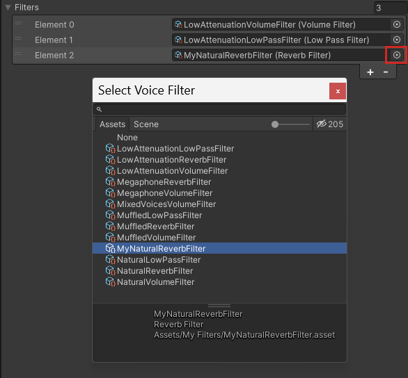

## Add the new Voice Setting to the new Voice Setting Collection

1. In Project window #2, select the **MyDefaultVoices** prefab.
1. In the **Inspector** in the **Voices** section, click the "+" button.
1. Drag **MyLowAttenuation** from the **Project** window and then drop it in the Element you just added to the **My Default Voices** Voice Collection.

    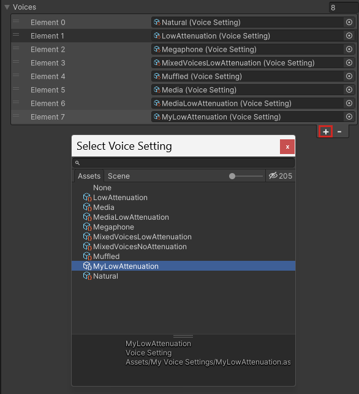

## Next steps

> [!div class="nextstepaction"]
> [Test a Voice Setting](test-a-voice-setting.md)