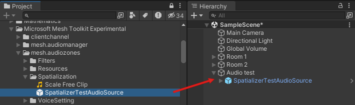
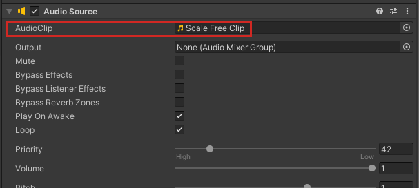
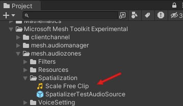
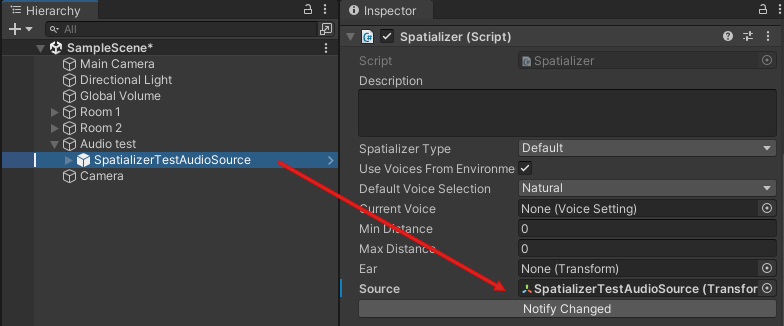

# Test a Mesh custom audio Voice Setting

You can "try out" a Mesh custom audio Voice Setting in your environment to see how it will eventually sound in a Mesh event. This is an efficient way to make minor changes and hear the results without having to build, deploy and test in the Mesh app each time.

You do this by using the *Spatializer* and associated prefab and scripts.

1. Add a new empty GameObject to your scene and rename it. For this example, we'll rename it "Audio test".
1. In the **Project** window, navigate to the *SpatializerTestAudioSource* prefab, and then drag it to the **Hierarchy** and make it a child object to **Audio test**.

    

1. In the **Inspector**, navigate to the **Spatializer** script, and then note the *Spatializer Type* setting of **Default**. If you want a different setting, click the drop-down and then make your selection. Each option gives you the following:

    **Unspecified**: The media object that creates the spatializer is responsible for configuring it and manually applying the output to the media object's audio.
    
    **Avatar**: Spatializes the audio coming from an attendee.
    
    **Acs Mixed Audio**: Choose this for use with the Teams gallery or broadcast system, where the audio comes from ACS.

1. Note that the *SpatializeTestAudioSource* prefab has a component attached named **Audio Source**. This component has an **AudioClip** property that uses an audio clip named **Scale Free Clip**.

    

    This audio clip is located in the **Spatialization** folder.

    

    You can select the clip and then play it in the **Inspector** to hear what it sounds like. If you wish, you can add your own audio clips to the project and use one of those in the **Audio Source** component instead of the *Scale Free Clip* audio clip.

1. In the **Spatializer** component, keep the **Default Voice Selection** property set to *Natural* or click the drop-down and then choose a different setting. This is similar to [choosing a "Use" in the Audio Zone component](./create-zones-and-environment-audio.md#how-a-voice-setting-gets-chosen-for-audio-zones-acoustic-zones-or-custom-environment-audio).
1. For the **Ear** property, choose the camera in the scene. If you don't yet have a camera, you'll need to add one.
1. For the **Source** property, drag the *SpatializerTestAudioSource** prefab from the **Hierarchy** and then drop it in the **Source** field.

    

1. Run the project. You should hear the audio clip you chose with the "use" you chose for the **Default Voice Selection** property. Note that this is fairly simple simulation; you can't walk around and trigger different audio settings.

## Next steps

> [!div class="nextstepaction"]
> [Enhanced features overview](../enhanced-features-overview.md)