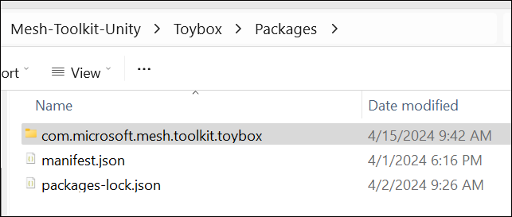
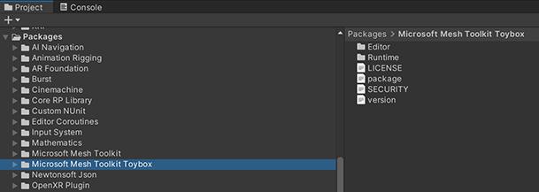
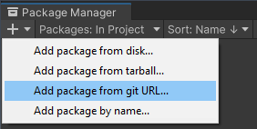
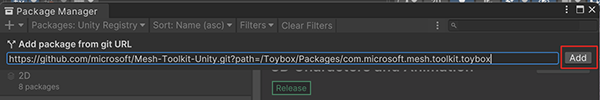

# Add interactive games, activities and objects

If you want to add interactive games, activities and objects to your environment, we recommend that you [download our Mesh samples](../getting-started/samples/download-mesh-samples.md), take a thorough look at our [Pavilion sample](../getting-started/samples/pavilion.md), and then import the Mesh Toolbox package into your project. This package provides the building blocks for the games, activities and interactive objects in the Pavilion sample. The package is named *com.microsoft.mesh.toolkit.toybox* and can be found in File Explorer in the *Packages* folder.

Here's how it looks in the Unity project.

## Add the Toybox package to an existing project

There are a couple of ways to add the Toybox package to your project.

- Copy and paste the *com.microsoft.mesh.toolkit.toybox* folder located in the [Packages](https://github.com/microsoft/Mesh-Toolkit-Unity/tree/main/Packages) folder into your project's Packages folder.
- Reference the Toybox package from GitHub.

> [!IMPORTANT]
> To reference the Toybox package from GitHub you must have [Git](https://gitforwindows.org/) installed on your computer.

**To import Toybox into your Unity project using GitHub**:

1. In your project, on the menu bar, select **Window** > **Package Manager**.
1. In the *Package Manager*, click the '+' drop-down and then select "Add package from git URL..."

    

1. Paste <https://github.com/microsoft/Mesh-Toolkit-Unity.git?path=/Packages/com.microsoft.mesh.toolkit.toybox> into the text field and then click **Add**.

    

Toybox will now be installed in your Unity project as a package in the project's *Packages* folder with the name  *Microsoft Mesh Toolkit Toybox*.

> [!TIP]
> We recommend that you use a specific release of the Toybox package to ensure your project is locked to a release.

You can reference a specific release version, branch, or Git commit hash by altering the URL in step 3 as demonstrated below:

| Syntax           | URL example                                                                                                                                     |
|------------------|-------------------------------------------------------------------------------------------------------------------------------------------------|
| Specific version | <https://github.com/microsoft/Mesh-Toolkit-Unity.git?path=/Packages/com.microsoft.mesh.toolkit.toybox#vX.Y.Z>                                   |
| Specific branch  | <https://github.com/microsoft/Mesh-Toolkit-Unity.git?path=/Packages/com.microsoft.mesh.toolkit.toybox#my_branch>                                |
| Git commit hash  | <https://github.com/microsoft/Mesh-Toolkit-Unity.git?path=/Packages/com.microsoft.mesh.toolkit.toybox#badc0ffee0ddf00ddead10cc8badf00d1badb002> |
