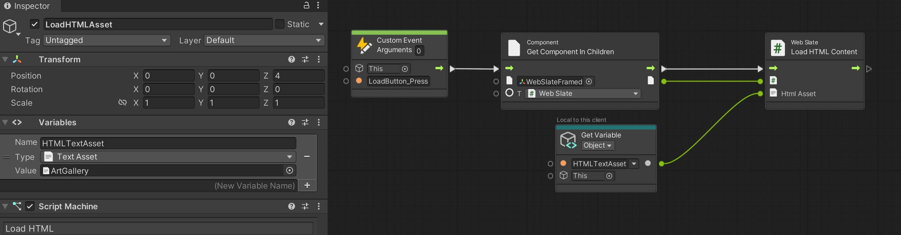

# WebSlates and Mesh Scripting

## WebSlate in Visual Scripting

With Visual Scripting, developers can implement WebSlate functionality and behavior without the need for typing code. Instead, a node-based visual interface is provided, enabling users to define and connect various actions and events in a scene. Some developers find that this can simplify the process of adding interactivity and behavior.

To enable visual scripting using WebSlate, you must set up a few things.

1. Go to **Edit** > **Project Settings**.

2. In the left-side list, select **Visual Scripting**.

   

3. Expand **Node Library**. This displays the assembly list.

4. At the bottom of the assemblies list on the right, click the Add (+) button. This adds a new item to the list which displays "(No Assembly)".

5. Click the new assembly entry, and then in the Search field, type "Webslate". This narrows the list to **Microsoft.Mesh.WebSlate**. Select this item to add it to the **Assembly** list.

   

   Visual Scripting adds the **Microsoft.Mesh.WebSlate** and its nodes to the Node Library. To use the nodes in your project, select the **Regenerate Nodes** button.

   

   ### Load URL

   Developers can now dynamically change web content in real time by loading new URLs through Visual Scripting. This functionality broadens the scope for various applications, including altering web content based on user preferences or updating it in response to real-time data.

   

   ### Load HTML Content

   This new feature in WebSlate allows developers to drop HTML files as TextAssets into the Unity scene with low effort. This integration not only simplifies the workflow but also enables immediate feedback in Unity Play Mode, enhancing real-time editing and debugging. Additionally, it supports dynamic content switching, offering flexibility and a more interactive user experience.

   

   **Create new or reuse existing HTML for viewing/interacting in your Mesh environment**: If you don't want to host HTML content or you have secure offline files, you can add HTML on the spot and include it as part of the asset in your scene. 

   **Dynamic Loading at Runtime**: Loading HTML from files allows developers to make real-time changes using Visual Scripting. This dynamic capability enhances the user experience.

   **Quick Feedback Loop in Unity Play Mode**: With the HTML content loaded from files, developers can instantly see the effects of their changes while inf Unity Play Mode.

## WebSlate in Cloud Scripting

Developers can add a WebSlate to Environments using Mesh cloud scripting, as well. This means that a WebSlate can be navigated by a Mesh cloud script and then synchronized across users. For example, you can create a Mesh cloud script containing a WebSlate node and one or more Interactable nodes. Next, you can set up your InteractableNode's click event handler to navigate the WebSlate to a different URL. By adding a Mesh cloud script alongside WebSlate, your users can update the WebSlate contents interactively.

For further guidance on the WebSlate node in Mesh Apps, see the [Visual scripting overview](../script-your-scene-logic/mesh-scripting-overview.md).

