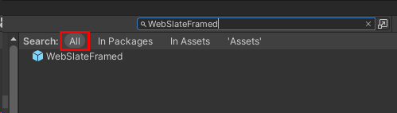

# Add a WebSlate to your environment

## Overview

In the Mesh toolkit, the WebSlate Prefab that we want to use is called *WebSlateFramed*. It contains a URL parameter that you can specify to control the content the WebSlate displays. It also comes with a component that lets an Event Organizer [change the URL for the WebSlate](./control-webslates.md) in an event in real time. When a Mesh event containing the WebSlate starts, the WebSlate will loads its content using the URL you provided.

If you don't want the stylized frame provided in the *WebSlateFramed* prefab, you can turn it off. Instructions for this are provided below.

**Notes**

- There's a also a Prefab named *WebSlate* in the Mesh toolkit but it doesn't support the updating of the URL in a Mesh event in real time so we don't recommend it.

- The size and shape of the WebSlate will match that of the quad GameObject it's placed on. Typically, this is the quad baked inside of the WebSlate prefab.

- You can add multiple WebSlates can to a scene. The number of users in a Mesh event based on Mesh won't affect WebSlate performance; WebSlate resources are initialized locally on the user's machine.

## Add a WebSlate

### Add the WebSlateFramed prefab from a menu

1. Right-click inside the **Hierarchy**, and then in the context menu, select **Mesh Toolkit** > **WebSlateFramed**.

   **Tip**: You can also click the "+" button at the top left of the Hierarchy window to see the same menu.

   

### Search for and add the WebSlateFramed prefab

1. In the Search field, type in "WebSlateFramed." Make sure you have the **All** filter selected.

   

1. Drag the prefab you want into the **Scene** view or the **Hierarchy**.

### Specify the default URL

1. In the **Hierarchy**, expand the **WebSlateFramed** GameObject and then select its child object named **WebSlate**.

   

1. In the **Inspector**, navigate to the **WebSlate** component.
1. Update the **Current URL** field to the URL you want the WebSlate to load by default in a Mesh event.

   

**To turn off the frame for the WebSlate**:
1. With the WebSlateFramed Prefab in the **Hierarchy** expanded, select its child object named **Backplate**.

   

1. In the **Inspector**, clear the check box to the left of "Backplate" to turn the GameObject off.

   

## Tips

- You can place a WebSlate on GameObjects other than a Quad by adding *WebSlate.cs* as a script component directly to your 3D object of choice and adding *UnlitWebSlate.mat* to MeshRenderer Materials. Note that this might result in visual texture stretching, inversion, and/or rotation.

- A WebSlate loads a default URL. You should replace this URL with one that you prefer for each WebSlate in use. The brightness parameter is set to 1.0 (100% of the browser's brightness).

- WebSlates will automatically suspend themselves after being offscreen for too long. If you need to ensure that a given WebSlate is always running (such as a live stream or continuous audio playback), in the **WebSlate** component, select **Prevent Suspension**. Note that doing so can cause the scene to consume more resources, since the WebSlate will remain active at all times.

- To size the image URL to the size of the WebSlate, wrap the URL in HTML. Make use of the WebSlate LoadHTML API through visual scripting to render this HTML content onto your WebSlate. Add the constructed HTML to the HTMLContent property. Alternatively, you can use the LoadHTMAsset API and pass the HTML as an asset. Replace the image URL with your image URL.

  Sample HTML with the image URL and Visual scripting graph using the LoadHTML and LoadHTMLAsset API:

  `<!DOCTYPE html><html lang="en"><head><meta charset="UTF-8"><meta name="viewport" content="width=device-width initial-scale=1.0"><title>Microsoft</title></head><body style="margin: 0; height: 100vh; overflow: hidden; background-color: black;"></body></html>`

  

  

## Live streams powered by WebSlate

To have your WebSlate display a live stream, in the **Current URL** field for the WebSlate, provide the live stream URL. In the case where the live stream URL isn't available beforehand, you could utilize a URL redirection service to generate a URL and provide that to the WebSlate. This approach provides the flexibility to update the redirection URL at the last moment without needing to re-publish the large environment with the live stream URL. Ensure that you select the *Prevent Suspension* option during the WebSlate setup to prevent it from suspending after 30 seconds if someone isn't actively viewing the WebSlate. WebSlates don't require configuration with the Host Tools, so host-less events can be created and serve as drop-in spaces with meaningful content.

## Next steps

> [!div class="nextstepaction"]
> [Test your WebSlate](./test-your-webslate.md)
