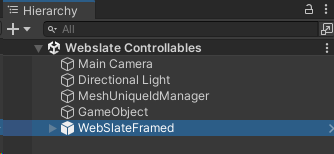
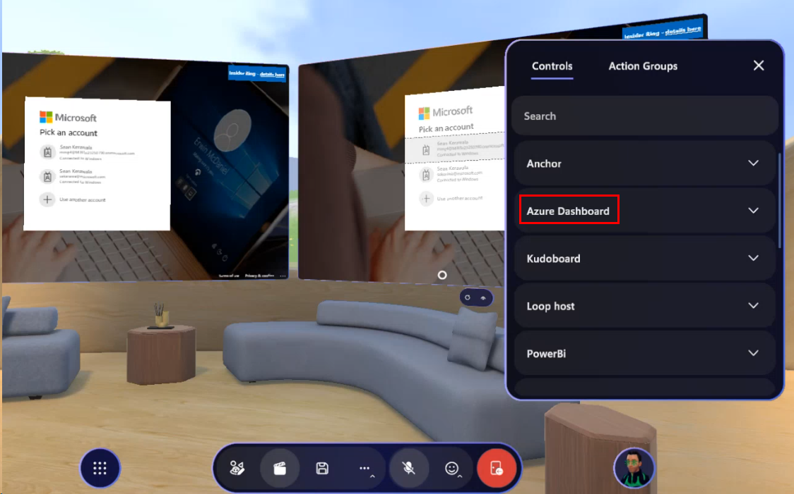
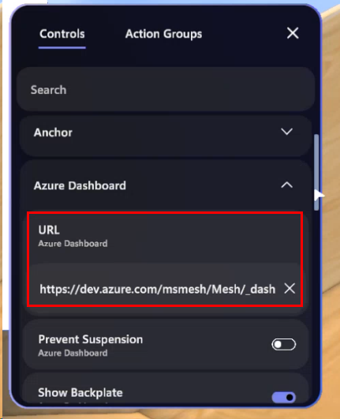

# Add a WebSlate to your environment

## Overview

In the Mesh toolkit, the WebSlate Prefab that we want to use is called *WebSlateFramed*. It contains a URL parameter that you can specify to control the content the WebSlate displays. It also comes with a component that lets an Event Organizer [change the URL for the WebSlate](./control-webslates.md) in an event in real time. When a Mesh event containing the WebSlate starts, the WebSlate will load its content using the URL you provided.

**Notes**

- There's a also a Prefab named *WebSlate* in the Mesh toolkit but it doesn't support the updating of the URL in a Mesh event in real time so we don't recommend it.

- The size and shape of the WebSlate will match that of the quad GameObject it's placed on. Typically, this is the quad baked inside of the WebSlate prefab.

- You can add multiple WebSlates can to a scene. The number of users in a Mesh event based on Mesh won't affect WebSlate performance; WebSlate resources are initialized locally on the user's machine.

## Add a WebSlate

### Add the WebSlateFramed prefab from a menu

1. Right-click inside the **Hierarchy**, and then in the context menu, select **Mesh Toolkit** > **WebSlateFramed**.

   **Tip**: You can also click the "+" button at the top left of the Hierarchy window to see the same menu.

   

### Search for and add the WebSlateFramed prefab

1. In the Search field, type in "WebSlateFramed." Make sure you have the **All** filter selected.

   

1. Drag the prefab you want into the **Scene** view or the **Hierarchy**.

### Specify the default URL

1. In the **Hierarchy**, expand the **WebSlateFramed** GameObject and then select its child object named **WebSlate**.

   

1. In the **Inspector**, navigate to the **WebSlate** component.
1. Update the **Current URL** field to the URL you want the WebSlate to load by default in a Mesh event.

   

## Make the WebSlate controllable in an event

When you add a WebSlate to your environment, you set a default URL for it, but what if an event organizer wants to change the URL in real time during an event using the Control Panel? To accommodate this, the *WebSlateFramed* Prefab comes with a component named *WebSlate Controllable*. It also comes with the *Object Controllable* component which lets an event organizer enable or disable the WebSlate during an event.

The controllable feature of WebSlates enables environment creators to retain the design and aesthetics of the environment while enabling Organizers who run multiple events (as a Template or not) to change content depending on the theme of their event. Note that Controllable URLs can be added or changed *only* during live events. URLs added during customization (in Edit mode) won't be saved and thus won't persist across multiple events; WebSlates will default to the URL added by developers in Unity each time.

With this feature, WebSlates provide the following capabilities: 

- **Event Organizers**: Toggle URLs, visibility (on/off), and (optionally) *Prevent suspension* (to keep WebSlates always on). Organizers can use the host panel to change a URL during an event; this updates WebSlates for all users in the event instantly (global refresh).  
- **Event Attendees**: When an attendee uses the cursor or controller to hover over a WebSlate, a menu bar with a built-in refresh button and a tooltip briefly explaining the single-user nature of WebSlates appears (some web apps may offer shared experiences). This provides a way to return to the URL set by Organizers in case the user navigates away and can be used in case web apps have issues during an event.  
 
### Add a controllable name and default URL

**Note**: If you already have a *WebSlateFramed* prefab in an existing environment, to get the Controllable feature, upgrade the Mesh toolkit to version 24.10 or later. After doing so, you can start at Step 3 below. 

1. In the **Hierarchy**, select the WebSlateFramed prefab you added.

   

1. In the **Inspector**, navigate to the **WebSlate Controllable** component and then, in the **Display Name** field, add a name for the Controllable. Ensure that the name gives some indication of the function of the WebSlate in the environment; this is what will be seen by Organizers in the Control Panel and used to update the WebSlate in real time, if needed. For this example, we'll use "Azure Dashboard".

   

1. In the **Object Controllable** component, provide a name in the same way.
1. In the **Hierarchy**, expand the **WebSlateFramed** component, and then select its child object named **WebSlate**.
1. In the **Inspector**, update the **Current URL** field to the URL you want the WebSlate to load by default in a Mesh event.

   

1. [Test the WebSlate](./test-your-webslate.md) in Play Mode to ensure that the URL displays properly. 

### More WebSlate controllable settings

   

**Prevent Suspension** (*WebSlate Controllable component*): This setting shows up in the Control Panel, and the default setting is **off**. This means that if an attendee moves away from a WebSlate and the WebSlate is no longer in their view for 30 seconds or longer, the Webslate is automatically suspended to conserve memory. It will reload if the WebSlate once again enters the attendee's view. 

In some situations, content may need to play for attendees regardless of their position in the event (for example, if the WebSlate is running live stream content). In this case, it's better to have the *Prevent Suspension* setting toggled **on**.

The event organizer can toggle this setting on and off in the event. If you want to change the default setting to "on", select the **Prevent Suspension** check box.

**Backplate** (*WebSlate Controllable component*): The WebSlateFramed Prefab comes with the **Backplate* GameObject selected here to provide the "frame". You can change this to "None" to turn off the frame, but we recommend that you keep this setting as is and leave it up to the Event Organizer to toggle the Backplate on or off . 

**Visible** (*Object Controllable component*): This setting also appears in the Control Panel, where the Event Organier can toggle the visibility of WebSlates on or off for all event attendees. Select this if you want the default to be "visible". 

**Note**: If any of these settings are changed during events, the changes will be reflected in real-time for all users.  

## Test the Controllable in a Mesh event

Testing the full controllable functionality of a WebSlate can only happen in a Mesh event. In our example event based on your environment, our example Controllable WebSlate, "Azure Dashboard", appears in the Control Panel.

The event Organizer can click the down-facing arrow on **Azure Dashboard** to view the URL, which they can then change.

As mentioned earlier, the Organizer can change several settingss of the WebSlate during the event, such as **Prevent Suspension**, **Show Backplate**, and **Visible** (toggle on/off). 

## WebSlate menu

When anyone (users or organizers) approaches a WebSlate and hovers over it with their cursor or VR controller, the WebSlate menu appears.

**Refresh** (left button): The attendee can click this to return their personal view back to the default webpage for the WebSlate.

**Information** (right button): This provides a tooltip to remind the attendee that what they're seeing is unique to them and not shared with other attendees unless the WebSlate is showing a [collaborative web app](./webcontent.md#single-user-and-collaborative-webslate-experiences). 

## Tips

- You can place a WebSlate on GameObjects other than a Quad by adding *WebSlate.cs* as a script component directly to your 3D object of choice and adding *UnlitWebSlate.mat* to MeshRenderer Materials. Note that this might result in visual texture stretching, inversion, and/or rotation.

- A WebSlate loads a default URL. You should replace this URL with one that you prefer for each WebSlate in use. The brightness parameter is set to 1.0 (100% of the browser's brightness).

- WebSlates will automatically suspend themselves after being offscreen for too long. If you need to ensure that a given WebSlate is always running (such as a live stream or continuous audio playback), in the **WebSlate** component, select **Prevent Suspension**. Note that doing so can cause the scene to consume more resources, since the WebSlate will remain active at all times.

- To size the image URL to the size of the WebSlate, wrap the URL in HTML. Make use of the WebSlate LoadHTML API through visual scripting to render this HTML content onto your WebSlate. Add the constructed HTML to the HTMLContent property. Alternatively, you can use the LoadHTMAsset API and pass the HTML as an asset. Replace the image URL with your image URL.

  Sample HTML with the image URL and Visual scripting graph using the LoadHTML and LoadHTMLAsset API:

  `<!DOCTYPE html><html lang="en"><head><meta charset="UTF-8"><meta name="viewport" content="width=device-width initial-scale=1.0"><title>Microsoft</title></head><body style="margin: 0; height: 100vh; overflow: hidden; background-color: black;"></body></html>`

  

  

## Next steps

> [!div class="nextstepaction"]
> [Test your WebSlate](./test-your-webslate.md)
