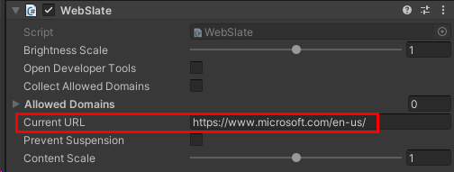

# Add a WebSlate to your environment

## Overview

In the Mesh toolkit, the WebSlate prefab contains a URL parameter that you can specify to control the content the WebSlate displays. In a Mesh event, the WebSlate will loads its content using the URL you provided.

**Notes**

- The size and shape of the WebSlate will match that of the quad GameObject it's placed on. Typically, this is the quad baked inside of the WebSlate prefab.

- You can add multiple WebSlates can to a scene. The number of users in a Mesh event based on Mesh won't WebSlate performance; WebSlate resources are initialized locally on the user's machine.

## Add a WebSlate

There are two flavors of WebSlate prefabs available in the Mesh toolkit that you can add to your scene. If you prefer a clean WebSlate with no extra components, add the _WebSlate_ prefab. If you'd like a WebSlate contained in a stylized frame with extra features, add the _WebSlateFramed_ prefab.

**Note**: If you want the WebSlate to be [controllable by an organizer](./control-webslates.md) in a Mesh event, use the *WebSlateFramed* prefab.

### Add the WebSlate prefab from a menu

**To add either of the prefabs to your scene**:

1. Right-click inside the **Hierarchy**, and then in the context menu, do one of the following:

   **To add the clean WebSlate with no extra components**:  
   Select **Mesh Toolkit** > **WebSlate**.

   **To add the WebSlate with the stylized frame and extra features**:  
   Select **Mesh Toolkit** > **WebSlateFramed**.

   **Tip**: You can also click the "+" button at the top left of the Hierarchy window to see the same menu.

   

   

### Search for and add the WebSlate prefab

You can also search for and add a WebSlate prefab.

1. In the Search field, type in "WebSlate." Make sure you have the **All** filter selected.

   

1. Drag the prefab you want into **Scene** view or the **Hierarchy**.

   

### Specify the default URL

1. Do one of the following:

    **If you're using the *WebSlate* prefab**:  
    Make sure the prefab is selected in the **Hierarchy**, and then, in the **Inspector**, navigate to the **WebSlate** component.
    
    **If you're using the *WebSlateFramed* prefab**:
    1. In the **Hierarchy**, expand the **WebSlateFramed** GameObject and then select its child object named **WebSlate**.
    1. In the **Inspector**, navigate to the **WebSlate** component.

   

1. Update the **Current URL** field to the URL you want the WebSlate to load by default in a Mesh event.

   

## Tips

- You can place a WebSlate on GameObjects other than a Quad by adding *WebSlate.cs* as a script component directly to your 3D object of choice and adding *UnlitWebSlate.mat* to MeshRenderer Materials. Note that this might result in visual texture stretching, inversion, and/or rotation.

- A WebSlate loads a default URL. You should replace this URL with one that you prefer for each WebSlate in use. The brightness parameter is set to 1.0 (100% of the browser's brightness).

- WebSlates will automatically suspend themselves after being offscreen for too long. If you need to ensure a given slate is always running (such as a livestream or continuous audio playback), then check the "Prevent Suspension" button on the association WebSlate. See below for performance implications.

- To size the image URL to the size of the WebSlate, wrap the URL in HTML. Make use of the WebSlate LoadHTML API via visual scripting to render this HTML content onto your WebSlate. Add the constructed HTML to the HTMLContent property. Alternatively, you can use the LoadHTMAsset API and pass the HTML as an asset. Replace the image URL with your image URL.

  Sample HTML with the image URL and Visual scripting graph using the LoadHTML and LoadHTMLAsset API:

  `<!DOCTYPE html><html lang="en"><head><meta charset="UTF-8"><meta name="viewport" content="width=device-width initial-scale=1.0"><title>Microsoft</title></head><body style="margin: 0; height: 100vh; overflow: hidden; background-color: black;"></body></html>`

  

  

## Live streams powered by WebSlate

To have your WebSlate display a live stream, in the **Current URL** field for the WebSlate, provide the live stream URL. In the case where the live stream URL isn't available beforehand, you could utilize a URL redirection service to generate a URL and provide that to the WebSlate. This approach provides the flexibility to update the redirection URL at the last moment without needing to re-publish the large environment with the live stream URL. Ensure that you select the 'Prevent Suspension' option during the WebSlate setup to prevent it from suspending after 30 seconds if someone isn't actively viewing the WebSlate. WebSlates don't require configuration with the Host Tools, so host-less events can be created and serve as drop-in spaces with meaningful content.

