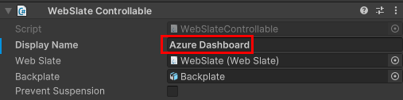
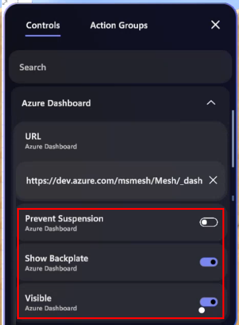
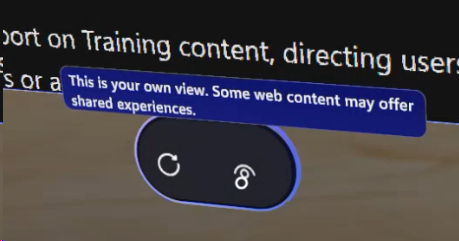

# Make web content controllable in an event

## Overview  

When you add a WebSlate to your environment, you can set a default URL for it, but what if an event organizer wants to change the URL in real time during an event using the Control Panel? To accommodate this, you should use the *WebSlateFramed* prefab which comes with a component named *WebSlate Controllable* for just this purpose. It also comes with the *Object Controllable* component which lets an event organizer enable or disable the WebSlate during an event.

WebSlate controllables are great for environment creators who want to retain the design and aesthetics of the environment while enabling Organizers who run multiple events (as a Template or not) to change content depending on the theme of their event. Note that Controllable URLs can be added or changed *only* during live events. URLs added during customization (in Edit mode) won't be saved and thus won't persist across multiple events; WebSlates will default to the URL added by developers in Unity each time.

With this feature, WebSlates provide the following capabilities: 

- **Developers**: Same simple workflow for adding Webslates, with minor additional configurations to add Controllable capabilities.  
- **Event Organizers**: Toggle URLs, visibility (on/off), and (optionally) *Prevent suspension* (to keep WebSlates always on). Organizers can use the host panel to change a URL runtime; this updates WebSlates for all users in the event instantly (global refresh).  
- **Event Attendees**: When using cursor/controller hover, a menu bar with a built-in refresh button and a tooltip briefly explaining the single-user nature of WebSlates appears (some web apps may offer shared experiences). This provides a way to return to the URL set by Organizers in case the user navigates away and can be used in case web apps have issues during an event.  
 
## Set up WebSlate Controllables 

**Note**: If you already have a *WebSlateFramed* prefab in an existing environment, to get the Controllable feature, upgrade the Mesh toolkit to version 24.10 or later. After doing so, you can start at Step 3 below. 

**To add and configure a WebSlate Controllable to your environment**:

1. Follow the instructions in our [Add a WebSlate article](./add-a-webslate.md#add-a-webslate) to add a WebSlate, making sure that you add the *WebSlateFramed* prefab.
1. In the **Hierarchy**, select the WebSlateFramed prefab.

   

1. In the **Inspector**, navigate to the **WebSlate Controllable** component and then, in the **Display Name** field, add a name for the Controllable. Ensure that the name gives some indication of the function of the WebSlate in the environment; this is what will be seen by Organizers in the Control Panel and used to update the WebSlate in real time, if needed. For this example, we'll use "Azure Dashboard".

   

1. In the **Object Controllable** component, provide a name in the same way.
1. In the **Hierarchy**, expand the **WebSlateFramed** component, and then select its child object named **WebSlate**.
1. In the **Inspector**, update the **Current URL** field to the URL you want the WebSlate to load by default in a Mesh event.

   

1. [Test the WebSlate](./test-your-webslate.md) in Play Mode to ensure that the URL displays properly. 

## Testing the Controllable in a Mesh event

Testing the full controllable functionality can only happen at runtime. The Control Panel and WebSlate menu are available in the Mesh app. In a Mesh event based on your environment, our example Controllable WebSlate, "Azure Dashboard", appears in the Control Panel.

   

The event Organizer can click the down-facing arrow on **Azure Dashboard** to view the URL, which they can then change.

   

The Organizer can configure other no-code features of the WebSlate during the event, such as **Prevent Suspension**, **Show Backplate**, and **Visible** (toggle on/off) 

   

## WebSlate menu

The WebSlate menu, consisting of two buttons, appears below the WebSlate.

**Refresh** (left button): The attendee can click this to return their personal view back to the default webpage for the WebSlate.

**Information** (right button): This provides a tooltip to remind the attendee that what they're seeing is unique to them and not shared with other attendees unless the WebSlate is showing a [collaborative web app](./webcontent.md#single-user-and-collaborative-webslate-experiences). 

   

 

