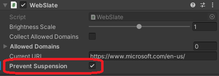
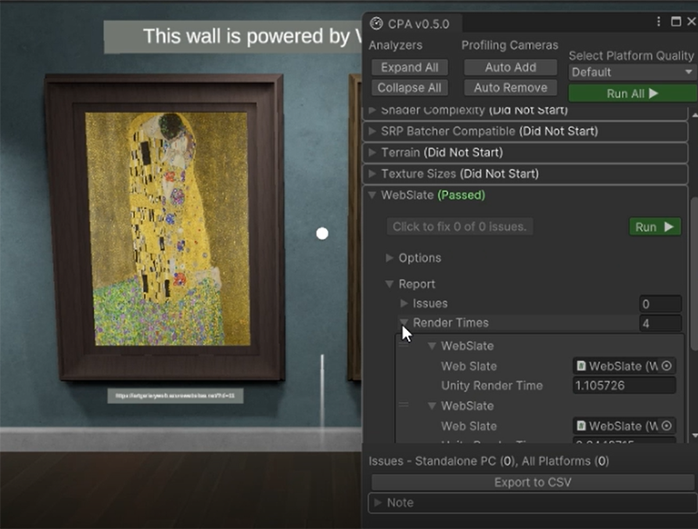
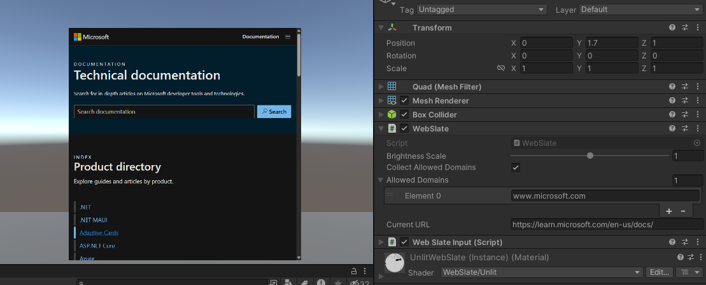
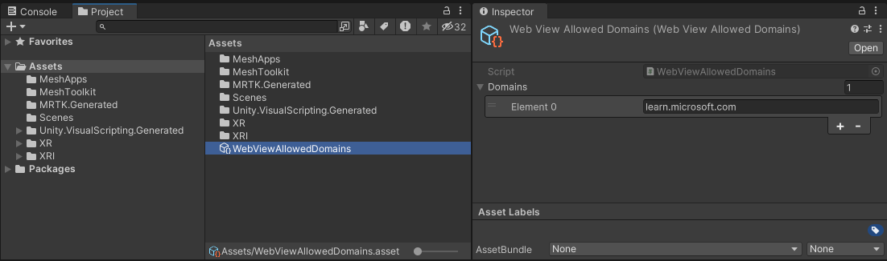
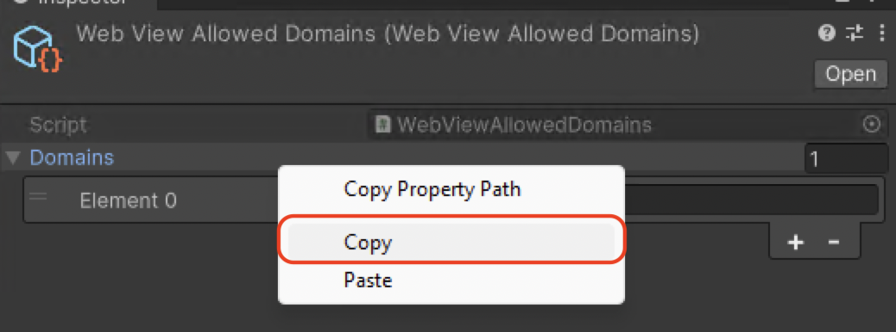
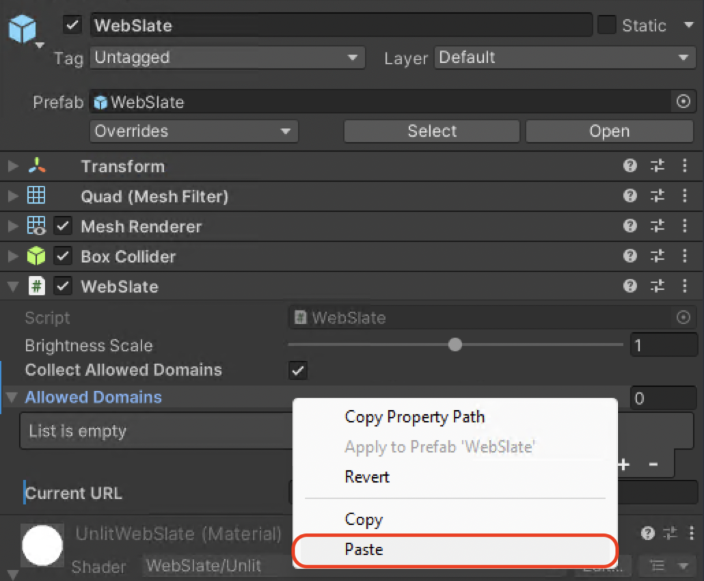
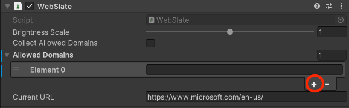

# WebSlate performance and security

## Performance

[Display and interact with web content overview](./webcontent.md)

Since a WebSlate is a loaded web page, it's important to consider performance implications:

- Scenes are typically performant at 60fps with up to 10 active WebSlates. Framerate and general performance degradation may be observed in proportion to the number of WebSlates placed in a scene, regardless of content.

- Content is loaded and executed in the WebSlate on a thread separate from the scene's update and rendering thread(s), and is therefore unlikely to directly affect frame rate. However, it's still important to consider the cost of JavaScript running on a Web page both in terms of runtime complexity and memory usage.

- To help save on performance, WebSlates that are offscreen for over 30s are automatically suspended. They quickly resume on coming back onscreen, but this can impact actively-running services on the hosted page. If this is an issue, developers can disable suspension with the prefab's "Prevent Suspension" checkbox. Note that doing so can cause the scene to consume more resources, as these WebSlates remain active at all times.

  

- Since WebSlates don't have any external navigation UI by default, the best practice is to only load custom URLs, where the site navigation is cyclic and can be done inside the page. This can be done with a navigation sidebar, or links to a hub page, for example.

- The Content Performance Analyzer (CPA) tool includes a WebSlate analyzer which measures the average time it takes Unity's render pipeline to render WebSlates in a frame.

  - Measurements are based on Unity's profiler recorder and require Play mode. The analyzer moves the camera over each WebSlate to collect sufficient profiler samples and calculates the average render time.

  - This provides a first-stage, high-level analysis of WebSlate render times in the context of Unity's render pipeline. It doesn't provide the frame rate of the WebSlate content itself.

  - If Unity's render pipeline exceeds the threshold to render WebSlates (currently 10ms), the CPA tool provides a warning.

  - The same measurements are also available to the Performance Profiler. The group on the Performance Profiler typically changes colors from green to red when the budget allowance for a category is surpassed. For now, the WebSlate group only shows as green until a reasonable render time budget is rationalized for WebSlates.

  

## Security restrictions

- WebSlates are locked to the URLs they navigate to, preventing malicious redirects. All unintended hyperlink navigations to outside domains are blocked, unless explicitly listed as an allowed domain (see below).

- WebSlates are restricted to navigation within the initial domain or the specified URL's and server's redirections.

- Navigation within a WebSlate is exclusively limited to HTTPS.

- Device access to webcam, microphone, and geolocation are blocked.

### WebSlate domain allow-list

To ensure security against unintended URL-based attack vectors such as phishing, WebSlates by default restrict navigation to the URL's that are included under the domain of the first page loaded into the WebSlate. For example, a WebSlate launched on https://www.microsoft.com/ will only navigate to pages whose URL's start with "www.microsoft.com". While this ensures that users won't accidentally diverge from the intended navigation flow, it can be an overly restrictive default for some use cases, such as user authentication, during which there may be redirections to subdomains or third-party authentication providers.

The way to accomodate for these use cases is by adding domains to the WebSlate's allow list.

### Automatically add domains (recommended)

When working with WebSlates in the Unity editor, you have the option to enable "Collect Allowed Domains". This will remove the domain navigation restriction so that you can navigate freely when running in Play mode to test your scenario. While you navigate in Play mode, the WebSlate will log the domains you visit in the background.

In this case, we're expanding navigation from _microsoft.com_ to also include _learn.microsoft.com_.

Once you exit Play mode, you'll find an asset called _"WebViewAllowedDomains.asset"_ in your top-level _Assets_ folder.

Clicking on this asset will give you the list of extra domains you visited beyond the domain of your initial URL. You can right click, copy, and then paste the values into the "Allowed Domains" field of the WebSlate component.

**Note**: This option is impossible to enable in uploaded scenes. Leaving "Collect Allowed Domains" enabled will NOT remove the restriction in your final scene. However, your allowed domains list will persist and will allow navigation as long as the domains are added to the WebSlate.

### Manually add domains

If you already know which domains you'll need, you can manually add them to the WebSlate by expanding the "Allowed Domains" drop-down and adding your supplemental domains to the list in the Unity GUI.

## Next steps

> [!div class="nextstepaction"]
> [Enhanced features overview](../enhanced-features-overview.md)
