# Display and interact with web content

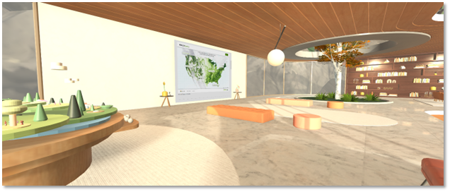

Use WebSlate to display interactive web content in your 3D Mesh environment. Get a full browsing experience on PC or Quest 2 with intuitive input, customizability, security, and performance management. 

You can use WebSlates for:

- Interacting with maps, diagrams, and data

- Viewing dashboards, web pages, photos, and videos

- Showcasing content that highlights products and services, customer stories, and brand identity

## WebSlate features

- **Specify a default URL:** Choose your location, then drag-and-drop the prefab, and then add a URL. Repeat if you want multiple WebSlates in your scene.

- **Input & audio built-in:** End user web navigation, interaction with apps, and viewing videos become available in Mesh.

- **Secure navigation:** Lock redirect URLs to prevent malicious redirects and unintended hyperlink navigations.

- **Visual customization:** Modify quality to optimize for users' devices. Attract users from a distance with easy-to-view content.

- **Scriptable:** With [visual scripting and cloud scripting](../script-your-scene-logic/mesh-scripting-overview.md), you can enable toggling between pages with a button.

- **[Content Performance Analyzer tool](../debug-and-optimize-performance/cpa.md) integration:** Measure the average time it takes for URP to render WebSlates in a frame and find content loading issues.

- **Testing in Mesh Emulation Mode:** Interact with your content as a user would, directly from the Unity editor.  

- **Manually authenticate in-experience:** Access secure content from within the experience by logging into your account and viewing content at runtime.

## How WebSlate works

If you have a Unity project set up to [create Mesh Environments](../build-your-basic-environment/create-a-new-project-or-update.md), adding a WebSlate to your Environment is a straightforward process.

In Mesh, WebSlate loads an interactive page through a provided URL. The URL given to it in the Environment will be the same one loaded in Mesh. In the Mesh Toolkit, the WebSlate prefab contains a URL parameter that developers can specify to control the content displayed in their Mesh Environment. 

- When loaded on the Mesh App for PC and Quest, webpages loaded by a WebSlate are interactable through mouse, keyboard, and Quest XR controller input.

- The size and shape of the WebSlate will match that of the quad GameObject it's placed on. Typically, this is the quad baked inside of the WebSlate prefab.

- Multiple WebSlates can be added to a scene. The number of users in your Mesh Environment doesn't affect WebSlate performance; WebSlate resources are initialized locally on the user's machine.

- WebSlates can be configured with visual or cloud scripting to add interactive behaviors and synchronization across users.

- WebSlate can display webpages and it supports interaction but doesn't function as a browser and doesn't support bookmark, history or travel back-forth. 

- You can preview your WebSlate in your Unity project before uploading your scene to Mesh by pressing Play.

## Requirements/Dependencies

WebSlate depends on the *Unity.InputSystem* and *Unity.XR.Interaction.Toolkit* Unity packages, located in the Mesh Toolkit.

## Add a WebSlate prefab to your Unity project

There are two flavors of WebSlate prefabs available in the Mesh Toolkit that you can add to your scene. If you prefer a clean WebSlate with no extra components, add the WebSlate prefab. If you'd like a WebSlate contained in a stylized frame with extra features, add the *WebSlateFramed* prefab.

### Add the WebSlate prefab from a menu

**To add either of the prefabs to your scene**:  
1. Right-click inside the **Hierarchy**, and then in the context menu, do one of the following:

    **To add the clean WebSlate with no extra components**:  
    Select **Mesh Toolkit** > **WebSlate**.
    
    **To the WebSlate with the stylized frame and extra features**:  
    Select **Mesh Toolkit** > **WebSlateFramed**.

1. Add a URL to the WebSlate to display content.

    **Tip**: You can also click the "+" button at the top left of the Hierarchy window to see the same menu.

    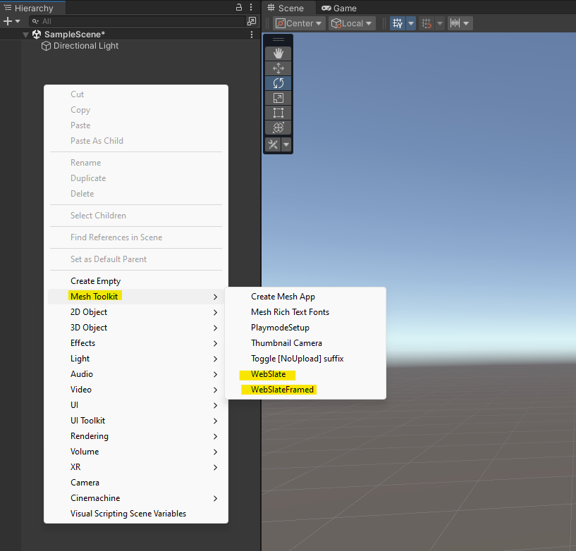

    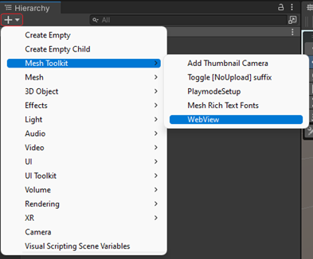

### Search for and add the WebSlate prefab

You can also search for and add a WebSlate prefab.

1. In the Search field, type in "WebSlate." Make sure you have the **All** filter selected.

    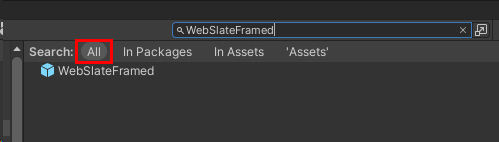

1. Drag the prefab you want into **Scene** view or the **Hierarchy**.

    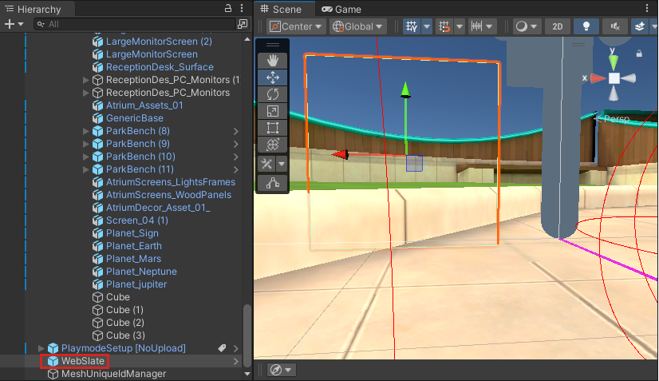

1. In the **Inspector**, navigate to the **WebSlate** component, and then add the URL you want to display on the WebSlate:

    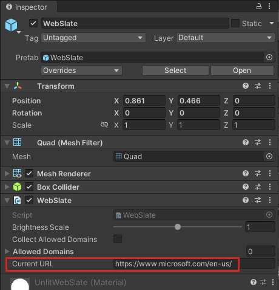

## Ensure that your WebSlate is readable

It's important to ensure that all the attendees in a Mesh experience can read all the content on a WebSlate comfortably. We recommend that you create some empty floor space in front of a WebSlate so that attendees can move closer to it and adjust their position for a better view. If your experience contains seats, view the WebSlate from each seat to ensure that an attendee sitting in that seat can read the text on the WebSlate. If you have control over the content that will appear on a WebSlate, experiment with various font sizes for the text to determine the optimal size for viewing. In the example experience below, the "Microsoft Teams" text in the middle of the WebSlate is more than large enough for comfortable viewing, but the much smaller text in the corners is difficult to read. In this type of scenario, you wouldn't have control over the text in the streaming video so you should consider moving the seats closer. Also, seats that are more centered and looking straight at the WebSlate will provide a better view than seats that are off to the sides.

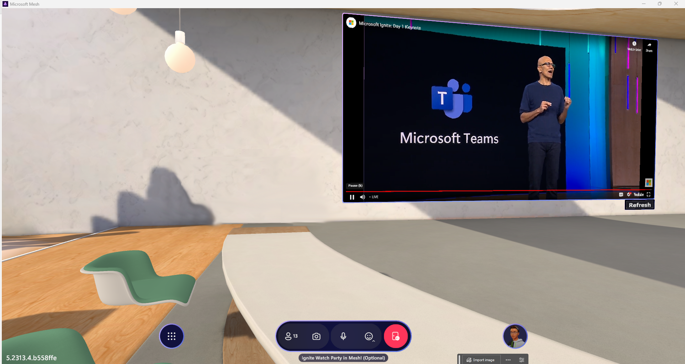

## Preview WebSlate in Mesh Emulation Mode

To view a URL displayed in your WebSlate more quickly, you can use Mesh Emulation Mode. Aside from testing in this mode, the only other way to see your WebSlate is to upload it using the Mesh Toolkit Uploader and view it in a Mesh experience.

To add Mesh Emulation Mode to your project, follow the instructions in the [Mesh Emulator article](../debug-and-optimize-performance/mesh-emulator.md).

**To view your Web page in the WebSlate**:  
Press the Unity editor Play button.

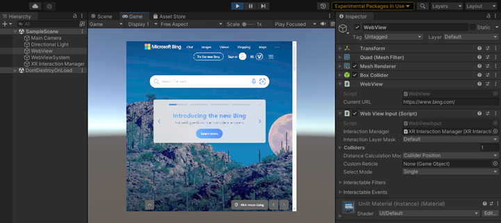

### Enable WebSlate interaction for Mesh Emulation Mode

To enable interaction in the WebSlate, you have to set up a few things.

1. Add the [Mesh Emulator](../debug-and-optimize-performance/mesh-emulator.md) to your scene to enable Mesh Emulation Mode.

1. Create a new **Plane** GameObject. This will be your floor. Ensure the GameObject is positioned at the origin (0,0,0):
    
    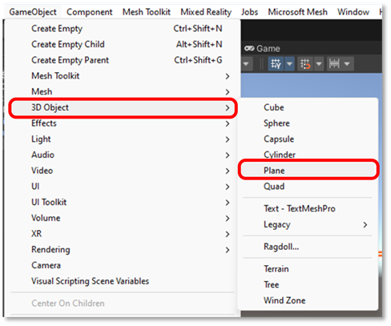

1. Position the WebSlate so it sits in front of the *MeshEmulatorSetup* character:

    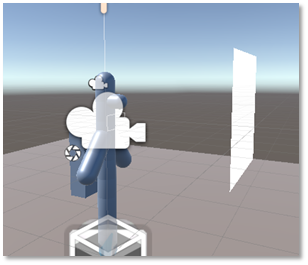

1. Click the Play button, and then double-click to interact with the Web page displayed in the WebSlate:

    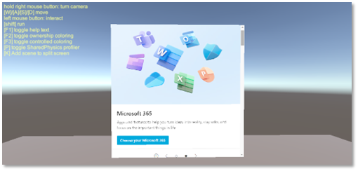

Great job! You added a custom WebSlate to your Unity scene and tested the interaction in Mesh Emulation Mode.

Now you're ready to upload the Environment to Mesh and share your creation with the world!

## WebSlate in Visual Scripting

With Visual Scripting, developers can implement WebSlate functionality and behavior without the need for typing code. Instead, a node-based visual interface is provided, enabling users to define and connect various actions and events in a scene. Some developers find that this can simplify the process of adding interactivity and behavior.

To enable visual scripting using WebSlate, you must set up a few things.

1. Go to **Edit** > **Project Settings**.

2. In the left-side list, select **Visual Scripting**.

   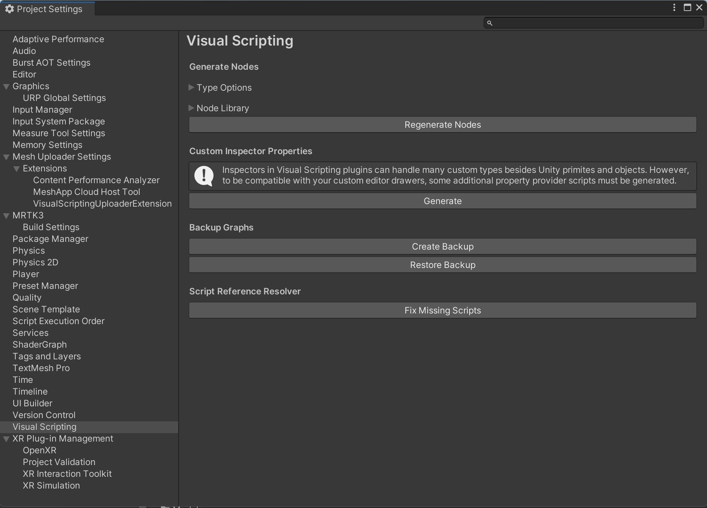

4. Expand **Node Library**. This displays the assembly list.

5. At the bottom of the assemblies list on the right, click the Add (+) button. This adds a new item to the list which displays "(No Assembly)".

6. Click the new assembly entry, and then in the Search field, type "Webslate". This narrows the list to **Microsoft.Mesh.WebSlate**. Select this item to add it to the **Assembly** list.

   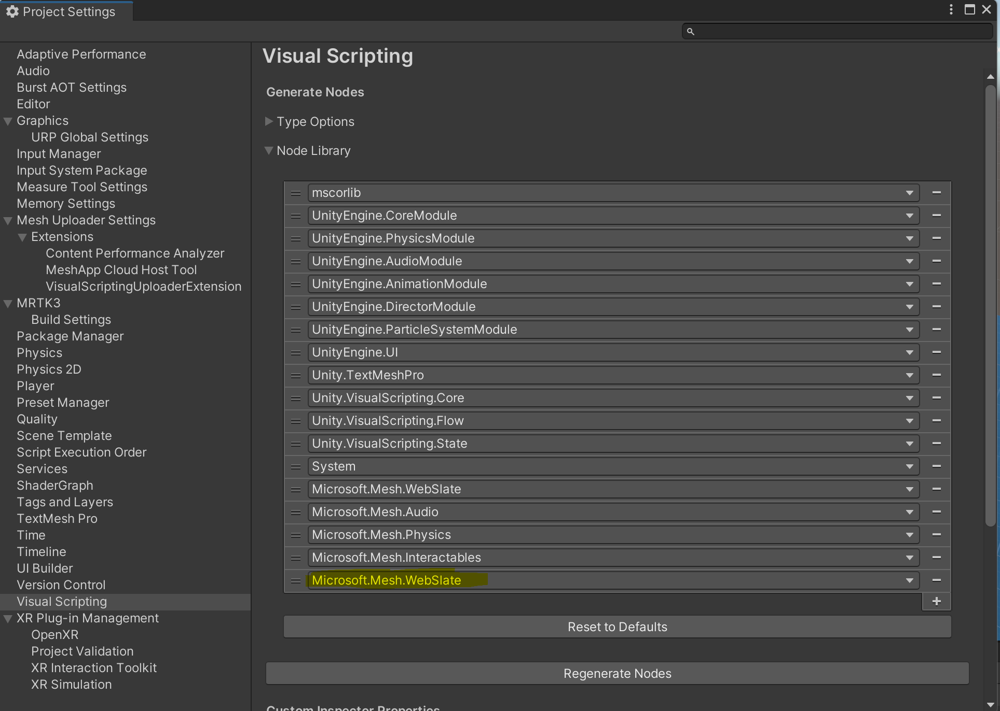

    Visual Scripting adds the **Microsoft.Mesh.WebSlate** and its nodes to the Node Library. To use the nodes in your project, select the **Regenerate Nodes** button.

    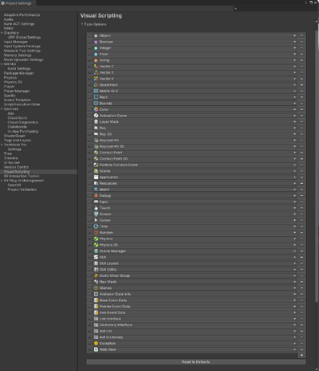

    After incorporating the WebSlate visual scripting node into your project, you can utilize it just like any other node in your script graph. Here's an example of a script graph that loads a new URL in WebSlate when the state of a graph variable changes.

    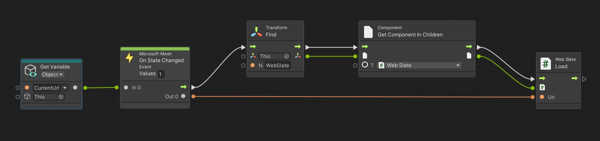

## WebSlate in Cloud Scripting

Developers can add a WebSlate to Environments using Mesh cloud scripting, as well. This means that a WebSlate can be navigated by a Mesh cloud script and then synchronized across users. For example, you can create a Mesh cloud script containing a WebSlate node and one or more Interactable nodes. Next, you can set up your InteractableNode's click event handler to navigate the WebSlate to a different URL. By adding a Mesh cloud script alongside WebSlate, your users can update the WebSlate contents interactively.

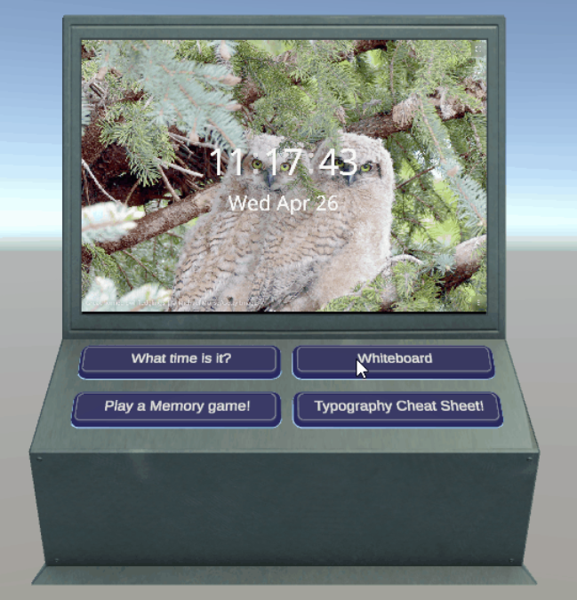

For further guidance on the WebSlate node in Mesh Apps, see the [Visual scripting overview](../script-your-scene-logic/mesh-scripting-overview.md).

## General Tips

- You can place a WebSlate on GameObjects other than a Quad by adding *WebSlate.cs* as a script component directly to your 3D object of choice. Note that this might result in visual texture stretching, inversion, and/or rotation.

- A WebSlate loads a default URL. You should replace this URL with one that you prefer for each WebSlate in use. The brightness parameter is set to 1.0 (100% of the browser's brightness).

    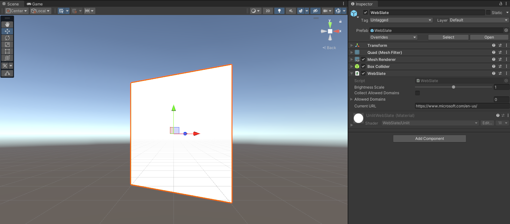

## Performance

- Since a WebSlate is a loaded web page, it's important to consider performance implications:

  - Scenes are typically performant at 60fps with up to 10 WebSlates. You may observe frame rate and general performance degradation in proportion to the number of WebSlates placed in a scene, regardless of content.

  - Content is loaded and executed in the WebSlate on a thread separate from the scene's update and rendering thread(s), and is therefore unlikely to directly affect frame rate. However, it's still important to consider the cost of JavaScript running on a Web page both in terms of runtime complexity and memory usage.

- Since WebSlates don't have any external navigation UI by default, the best practice is to only load custom URLs, where the site navigation is cyclic and can be done inside the page. This can be done with a navigation sidebar or links to a hub page, for example.

- The Content Performance Analyzer (CPA) tool includes a WebSlate analyzer which measures the average time it takes Unity's render pipeline to render WebSlates in a frame. 

    - Measurements are based on Unity's profiler recorder and require Play mode. The analyzer moves the camera over each WebSlate to collect sufficient profiler samples and calculates the average render time.

    - This provides a first-stage, high-level analysis of WebSlate render times in the context of Unity's render pipeline. It doesn't provide the frame rate of the WebSlate content itself.
  
    - If Unity's render pipeline exceeds the threshold to render WebSlates (currently 10ms), the CPA tool provides a warning.
  
    - The same measurements are also available to the Performance Profiler. The group on the Performance Profiler typically changes colors from green to red when the budget allowance for a category is surpassed. For now, the WebSlate group only shows as green until a reasonable render time budget is rationalized for WebSlates.

    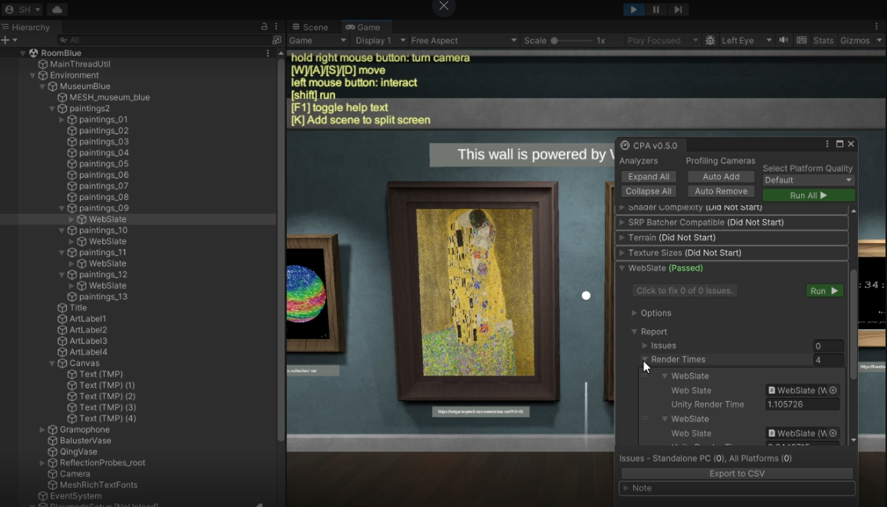

## Security restrictions

- WebSlates are locked to the URLs they navigate to, preventing malicious redirects. All unintended hyperlink navigations to outside domains are blocked.

- WebSlates are restricted to navigation within the initial domain or the specified URL's and server's redirections.

- Navigation within a WebSlate is exclusively limited to HTTPS.

- Device access to webcam, microphone, and geolocation are blocked.

### WebSlate domain allow-list

To ensure security against unintended URL-based attack vectors such as phishing, WebSlates by default restrict navigation to the URL's that are included under the domain of the first page loaded into the WebSlate. For example, a WebSlate launched on https://www.microsoft.com/ will only navigate to pages whose URL's start with "www.microsoft.com". While this ensures that users won't  accidentally diverge from the intended navigation flow, it can be an overly restrictive default for some use cases, such as user authentication, during which there may be redirections to subdomains or third-party authentication providers.

The way to accomodate for these use cases is by adding domains to the WebSlate's allow list.

### Automatically add domains (recommended)

When working with WebSlates in the Unity editor, you have the option to enable "Collect Allowed Domains". This will remove the domain navigation restriction so that you can navigate freely when running in Play mode to test your scenario. While you navigate in Play mode, the WebSlate will log the domains you visit in the background. 

In this case, we're expanding navigation from *microsoft.com* to also include *learn.microsoft.com*.

Once you exit Play mode, you'll find an asset called *"WebViewAllowedDomains.asset"* in your top-level *Assets* folder.

Clicking on this asset will give you the list of extra domains you visited beyond the domain of your initial URL. You can right click, copy, and then paste the values into the "Allowed Domains" field of the WebSlate component.

>[!Note]
> This option is impossible to enable in uploaded scenes. Leaving "Collect Allowed Domains" enabled will NOT remove the restriction in your final scene. However, your allowed domains list will persist and will allow navigation as long as the domains are added to the WebSlate.

### Manually add domains

If you already know which domains you'll need, you can manually add them to the WebSlate by expanding the "Allowed Domains" drop-down and adding your supplemental domains to the list in the Unity GUI.

## Limitations and Known Issues

### General limitations

- WebSlates are currently supported in the Mesh application on PC Standalone and Quest devices. In the Unity editor on Windows, WebSlates are only available to preview.

- Automatic scaling and scale adjustments for content with different resolution requirements isn't currently available.

- WebSlates in the editor preview are missing a few input capabilities, such as double-click and dragging.

- Low legibility for viewing from a distance on Quest.

- Audio isn't spatially localized.

- Web content sync is limited to applications that use web APIs to synchronize content.

### Known issues

- When working with WebSlate in the Unity editor, the editor needs to be restarted when updating the WebSlate or Mesh Toolkit packages through the Unity Package Manager.

- The "Current URL" field of a WebSlate can't be updated during Play mode.

- If your WebSlate GameObject displays "internal shader error", navigate to the **Inspector** view of your WebSlate and ensure that the selected shader is set to "UnlitWebSlate".

- Visual scripting has WebSlate support. If your visual scripting graph shows references to the legacy “WebView” type, manually update this reference to “WebSlate”.

- When interacting with a WebSlate, Mesh may capture keyboard input, causing unintended interactions with the Mesh app.

## Feedback for Web content in Mesh

We love feedback and bug reports! If you'd like to provide feedback, use the Feedback button inside any Mesh experience. This ensures that your feedback and bug reporting will be reviewed and incorporated quickly. For WebSlate feedback, include "**[web content]**" or **a mention of WebSlate** in your feedback.