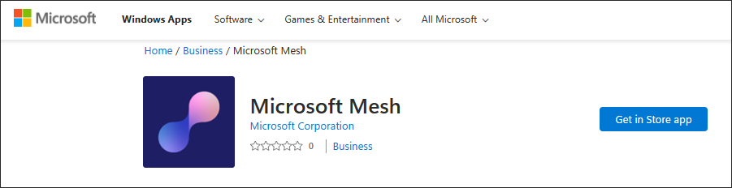
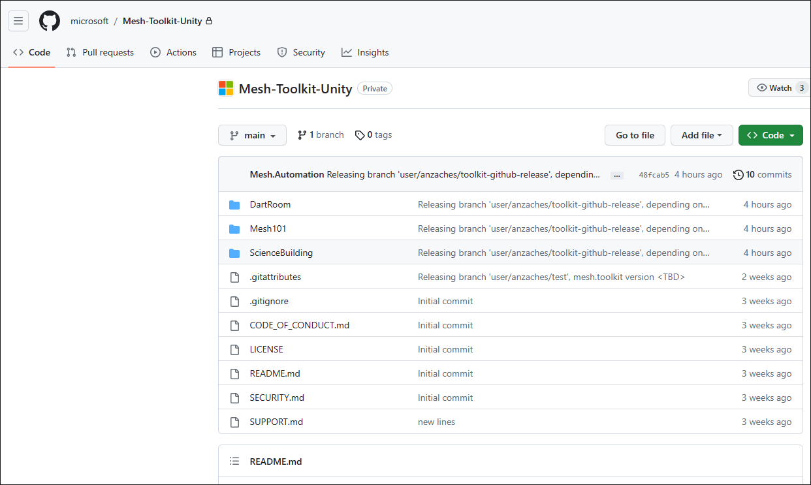
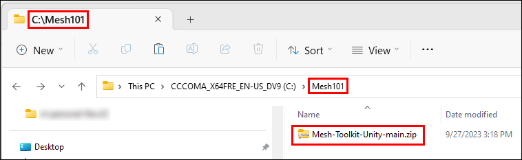
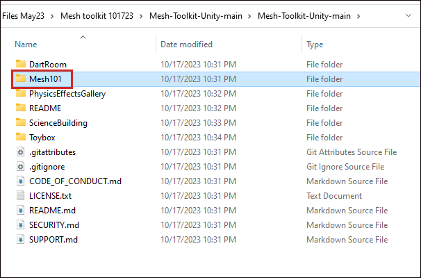

# Mesh 101 Tutorial Chapter 1: Overview and Setup

The Mesh 101 tutorial is a great way to learn about adding Mesh features
to a Unity project to create an interactive learning experience. Created
for intermediate to advanced Unity developers, the tutorial will give
you a solid understanding of the power of Mesh, spanning Mesh Interactables and Physics,
Scripting, and more. You'll start with a pre-built Unity project, add
custom interactivity and other Mesh features, and then deploy the
project as an *Environment* to Microsoft Mesh. Customers can
attend an Event based on your Environment where they'll learn about wind
turbines by visiting a series of interactive stations and experience
multi-user interaction and communication.

The tutorial project is named *Mesh101* and is included in the
Mesh toolkit.

 

> [!VIDEO https://learn-video.azurefd.net/vod/player?id=faa2c9cf-93ce-4314-a73e-b426c4ba3637]
 

> [!IMPORTANT]
> The tutorial project is governed by the MIT license as shown in the [LICENSE.txt](https://github.com/microsoft/Mesh-Toolkit-Unity/blob/main/LICENSE.txt) file in the *Mesh-Toolkit-Unity* repository. However, the samples functionality is dependent on the Mesh toolkit, which is governed by a separate license, and contains 3rd party software. A Teams Premium license is required for using the Mesh application for custom immersive spaces in Mesh on PC and Quest. A license isn't required to develop with the Mesh toolkit, but you'll be blocked from building and publishing Environments to Mesh and organizing or joining events in Mesh if you and your users don't have Teams Premium licenses. For more information, see [Set up M365 for Microsoft Mesh](../../../Setup/Content/setup-m365-mesh.md).

The tutorial is structured as follows:

- Chapter 1: Overview and setup *(this article)*

- [Chapter 2: Prepare the tutorial project](mesh-101-02-prepare-the-project.md)

- [Chapter 3: Add interactivity with Mesh Visual Scripting](mesh-101-03-visual-scripting.md)

  - Station 3.1: Create an Interactable Button
  - Station 3.2: Trigger an info dialog
  - Station 3.3: Teleport to the turbine generator

- [Chapter 4: Move objects and trigger animations with Mesh Interactables and Physics](mesh-101-04-physics.md)

  - Station 4.1: Grab and Release
  - Station 4.2: Animation Trigger
  - Station 4.3: Constraining Bodies

- [Chapter 5: Make your environment available for Events](mesh-101-05-make-environment-available.md)

- [Chapter 6: Test your environment within the Mesh app](mesh-101-06-test-your-environment.md)

- [Chapter 7: Create an event and invite others](mesh-101-07-create-an-event-and-invite-others.md)

## Terminology

In Mesh terms, the project you create in Unity and then upload to Mesh on the web is called an *Environment*.

## Prerequisites

### Previous Unity experience

This tutorial assumes that you have the intermediate to advanced Unity skills needed to create an Environment. We also recommend that you have some familiarity with Unity Visual Scripting; however, we've gotten feedback from scripting novices that they found the tutorial easy to follow. A good place to learn Visual Scripting basics is through [Unity's Visual Scripting tutorial](https://learn.unity.com/project/introduction-to-visual-scripting). This teaches you most if not all of the concepts you need to get started with Mesh Visual Scripting. 

If you don't, you can still [create, customize and produce](../../../events-guide/create-event-mesh-portal.md) Mesh events using ready-to-use environments.

### Hardware requirements

Minimum PC requirements: 4 CPU cores, 8GB RAM

### Unity version 2022.3.7f1

Unity version 2022.3.7f1 is required for this tutorial.

[Review system requirements for Unity](https://docs.unity3d.com/2022.3/Documentation/Manual/system-requirements.html)

[Get help installing Unity](https://docs.unity3d.com/hub/manual/InstallEditors.html)

Your installation should include modules for Android and Windows. The Mesh app works for PC and the Oculus Quest 2, and Android is the operating system for the Quest.

## Set things up for Mesh

### Download the Mesh desktop app

Download Microsoft Mesh on PC
 
> [!div class="nextstepaction"]
> [Microsoft Mesh - Microsoft Store Apps](https://apps.microsoft.com/store/detail/microsoft-mesh/9NLXZJ1FDBD7)

### Download the Mesh Toolkit samples

The *Mesh 101* tutorial project is available in the [*Mesh-Toolkit-Unity*](https://github.com/microsoft/Mesh-Toolkit-Unity) GitHub repository.

1. In your browser, go to GitHub, and then navigate to the [*Mesh-Toolkit-Unity* repository](https://github.com/microsoft/Mesh-Toolkit-Unity).

    

1. Select the **Code** button, and then select **Download ZIP**.

    

1. On your C: drive, create a folder with a one-word name (for example, "Mesh101") and then move or copy the downloaded Mesh toolkit Zip file to that folder. This is done to avoid running into a problem with the Windows path length limit, which is 256 characters. **IMPORTANT**: *Don't* place the Zip file on the Windows desktop. Behind the scenes, this creates a very long path name.

    In the example below, the user created a folder on their C: drive named *Mesh101.* Next, they moved the downloaded Mesh toolkit Zip file to the *Mesh101* folder.

    

1. Unzip the samples Zip file into the same folder, and then navigate through the unzipped folder hierarchy until you see the **Mesh101** folder. This contains the tutorial project which you'll open in the next chapter.

    

### Mesh toolkit package

For this tutorial, the only package you need is the Mesh toolkit package, and it's already pre-loaded into the tutorial project. If you were creating your
own project from scratch, you would need to [import the Mesh toolkit package](../../build-your-basic-environment/add-the-mesh-toolkit-package.md).

## Next steps

> [!div class="nextstepaction"]
> [Chapter 2: Prepare the project](mesh-101-02-prepare-the-project.md)
