# Mesh 101 Tutorial Chapter 2: Prepare the project

 

> [!VIDEO https://learn-video.azurefd.net/vod/player?id=c6b989b4-6634-4c4d-a1f7-2aa38ab3cd70]

 

## Scenes in the project

1. Open the **Mesh101** project in Unity. If you have more than
    one version of Unity installed, be sure to open the project with `Unity 2022.3.7f1` which is required for this tutorial.

2. In the **Assets** folder, there are two scenes available: **Starting Point** and **Finished Project**.

    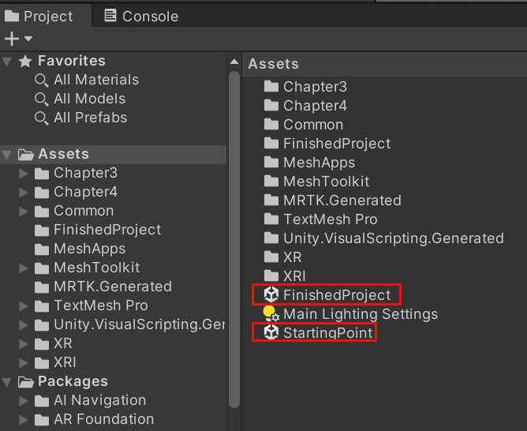

1. Open the **StartingPoint** scene. 

### About the Scenes

**StartingPoint**: This is the scene you'll do the tutorial in. It
contains a pre-built setting that includes the wind turbines and
stations you'll be visiting and adding Mesh features to.

**FinishedProject**: As the title implies, this scene contains an
accurate completed version of the tutorial. You can refer to this at any
time to confirm that you've completed tutorial steps in the
*StartingPoint* scene correctly. Always save your work in the
*StartingPoint* scene before switching scenes.

### Turn object icons off for a clearer view

Many objects appear in a scene with gizmos or icons displayed by default. This can help you identify the objects, but it can also clutter the view and make objects harder to see. 

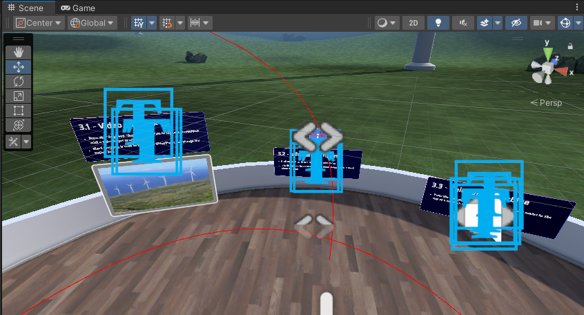

Let's turn off some of the icons we don't need to make the view more clear.

1. In the toolbar above the upper right corner of the **Scene** window, select the Gizmos drop-down.

    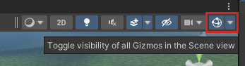

    The first icon we'll address is the one for *TextMeshPro*. The goal here is find **TextMeshPro** in the list and then click its **icon** toggle button, which turns off the display of the icons in the **Scene** window. You could scroll down until you find TextMeshPro in the list:

    

    ... but there's a faster way to find objects than scrolling.

1. In the search field, type in "text." The list narrows down to objects starting with those letters.

    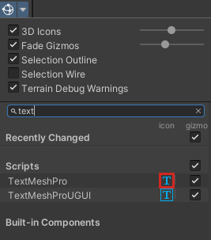

1. Click the icon toggle button for **TextMeshPro** to turn off its icons.
1. Do the same for these objects:

    **AudioSource**:

    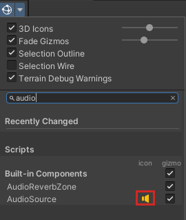

    **Variables**:

    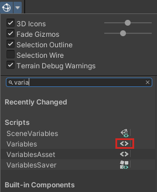

    **ScriptMachine**:

    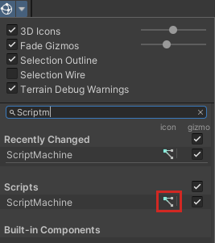

    This will make it easier to read info dialogs, labels on buttons, and more.

    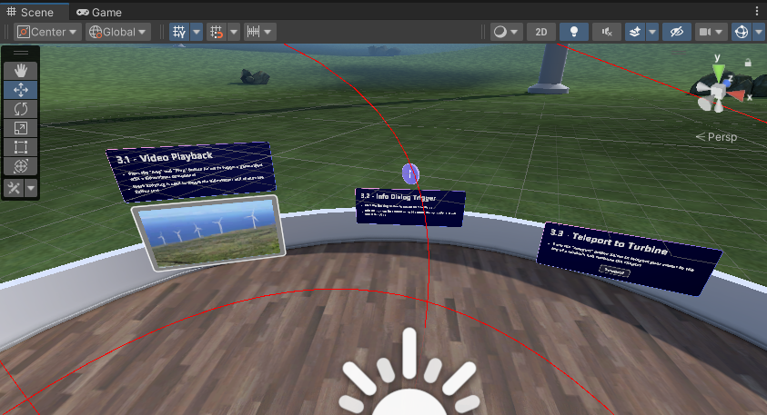

### Exploring the *StartingPoint* scene

Feel free to move around in the **Scene** window to get familiar with
the scene's contents. If we zoom out a little, we can see that there are
a number of wind turbines in our wind farm. Those two white rounded
items are called *Sphere Terraces*.

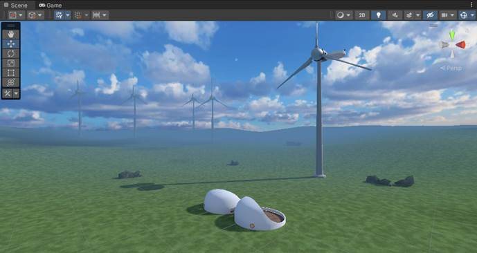

When viewing the sphere terraces from the front, you can see that each one contains a space inside that
you'll soon be walking around in.

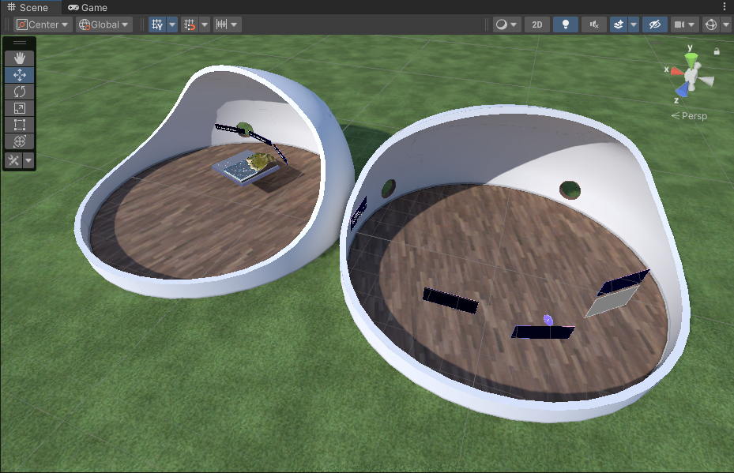

You'll be visiting the Sphere Terraces starting in the next chapter---they each contain a series of stations where you'll learn how to implement Mesh features. The first Sphere Terrace (covered in Chapter 3) is where you'll learn about Mesh Visual Scripting ...

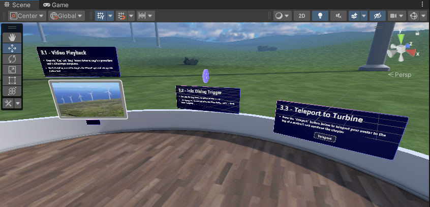

... and the other Sphere Terrace, covered in Chapter 4, is where you'll
learn about Mesh Interactables and Mesh Physics.

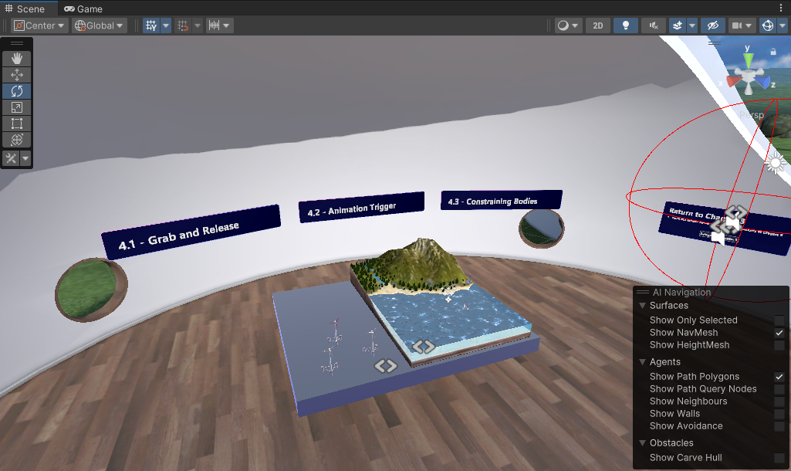

### Choose the GroundCollision layer

For this project, we want our avatar to be able to walk around only on the floors inside the *Sphere Terrace* objects and the floor of a platform that's attached to one of the wind turbine generators. For these areas to be teleportable, they must be on the *GroundCollision* layer. Let's add the *Sphere Terrace* in Chapter 3 to the GroundCollision layer.

1. In the **Hierarchy**, expand the **Chapter 3** GameObject.

1. Select the **Sphere Terrace** GameObject that's a child object to
    the **Chapter3** GameObject.

    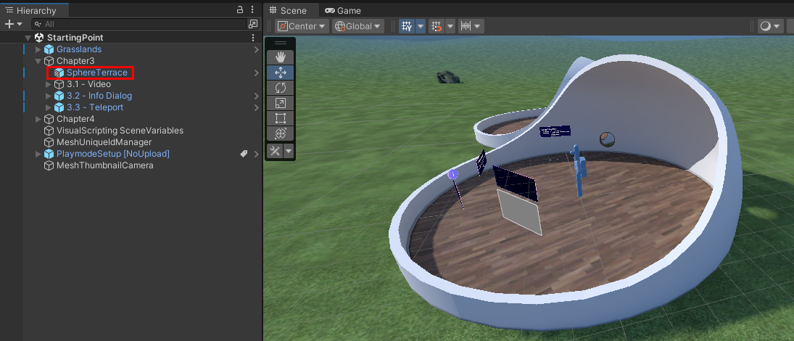

1. In the **Inspector**, select the **Layer** drop-down and then choose
    **GroundCollision**.

    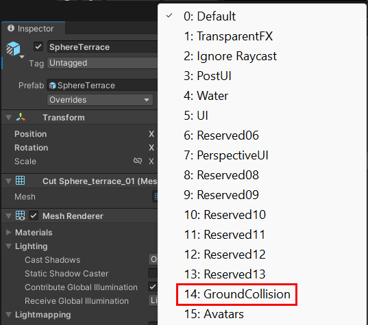

You don't have to add the other walkable GameObjects to the GroundCollision layer---we've already done it for you.

### Add Mesh Emulation Mode capability

Let's add Mesh Emulation Mode capability to your project. In this mode, when you press the Unity Editor Play button, you get an approximate preview of what the content will look and feel like when it runs in the Mesh app. A key feature of Mesh Emulation Mode is the ability to run multiple clients within the same process; this allows you to easily get a first impression of a multi-user scenario.

**To add Mesh Emulation Mode capability**:  
1. Press the Unity Editor Play button. This dialog appears:

    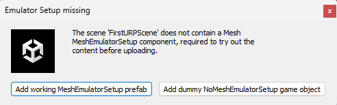

1. Select the first button, **Add working MeshEmulatorSetup prefab.** The project goes into Play mode and the **MeshEmulatorSetup [NoUpload]** prefab appears in the **Hierarchy** ...

    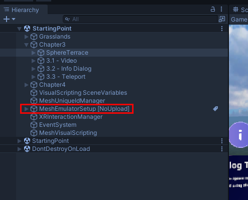

    This prefab provides you with a highly stylized avatar controller that has a camera attached, so now when we "play" the project we can have a look around. By default, the Mesh Emulator is set up to give you two different views in the **Game** window. 
 
     
 
    For this tutorial, we only want a single view, so let's change that.

1. Press the Unity Editor Play button to exit Play Mode.
1. With **MeshEmulatorSetup** still selected in the **Hierarchy**, in the **Inspector**, navigate to the **Mesh Emulator Setup** component, and then change its **Initial Screen Count** property to 1.

     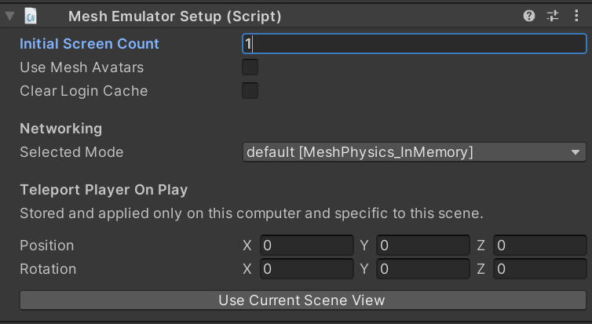

1. Click the Unity Editor Play button. Note that you now have a single view, from the avatar's position, in the **Game** window.

    

***

**Tip**: You may have noticed that the images above of Unity in Play mode have a blue tint. You can choose to have the Unity UI display a different color tint in Play mode than in Edit mode. This can help you to tell at a glance which mode you're in. To change the Play mode tint:

1. On the menu bar, select **Edit** > **Preferences**.
1. In the left-side menu, select **Colors**.
1. Under **General**, click the **Playmode tint** color box and then select the color you want.    

***

1. Use the <kbd>W</kbd><kbd>A</kbd><kbd>S</kbd><kbd>D</kbd> keys to walk around inside the Sphere Terrace. You can also use the arrow keys or drag the right mouse button to pan in any direction. When you're done experimenting, click the Unity Editor Play button again to exit Play mode.

### Check the scale of your GameObjects

The tutorial project uses default Unity scale values: 1 unit = 1 meter.
The *MeshEmulatorSetup* avatar is the same height as an average human. When
you're creating your own Environment, you can compare its size to any
custom `GameObject` you add to your project to ensure that those objects
are the size you want.

### Add the Mesh Thumbnail Camera

Adding the `Mesh Thumbnail Camera` provides a thumbnail image that will be
added to your Environment's listing in Mesh on the web and its
selection button in the Mesh app. This comes in handy when you're
selecting Environments in either place because it gives you a visual
reminder of what the Environment looks like.

**To add the thumbnail camera to the scene and set its view:**

1. In the **Scene** window, adjust the view so that it shows what you
    want to display in the thumbnail image (the Thumbnail Camera's view will
    be based on the **Scene** window).

1. Select the "+" drop-down located below the **Hierarchy** tab, and
    then select **Mesh Toolkit** > **Thumbnail Camera**.

1. To see what your thumbnail will look like, view the small **MeshThumbnailCamera** window which appears in the lower right corner of the **Scene** window. 

    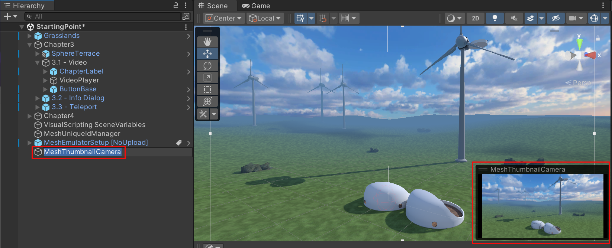

> **Note**: If you decide you want a different view for the Thumbnail
Camera, the easiest way to achieve this is to delete the Camera, establish the **Scene** view that you want, and then add the Camera again. You can also adjust the Camera GameObject directly in the **Scene**
window or change its **Position** and **Rotation** values in the
**Inspector** prior to uploading your Environment to Mesh.

There are no set rules for how your thumbnail should look---it's totally
up to you. For the example below, we chose a close-up front view of a
wind turbine.

## Next steps

> [!div class="nextstepaction"]
> [Chapter 3: Add interactivity with Mesh Visual Scripting](mesh-101-03-visual-scripting.md)