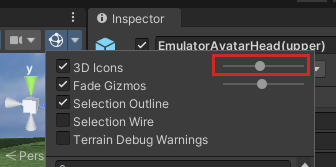
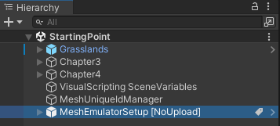

# Mesh 101 Tutorial Chapter 2: Prepare the project

 

> [!VIDEO https://learn-video.azurefd.net/vod/player?id=c6b989b4-6634-4c4d-a1f7-2aa38ab3cd70]

 

## Scenes in the project

1. Open the **Mesh101** project in Unity. If you have more than one version of Unity installed, be sure to open the project with `Unity 2022.3.34` which is required for this tutorial.

2. In the **Assets** folder, there are two scenes available: **Starting Point** and **Finished Project**.

    

1. Open the **StartingPoint** scene. 

### About the Scenes

**StartingPoint**: This is the scene you'll do the tutorial in. It
contains a pre-built setting that includes the wind turbines and
stations you'll be visiting and adding Mesh features to.

**FinishedProject**: As the title implies, this scene contains an
accurate completed version of the tutorial. You can refer to this at any
time to confirm that you've completed tutorial steps in the
*StartingPoint* scene correctly. Always save your work in the
*StartingPoint* scene before switching scenes.

### Turn object icons off for a clearer view

Many objects appear in a scene with 3D icons displayed by default. This can help you identify the objects, but it can also clutter the view and make objects harder to see. 

Let's turn off 3D icons to make the view more clear.

1. In the toolbar above the upper right corner of the **Scene** window, select the Gizmos drop-down.

    

1. Slide the **3D icons** slider all the way to the left.

    

    This will make it easier to read info dialogs, labels on buttons, and more.

    

### Exploring the *StartingPoint* scene

Feel free to move around in the **Scene** window to get familiar with
the scene's contents. If we zoom out a little, we can see that there are
a number of wind turbines in our wind farm. Those two white rounded
items are called *Sphere Terraces*.

When viewing the sphere terraces from the front, you can see that each one contains a space inside that
you'll soon be walking around in.

You'll be visiting the Sphere Terraces starting in the next chapter---they each contain a series of stations where you'll learn how to implement Mesh features. The first Sphere Terrace (covered in Chapter 3) is where you'll learn about Mesh Visual Scripting ...

... and the other Sphere Terrace, covered in Chapter 4, is where you'll
learn about Mesh Interactables and Mesh Physics.

### Using Play Mode with Mesh Emulation

When you press the Unity Editor Play button, your project automatically uses *Mesh Emulation*. This is made possible by the presence of the **MeshEmulatorSetup [NoUpload]** prefab which you can view in the **Hierarchy**.

In earlier versions of the tutorial, you needed to add this prefab intentionally when you first entered Play mode. As of mid-May 2024, the prefab comes pre-loaded into the scene.

In Play Mode with Mesh Emulation, you get an approximate preview of what the content will look and feel like when it runs in the Mesh app. The Emulator prefab provides you with a highly stylized avatar controller that has a camera attached, so now when we "play" the project we can have a look around. By default, the Mesh Emulator is set up to give you a single view in the **Game** window. 

A key feature of Play Mode with Mesh Emulation is the ability to run multiple clients within the same process; this allows you to easily get a first impression of a multi-user scenario. In the future, you may want to have two or more views in Mesh Emulator mode. To do this, you can navigate to the Emulator's **Mesh Emulator Setup** component in the **Inspector** and then change its **Initial Screen Count** property to 2 (or more).

For this tutorial, we'll stay with the single view.

1. Press the Unity Editor Play button to enter Play mode.
1. Use the <kbd>W</kbd><kbd>A</kbd><kbd>S</kbd><kbd>D</kbd> keys to walk around inside the Sphere Terrace. You can also use the arrow keys or drag the right mouse button to pan in any direction. When you're done experimenting, click the Unity Editor Play button again to exit Play mode.

### Check the scale of your GameObjects

The tutorial project uses default Unity scale values: 1 unit = 1 meter.
The *MeshEmulatorSetup* avatar is the same height as an average human. When
you're creating your own Environment, you can compare its size to any
custom `GameObject` you add to your project to ensure that those objects
are the size you want.

### Add the Mesh Thumbnail Camera

Adding the `Mesh Thumbnail Camera` provides a thumbnail image that will be
added to your Environment's listing in Mesh on the web and its
selection button in the Mesh app. This comes in handy when you're
selecting Environments in either place because it gives you a visual
reminder of what the Environment looks like.

**To add the thumbnail camera to the scene and set its view:**

1. In the **Scene** window, adjust the view so that it shows what you
    want to display in the thumbnail image (the Thumbnail Camera's view will
    be based on the **Scene** window).

1. Select the "+" drop-down located below the **Hierarchy** tab, and
    then select **Mesh Toolkit** > **Thumbnail Camera**.

1. To see what your thumbnail will look like, view the small **MeshThumbnailCamera** window which appears in the lower right corner of the **Scene** window. 

    

> **Note**: If you decide you want a different view for the Thumbnail
Camera, the easiest way to achieve this is to delete the Camera, establish the **Scene** view that you want, and then add the Camera again. You can also adjust the Camera GameObject directly in the **Scene**
window or change its **Position** and **Rotation** values in the
**Inspector** prior to uploading your Environment to Mesh.

There are no set rules for how your thumbnail should look---it's totally
up to you. For the example below, we chose a close-up front view of a
wind turbine.

## Next steps

> [!div class="nextstepaction"]
> [Chapter 3: Add interactivity with Mesh Visual Scripting](mesh-101-03-visual-scripting.md)