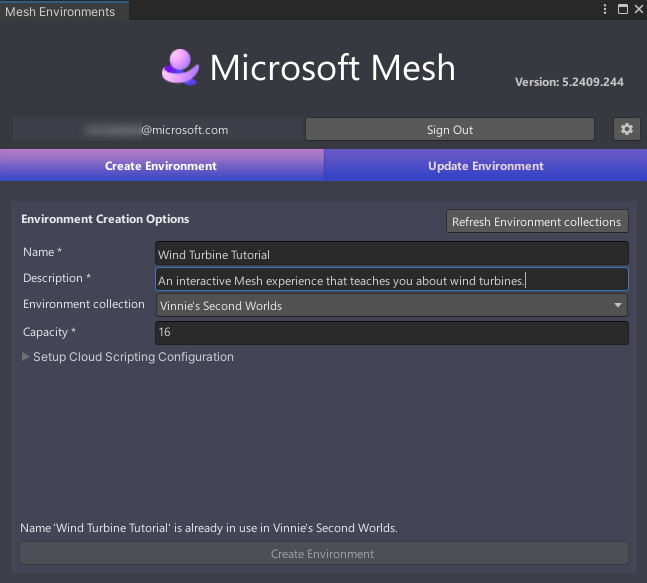
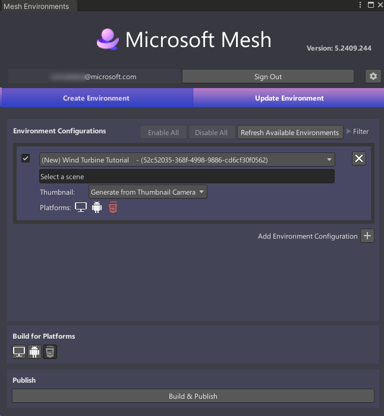
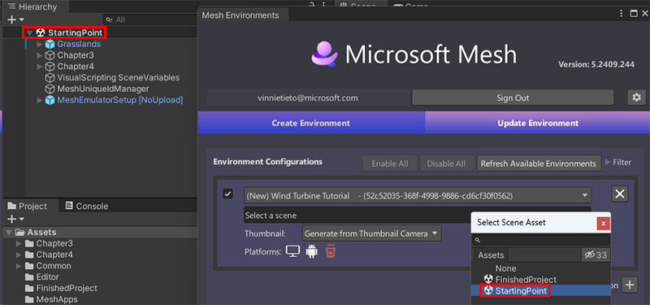
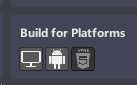
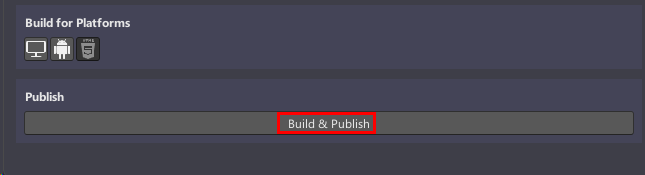
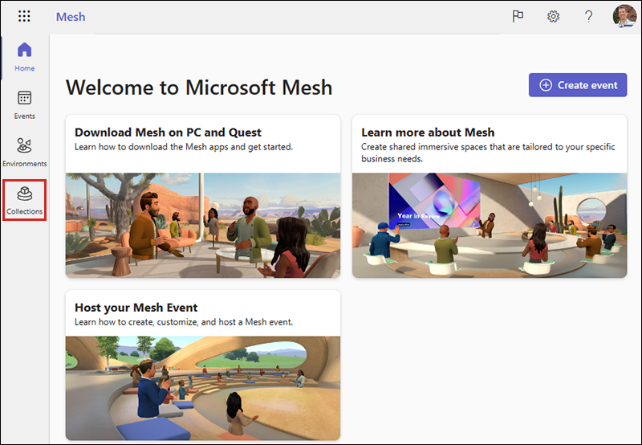

# Mesh 101 Tutorial Chapter 5: Make your environment available for testing

You've completed adding all the features you need for your Mesh experience using Mesh Interactables, Physics and Scripting. So far, we've been working in a Unity *project*; now you'll turn the *StartingPoint* scene into a Mesh *Environment* and upload it to the *Collections* page in *Mesh on the web*. At that point, your Environment is ready for you to test so you can move ahead with confidence as you prepare to schedule an *Event*.

> [!IMPORTANT]
> A Teams Premium license is required for using the Mesh application for custom immersive spaces in Mesh on PC and Quest. A license isn't required to develop with the Mesh toolkit, but you'll be blocked from building and publishing Environments to Mesh and organizing or joining events in Mesh if you and your users don't have Teams Premium licenses. For more information, see [Set up M365 for Microsoft Mesh](../../../Setup/Content/setup-m365-mesh.md).

## Mesh Uploader versions

As explained in the article named [Add the Mesh toolkit package](../../build-your-basic-environment/add-the-mesh-toolkit-package.md), there are two versions of the Mesh toolkit: the stable build and the preview build. Note that from time to time you may see minor differences between the two versions.

## Sign in to the Mesh Uploader

1. On the menu bar, select **Mesh Toolkit** > **Environments**.
1. In the **Mesh Environments** window, select **Sign In**.
1. Sign in with your account.

## Create your environment

1. Make sure you're in the **Create Environment** tab, and then, in
    the **Internal Name** field, type "Wind Turbine Tutorial."

    

2. In the **Description** field, type "An interactive Mesh experience
    that teaches you about wind turbines."

    > [!NOTE]
    > For future projects, keep in mind that the **Internal Name** field has a maximum of 40 characters, and the **Description** field has a maximum of 70 characters.

3. To ensure you have the latest Collections that are available in Mesh on the web, select the **Refresh Environment collections** button.

4. Select the **Environment collection** drop down, and then select the Environment Collection you
    want to upload your Environment to if it's not already selected.

5. In the **Capacity** field, enter the capacity for your Environment.
    The maximum is 16.

    

6. Select **Create Environment** to create the Environment that you'll be
    uploading to Mesh on the web.

7. You'll receive a confirmation dialogue as shown below. Select
    **Close**.

    

## Build and publish your environment

You should now be in the **Update Environment** tab of the **Mesh
Environments** window.

> [!NOTE]
> In the **Environment Configurations** section, a new Environment configuration has been created that displays the name you  added in the **Create Environment** tab: *Wind Turbine Tutorial*. If you see any other Environment configuration sections, close them.

### Building for single and multiple platforms

It's good to keep in mind that Mesh events can be experienced on two
different platforms: desktop PC and Android, which powers the Meta Quest
headset. Since desktop PCs typically have far more power than mobile
devices using Android, when you're creating your own project, there are
several potential scenarios to consider: build and publish your scene
for PC only, Android only, or both PC and Android. For this tutorial, we'll build for both PC and Android. To learn more about
building for single and multiple platforms, see our article titled [Build for single and multiple platforms](../../build-your-basic-environment/build-for-single-and-multiple-platforms.md).

### Update your Environment

1. In the **Update Environment** tab, click the **Select a scene**
    field, and then, in the **Select SceneAsset** dialog, select
    **StartingPoint**.

    

In the **Build for Platforms** section, you choose which platforms to
build for. Note that when a button background is gray, the button is
"on"; when the background is black, the button is "off." We're building
for both PC and Android, so make sure that both buttons are "on."

### Build and publish

Select the **Build & Publish** button.

- If the Environment builds and uploads successfully, the **Build and Upload Results** dialog appears and confirms the results.

    

- If the build and upload process fails, this is confirmed in the **Build and Upload** **Results** dialog.

## View your Environment in Mesh on the web

If you navigate to the **Environments** page for your Environment collection in Mesh on the web, you'll see that your Environment has been saved there.

1. Go to [Mesh on the web](https://portal.mesh.microsoft.com) and then, in the left-side toolbar, select **Collections**.

    

1. On the **Collections** page, select your Collection.

    On the next page, your Environment should be displayed in the **Environments** tab.

    

Your saved custom Environment is now ready for you to test in the Mesh app on your desktop PC or Quest headset to be sure it will look and perform exactly as you expect.

## Summary

In this chapter, you learned how to create an Environment based on your scene and then build it and publish it to your Environment Collection in Mesh on the web.

## Next steps

> [!div class="nextstepaction"]
> [Chapter 6: Test your environment in the Mesh app](./mesh-101-06-test-your-environment.md)
