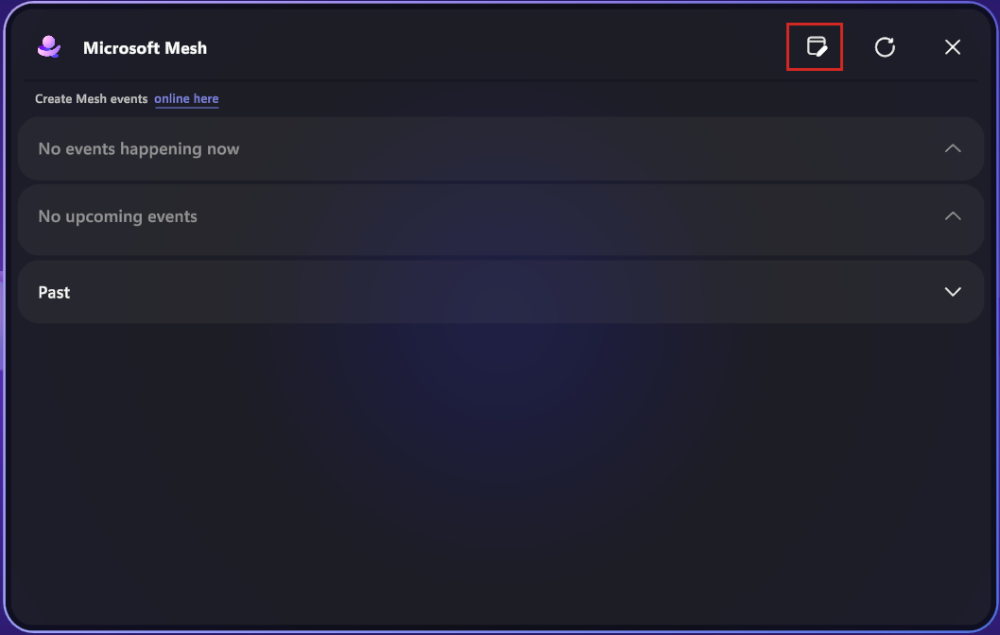
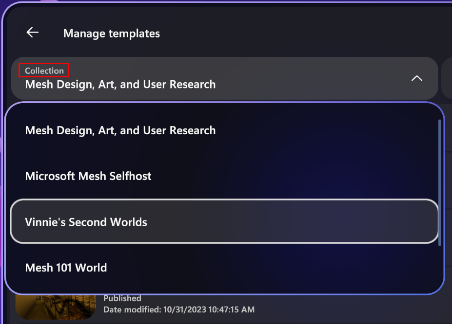
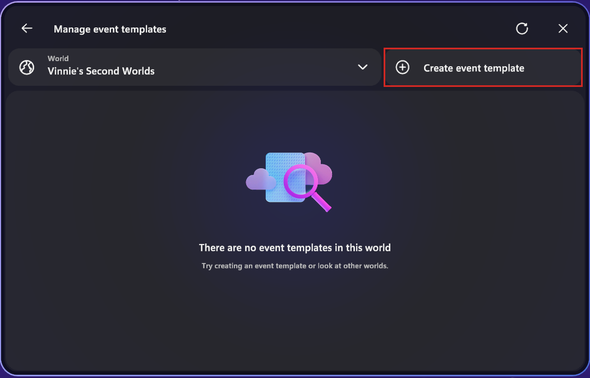
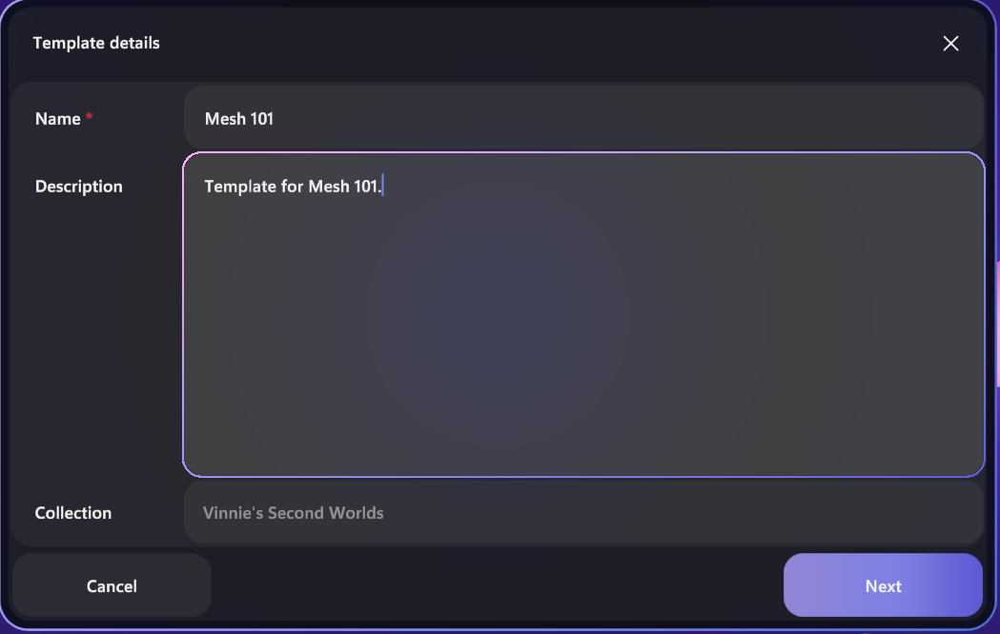

# Mesh 101 Tutorial Chapter 6: Test your environment within the Mesh app

While the [Mesh Emulation Mode](../../debug-and-optimize-performance/mesh-emulator.md) is great for trying out your environment as you build it, at some point you'll want to see how your creation feels and performs in a headset or with multiple human attendees. At that point, it's time to launch the Mesh app and create a **Template** you can use to test and iterate on your environment.

## Testing your environment in Mesh

1. After publishing your environment, open the Mesh app on your desktop PC or Quest headset.
1. Log in with your corporate account.
1. Click the **Manage event templates** button in the upper right of the Mesh dashboard:

    

1. Click the **Collection** drop-down and then select your Collection.

    

1. Click **Create event template**.

    

1. Give your Template a name and description. In this example we'll name the template **Mesh 101** and describe it as **Template for Mesh 101**. The world location will populate for you. When you're finished, click **Next**.

     
 
1. Make sure the tab **From *(name of your world)*** is selected at the top. You'll then see your published Wind Turbine Tutorial environment. Select this template and then click **Save draft**: 

    
 
1. You should get a confirmation that your Template was created. Click **OK**.

    
 
1. Select the **Customize template** button.

    
 
This will start a new customization session for your Template. To learn more, see [Create event template: Customize your templete](../../../events-guide/create-template.md).

1. You can now test the appearance and performance of your environment in the Mesh app on your desktop PC or Quest headset. To learn more, see the articles in the "Organize Events" and "Join Events" sections of the Mesh documentation.

## Testing your environment with others

Others can join you in testing your Template by launching the Mesh app on their own devices and clicking **Manage event templates**. If you both click **Customize** on the same template, you'll end up in a customization session together. Inviting others lets you test the performance of your environment when multiple avatars are present in your view.

## Testing new iterations of your environment

As you continue to work on building your environment, your Template is always ready for you. When you publish an update to your environment, come back to the Mesh app, then click **Manage event templates**, and then click **Customize** again to view your new changes.

## Summary

In this chapter, you learned how to create a Template to test and iterate on your environment. You entered a customization session for your Template to experience your environment as attendees will, and you verified that it looks and performs as you expect. Others could join you to help you ensure that any multi-user activities work as expected and your performance stays good even with their avatars present. This Template remains available for you as you continue to iterate on your environment and make any final tweaks.

With your environment ready to go, it's time to create an event and invite attendees to join you for real in Mesh!

## Next steps

> [!div class="nextstepaction"]
> [Chapter 7: Create an Event and invite others](mesh-101-07-create-an-event-and-invite-others.md)