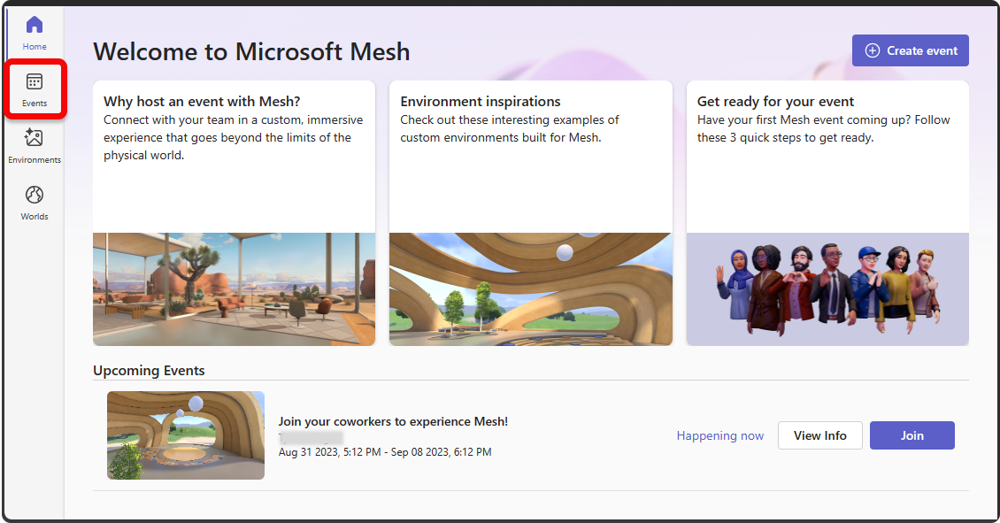
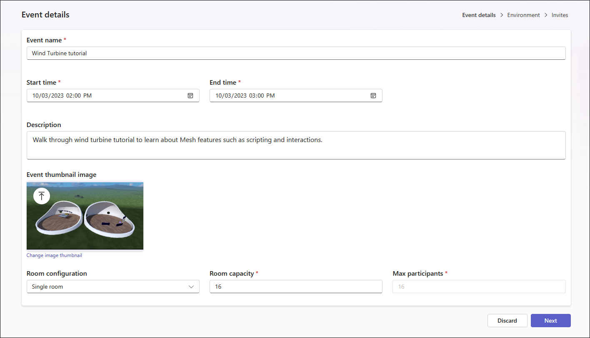
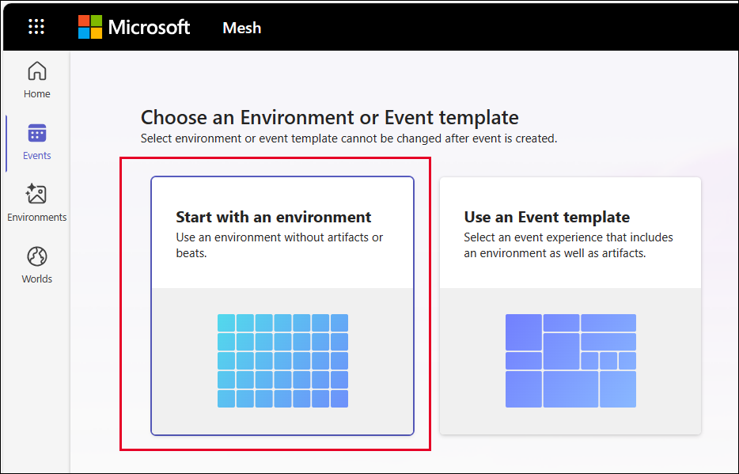
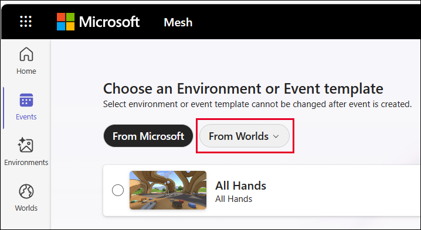
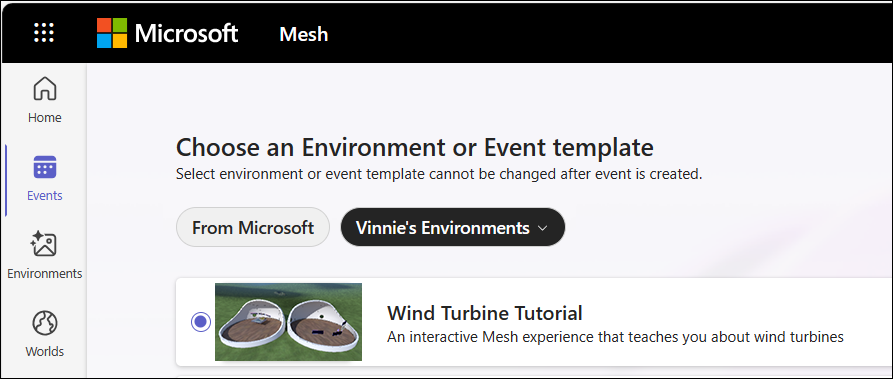
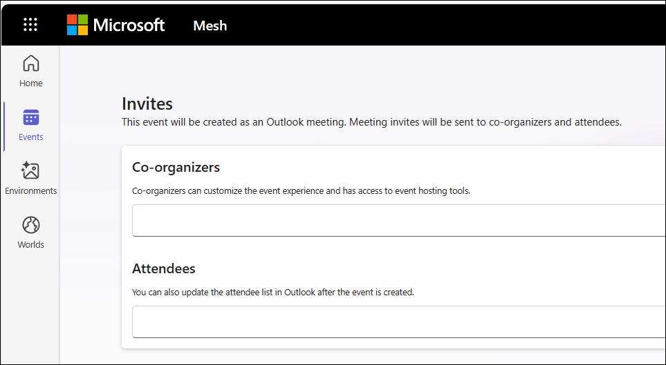

# Mesh 101 Tutorial Chapter 7: Create an event and invite others

Now that you've uploaded your Mesh 101 Environment to Mesh on the web, tested its appearance and performance, and made any final tweaks, you can
create and produce an Event based on that Environment that participants
can experience through the Mesh app for PC or Quest.

> [!IMPORTANT]
> To ensure the best experience, we recommend that attendees to an event update the latest version of the Mesh app.

1. Open [Mesh on the web](https://portal.mesh.microsoft.com/).
1. Log in with your corporate account.
1. On the Home page, in the left-side navigation bar, select **Events**.

    

1. Select **Create event** at the top right.
1. On the **Event details** page, add the **Event name**, **Start time** and **End time**, **Description**, and an optional **Event thumbnail image**.
1. Select a **Room configuration**. Your choices are "Single room" or "Multiple rooms."

    - The **Room capacity** for both is *16*.
    - The maximum number of participants allowed for a *Single room* is 16, and for **Multiple rooms** is 200. You can set the maximum number of participants for your event in the **Max participants** field.

    

1. When you're finished, select **Next**.
1. On the **Choose an Environment or Event template** page, select the **Start with an environment** box if it's not already selected, and then click **Next**.

    

1. On the following page, click the **From collections** drop-down and then, in the list that appears, choose the Collection that you uploaded your Environment to.

    

1. On the following page, select your Environment, and then select **Next**.

    

1. On the **Invites** page, you can add **Co-organizers** (who will be able to edit the event) and **Attendees** (who will be able to join the event). For this event, you wouldn't need anyone to do any editing, so you would only fill in the **Attendees** list.

    

1. When you're finished, select **Create event**.

## Summary

In this chapter, you learned how to create an Event that's based on your
Environment. Attendees you invite can join the Event and then use the Mesh
features that you enabled in Chapters 3 and 4 to learn about wind
turbines.

## Conclusion

Congratulations! Now that you've learned some of the basics of Mesh, you
can create a Unity project using your own 3D assets and build a
collaborative Mesh experience that best fits your business goals.
