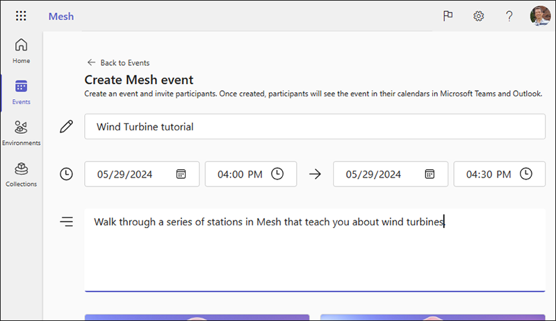

# Mesh 101 Tutorial Chapter 7: Create an event and invite others

Now that you've uploaded your Mesh 101 Environment to Mesh on the web, tested its appearance and performance, and made any final tweaks, you can
create and produce an Event based on that Environment that participants
can experience through the Mesh app for PC or Quest.

> [!IMPORTANT]
> To ensure the best experience, we recommend that attendees to an event update to the latest version of the Mesh app.

1. Open [Mesh on the web](https://portal.mesh.microsoft.com/).
1. Log in with your corporate account.

## Create an event

1. On the Home page, in the left-side navigation bar, select **Events**.

    

1. Select **Create event** at the top right. This takes you to the **Create Mesh Event** page.

> [!TIP]
> On this page, you can learn about a setting by moving the cursor over the icon to the left of the setting.

    

1. Add an event title, the starting date and time, the ending date and time, and details about the event if needed. the **Event name**, **Start time** and **End time**, **Description**, and an optional **Event thumbnail image**.

    

1. Click one of the room configuration thumbnails to select that configuration.

    

    For the Single and Multi-room configurations, you can add **co-organizers** and **attendees**. For the Multi-room configuration, you must also specify the number of attendees per room.

    

    If you select **Choose a template** or **Start from scratch**, you can choose a built-in Microsoft or custom template or environment.

    

1. The last option on the page lets you upload an image that will become your event cover image in Mesh.

    

1. When you're finished, select **Create**.

## Join the event

1. In the left-side column of the Mesh Portal, select **Events**.
1. On the **Events** page, navigate to your event and then click its **Join in Mesh app** button.

## Summary

In this chapter, you learned how to create an Event that's based on your
Environment. Attendees you invite can join the Event and then use the Mesh
features that you enabled in Chapters 3 and 4 to learn about wind
turbines.

## Conclusion

Congratulations! Now that you've learned some of the basics of Mesh, you
can create a Unity project using your own 3D assets and build a
collaborative Mesh experience that best fits your business goals.
