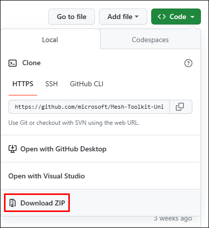
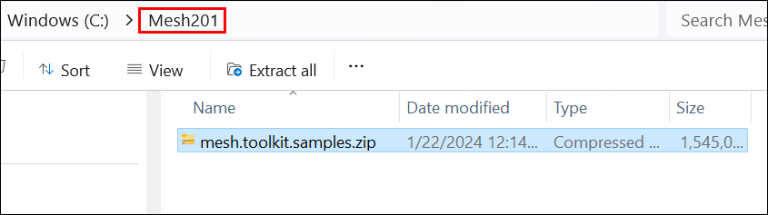
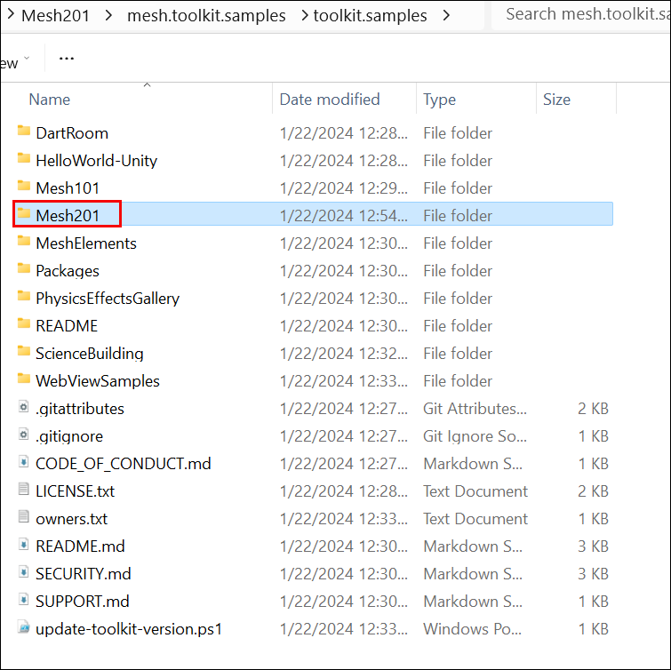

# Mesh 201 Tutorial Chapter 1: Overview and setup

In the Mesh 101 tutorial (a prerequisite for this tutorial), you'll get up and running with creating a Mesh experience and gain a solid understanding of Interactables, Physics, Visual Scripting, and more. In this tutorial, you'll build on that knowledge and learn how to use WebSlates to display web content in your experience. The tutorial includes an interactive globe--when an event attendee clicks on the globe, a call is made to the Bing Maps API and the geographical area clicked on by the attendee is displayed on a nearby WebSlate.

    

The tutorial project is named *Mesh201* and is included in the Mesh toolkit.

> [!IMPORTANT]
> The tutorial project is governed by the MIT license as shown in the [LICENSE.txt](https://github.com/microsoft/Mesh-Toolkit-Unity/blob/main/LICENSE.txt) file in the *Mesh-Toolkit-Unity* repository. However, the samples functionality is dependent on the Mesh toolkit, which is governed by a separate license, and contains 3rd party software. A Teams Premium license is required for using the Mesh application for custom immersive spaces in Mesh on PC and Quest. A license isn't required to develop with the Mesh toolkit, but you'll be blocked from building and publishing Environments to Mesh and organizing or joining events in Mesh if you and your users don't have Teams Premium licenses. For more information, see [Set up M365 for Microsoft Mesh](../../../Setup/Content/setup-m365-mesh.md).

The tutorial is structured as follows:

- Chapter 1: Overview and setup *(this article)*

- [Chapter 2: Prepare the project.](./mesh-201-02-prepare-the-project.md)

- [Chapter 3: Load a local HTML file that's *not* shared.](./mesh-201-03-webslate-1.md)

- [Chapter 4: Load a local HTML file that *is* shared.](./mesh-201-04-webslate-2.md)

- [Chapter 5: Load a URL from a 3D asset.](<link>)

## Prerequisites

### Previous Unity experience

This tutorial assumes that you have the intermediate to advanced Unity skills needed to create an Environment. We also recommend that you have some familiarity with Unity Visual Scripting. A good place to learn Visual Scripting basics is through [Unity's Visual Scripting tutorial](https://learn.unity.com/project/introduction-to-visual-scripting). This teaches you most if not all of the concepts you need to get started with Mesh Visual Scripting. 

### Previous Mesh development with Visual Scripting *or* completion of the Mesh 101 tutorial

If you've been developing Mesh experiences for a while and are familiar not only with Unity Visual Scripting in general but also with some of the more common Mesh-specific Visual Scripting nodes, you can probably complete this tutorial successfully without first having gone through the Mesh 101 tutorial. If you have any doubt, we highly recommend that you complete the Mesh 101 tutorial.

### Hardware requirements

Minimum PC requirements: 4 CPU cores, 8GB RAM

### Unity version 2022.3.7f1

Unity version 2022.3.7f1 is required for this tutorial.

[Review system requirements for Unity](https://docs.unity3d.com/2022.3/Documentation/Manual/system-requirements.html)

[Get help installing Unity](https://docs.unity3d.com/hub/manual/InstallEditors.html)

Your installation should include modules for Android and Windows. The Mesh app works for PC and the Oculus Quest 2, and Android is the operating system for the Quest.

## Set things up for Mesh

### Download the Mesh desktop app

Download Microsoft Mesh on PC
 
> [!div class="nextstepaction"]
> [Microsoft Mesh - Microsoft Store Apps](https://apps.microsoft.com/store/detail/microsoft-mesh/9NLXZJ1FDBD7)

### Download the Mesh Toolkit samples

1. In your browser, go to the [*Mesh-Toolkit-Unity* repository](https://github.com/microsoft/Mesh-Toolkit-Unity).

    

1. Select the **Code** button, and then select **Download ZIP**.

    

1. On your C: drive, create a folder with a one-word name (for example, "Mesh201") and then move or copy the downloaded Mesh toolkit Zip file to that folder. This is done to avoid running into a problem with the Windows path length limit, which is 256 characters. **IMPORTANT**: *Don't* place the Zip file on the Windows desktop. Behind the scenes, this creates a very long path name.

    In the example below, the user created a folder on their C: drive named *Mesh101.* Next, they moved the downloaded Mesh toolkit Zip file to the *Mesh201* folder.

    

1. Unzip the samples Zip file into the same folder, and then navigate through the unzipped folder hierarchy until you see the **Mesh201** folder. This contains the tutorial project which you'll open in the next chapter.

    

### Mesh toolkit package

For this tutorial, the only package you need is the Mesh toolkit package, and it's already pre-loaded into the tutorial project. If you were creating your
own project from scratch, you would need to [import the Mesh toolkit package](../../build-your-basic-environment/add-the-mesh-toolkit-package.md).

## Next steps

> [!div class="nextstepaction"]
> [Chapter 2: Prepare the project](./mesh-201-02-prepare-the-project.md)
