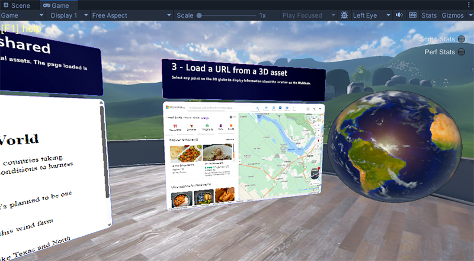

# Mesh 201 Tutorial Chapter 1: Overview, set up and get started

If you completed the [Mesh 101 tutorial](../mesh-101-tutorial/mesh-101-01-overview-and-setup.md), you got up and running with creating a Mesh experience and gained a solid understanding of Interactables, Physics, Visual Scripting, and more. In this "Mesh 201" tutorial, you build on that knowledge. You'll visit a number of *stations* and learn about the following:

- How to use WebSlates to display Web content in your experience.  
- Add an interactive globe. When an attendee in your experience clicks on the globe, the latitude and longitude of the clicked location are captured and these coordinates are incorporated into a Bing Maps URL as parameters. An HTTP request is executed using this URL; Bing Maps provides a map of the chosen area and sends it to a nearby WebSlate, which is a screen that can display images, videos, interactive content and more.

As of late May 2024, the Mesh 201 tutorial has been updated to include two additional stations that feature Mesh Cloud Scripting, which you can use to call any .NET API and bring real-time cloud data into your environment. The Mesh 101 tutorial was designed to teach attendees in your experience about wind farms, and the two new stations continue with that theme by providing attendees with information that can help them decide where to build a new wind farm. At these stations you'll learn how to implement the following:

- Pull data from internal or public sources into your scene. An attendee in the event will be able to click an interactive globe to view live weather data from three cities that they are considering for the location of their new wind farm.

    

- Set up AI-powered interactions using an OpenAI-based virtual assistant or "chatbot". An attendee can click an "Info" button and ask questions about the best locations for wind farms. You, the developer, will add code that will provide the OpenAI LLM ([Large Language Model](https://learn.microsoft.com/training/modules/introduction-large-language-models/) with some context for the wind farm-related questions attendees will likely be asking.

    

The tutorial project is named *Mesh201* and is included when you [download the Mesh samples and tutorials from GitHub](#download-the-mesh-samples-and-tutorials).

> [!IMPORTANT]
> The tutorial project is governed by the MIT license as shown in the [LICENSE.txt](https://github.com/microsoft/Mesh-Toolkit-Unity/blob/main/LICENSE.txt) file in the *Mesh-Toolkit-Unity* repository. However, the samples functionality is dependent on the Mesh toolkit, which is governed by a separate license, and contains 3rd party software. A Teams Premium license is required for using the Mesh application for custom immersive spaces in Mesh on PC and Quest. A license isn't required to develop with the Mesh toolkit, but you'll be blocked from building and publishing Environments to Mesh and organizing or joining events in Mesh if you and your users don't have Teams Premium licenses. For more information, see [Set up M365 for Microsoft Mesh](../../../Setup/Content/setup-m365-mesh.md).

The tutorial is structured as follows:

- Chapter 1: Overview, setup and get started. *(this article)*

- [Chapter 2: Load a local non-shared HTML file into a WebSlate](./mesh-201-02-webslate-1.md).

- [Chapter 3: Load a local shared HTML file into a WebSlate](./mesh-201-03-webslate-2.md).

- [Chapter 4: Load a URL from a 3D asset](./mesh-201-04-webslate-3.md).

- [Chapter 5: Click an interactive globe to get live weather data](./mesh-201-05-live-weather-data.md)

- [Chapter 6: Get answers to questions using Azure OpenAI](./mesh-201-06-open-ai.md)

## Prerequisites

### Familiarity with cloning from GitHub and [Git LFS](https://git-lfs.com/)

### Previous Unity experience

This tutorial assumes that you have the intermediate to advanced Unity skills needed to edit an Environment. We also recommend that you have some familiarity with Unity Visual Scripting. A good place to learn Visual Scripting basics is through [Unity's Visual Scripting tutorial](https://learn.unity.com/project/introduction-to-visual-scripting). This teaches you most if not all of the concepts you need to get started with Mesh Visual Scripting. 

### Previous Mesh development with Visual Scripting *or* completion of the Mesh 101 tutorial

If you've been developing Mesh experiences for a while and are familiar not only with Unity Visual Scripting in general but also with some of the more common Mesh-specific Visual Scripting nodes, you can probably complete this tutorial successfully without first having gone through the Mesh 101 tutorial. If you have any doubt, we highly recommend that you complete the [Mesh 101 tutorial](../mesh-101-tutorial/mesh-101-01-overview-and-setup.md). The following features were covered in the Mesh 101 tutorial documentation and are also included in the Mesh 201 Unity project but won't be covered again in the Mesh 201 documentation. If you feel a need to understand these concepts better, click the links.

[Turn object icons off for a clearer view](../mesh-101-tutorial/mesh-101-02-prepare-the-project.md#turn-object-icons-off-for-a-clearer-view)

[Play Mode with Mesh Emulation](../mesh-101-tutorial/mesh-101-02-prepare-the-project.md#using-play-mode-with-mesh-emulation)

[Mesh Thumbnail Camera](../mesh-101-tutorial/mesh-101-02-prepare-the-project.md#add-the-mesh-thumbnail-camera)

### Hardware requirements

Minimum PC requirements: 4 CPU cores, 8GB RAM

### Unity version 2022.3.34

Unity version 2022.3.34 is required for this tutorial.

[Review system requirements for Unity](https://docs.unity3d.com/Manual/system-requirements.html)

[Get help installing Unity](https://docs.unity3d.com/hub/manual/InstallEditors.html)

Your installation should include modules for Android and Windows. The Mesh app works for PC and the Meta Quest, and Android is the operating system for the Quest.

### Mesh Cloud Scripting Setup

At the end of this tutorial, you have the option to build and publish the completed project to Mesh on the web and then create an event from it that you can run in the Mesh app. Thanks to the *Mesh Emulator*, you can still see how the finished project will look in the Mesh app *without* building and publishing. If you do want to step through the build-and-publish process, you need some extra preparation in order for Mesh cloud Scripting to work. To learn more, see the article named [Prepare for your first Mesh Cloud Scripting Project](../../script-your-scene-logic/cloud-scripting/cloud-scripting-prepare-for-your-project.md) and make sure you've addressed the prerequisites listed there.

## An M365 Office subscription and familiarity with the Azure portal.

You'll need to use the Azure Portal in order to set up OpenAI in Chapter 6.

**Important**: OpenAI is only available to approved enterprise customers and partners. If you're not yet in this group, you must submit a [registration form](https://aka.ms/oai/access). [Learn more about the registration process](/legal/cognitive-services/openai/limited-access).

## Set things up for Mesh

### Download the Mesh desktop app

Download Microsoft Mesh on PC
 
> [!div class="nextstepaction"]
> [Microsoft Mesh - Microsoft Store Apps](https://apps.microsoft.com/store/detail/microsoft-mesh/9NLXZJ1FDBD7)

### Download the Mesh samples and tutorials

To get the Mesh 201 tutorial, you must go to the [*Mesh-Toolkit-Unity* repository](https://github.com/microsoft/Mesh-Toolkit-Unity) and then clone the repo.

**NOTES**:

- GitHub also gives you the option to download the samples in a Zip file. We recommend that you clone the repo since it's more convenient to get future updates simply by updating the repo rather than downloading a new Zip file every time.  
- If you previously did the [Mesh 101 tutorial](../mesh-101-tutorial/mesh-101-01-overview-and-setup.md)  and you cloned the repo at that time, you should run a *pull* operation on the repo so you have the latest changes for Mesh 201. 
- We're not currently accepting code contributions to our samples. If you have any feedback or if you run into any issues with the samples or the Mesh toolkit, do the following: in a Unity project that has the Mesh toolkit package installed, select **Mesh Toolkit** > **Give feedback to Microsoft** and then use the feedback link in the Mesh toolkit to let us know.

**Important**: If you're cloning, you should have [Git LFS installed](https://git-lfs.com/).

1. Select the **Code** button, and then click the "Copy url to clipboard" button.

    

1. We recommend that you create a folder on your C: drive named "Mesh Samples" and then clone the repo to that folder. This is a good name for two reasons: it's short, so it avoids running into a problem with the Windows path length limit, which is 256 characters. Also, there are other Mesh samples in addition to the Mesh 201 tutorial, so all your samples will be located in one place.
1. In the newly created folder, create a Git repo and then clone the repo by pasting the copied URL after the *git clone* command in Git Bash and then pressing the Enter key.

    

### Mesh toolkit package

For this tutorial, the only package you need is the Mesh toolkit package, and it's already pre-loaded into the tutorial project. If you were creating your own project from scratch, you would need to [import the Mesh toolkit package](../../build-your-basic-environment/add-the-mesh-toolkit-package.md).

## Scenes in the project

1. Open the **Mesh201** project in Unity. If you have more than  one version of Unity installed, be sure to open the project with `Unity 2022.3.34` which is required for this tutorial.

    **WARNING**: The project could take 15 minutes or slightly longer to load due to large asset sizes. If you need to, change your Sleep mode setting so that the computer doesn't go to sleep while the project is loading. If this happens, it could cause the project to not load properly.
    
1. In the **Assets** folder, note that there are two scenes available: **Starting Point** and **Finished Project**.

    

    **StartingPoint**: This is the scene you'll do the tutorial in. It
    contains a pre-built setting that includes the WebSlates and interative globe you'll be visiting and adding Mesh features to.

    **FinishedProject**: As the title implies, this scene contains an
    accurate completed version of the tutorial. You can refer to this at any
    time to confirm that you've completed tutorial steps in the
    *StartingPoint* scene correctly. Always save your work in the
    *StartingPoint* scene before switching scenes.

## Trying out the finished project

We recommend that you open the **FinishedProject** scene, run it, and visit a few of the *stations* it contains to try out some of the Mesh features you'll be implementing in the tutorial. The stations are located on a GameObject called a *Sphere Terrace*. 

 

1. Click the Unity Editor Play button.
1. Stations 1, 2 and 3 are located on one side of the Sphere Terrace. Navigate to this area and then position yourself so that you're facing the Stations. 

     

1. Move in closer to Stations 1 and 2 and then click their **Load** buttons. Notice that this action loads HTML pages into the WebSlates.

     

1. Move in front of Station 3, and then click several different spots on the **Earth** object--you can rotate it by left-clicking on it and then dragging. Notice how each time you click, a map of that area appears on the nearby WebSlate.

     

1. Click the Unity Editor Play button to exit Play mode.

## Check the Scene window "Scale" setting

If things look a little blurry in the **Game** window when you're in Play mode, take a look at the **Scale** slider located just above the window. For the best visual fidelity, the slider should be moved all the way to the left so the scale equals "1x."

 

 
 
## Next steps

> [!div class="nextstepaction"]
> [Chapter 2: Load a local non-shared HTML file into a WebSlate](./mesh-201-02-webslate-1.md)
