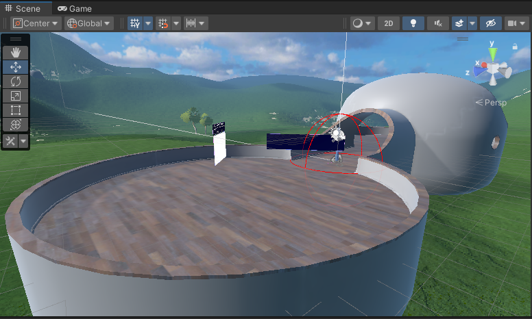
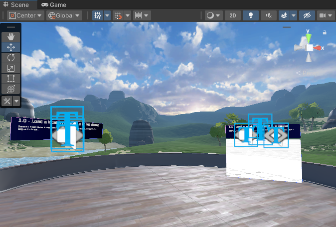
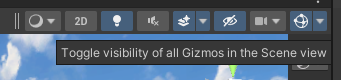
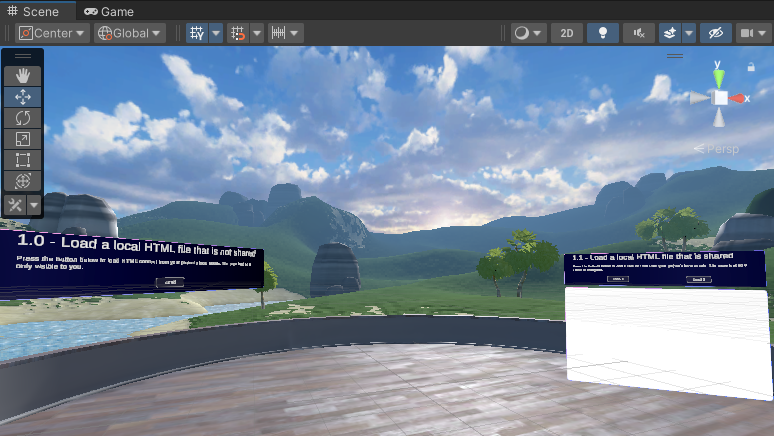
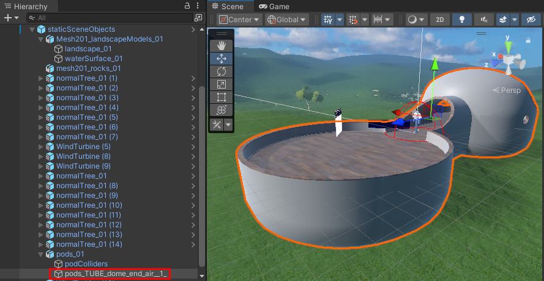
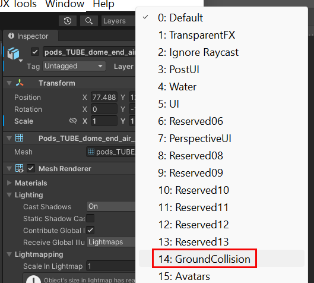

# Mesh 201 Tutorial Chapter 2: Prepare the project

## Scenes in the project

1. Open the **Mesh201** project in Unity. If you have more than
    one version of Unity installed, be sure to open the project with `Unity 2022.3.7f1` which is required for this tutorial.

2. In the **Assets** folder, note that there are two scenes available: **Starting Point** and **Finished Project**.

    

    **StartingPoint**: This is the scene you'll do the tutorial in. It
    contains a pre-built setting that includes the WebSlates and interative globe you'll be visiting and adding Mesh features to.

    **FinishedProject**: As the title implies, this scene contains an
    accurate completed version of the tutorial. You can refer to this at any
    time to confirm that you've completed tutorial steps in the
    *StartingPoint* scene correctly. Always save your work in the
    *StartingPoint* scene before switching scenes.

1. Open the **StartingPoint** scene.

## Explore the *StartingPoint* scene

Feel free to move around in the **Scene** window to get familiar with
the scene's contents. If we zoom out a little, we can see that the WebSlates we'll be updating are located on a GameObject called a *Sphere Terrace*. It contains a series of stations where you'll learn how to implement Mesh features for the WebSlates.

## Turn object icons off for a clearer view

- In the **Scene** window, navigate onto the sphere terrace so that you're facing stations 1.0 and 1.1, as seen below.

    

As you can see, some of the objects in front of the stations have gizmos or icons displayed. These can help you identify the objects, but they can also clutter the view and make objects harder to see. Let's turn off some of the icons we don't need to make the view more clear.

1. In the toolbar above the upper right corner of the **Scene** window, select the Gizmos drop-down.

    

    The first icon we'll address is the one for *TextMeshPro*. The goal here is find **TextMeshPro** in the list and then click its **icon** toggle button, which turns off the display of the icons in the **Scene** window. You could scroll down until you find TextMeshPro in the list:

    

    ... but there's a faster way to find objects than scrolling.

1. In the search field, type in "text." The list narrows down to objects starting with those letters.

    

1. Click the icon toggle button for **TextMeshPro** to turn off its icons.
1. Do the same for these objects:

    **AudioSource**:

    

    **Variables**:

    

    **ScriptMachine**:

    

    This will make it easier to read info dialogs, labels on buttons, and more.

    

## Choose the GroundCollision layer

For this project, we want our avatar to be able to walk around only on
the floor inside the *Sphere Terrace* object. For this area to be walkable, it must be on the *GroundCollision* layer. Let's add the *Sphere Terrace* we'll be working with in Chapter 3 to the GroundCollision layer.

1. In the **Hierarchy**, expand **staticSceneObjects** and **pods_01** and then select the child object named **pods_TUBE_dome_end-air__1_**. This is the sphere terrace object--the image below gives you a zoomed-out view of the whole sphere terrace selected.

    

1. In the **Inspector**, select the **Layer** drop-down and then choose
    **GroundCollision**.

    

## Mesh Emulation Mode capability

In Mesh Emulation mode, when you press the Unity Editor Play button, you get an approximate preview of what the content will look and feel like when it runs in the Mesh app. A key feature of this mode is the ability to run multiple clients within the same process; this allows you to easily get a first impression of a multi-user scenario.

Normally, there are a few steps involved in setting up Mesh Emulation mode, but for this tutorial, we've already set it up for you. For a full explanation, see the Mesh 101 tutorial.

***

**Tip**: You can choose to have the Unity UI display a different color tint in Play mode than in Edit mode. This can help you to tell at a glance which mode you're in. In this tutorial, Play mode images are tinted blue.

**To change the Play mode tint**:  
1. On the menu bar, select **Edit** > **Preferences**.
1. In the left-side menu, select **Colors**.
1. Under **General**, click the **Playmode tint** color box and then select the color you want.    

***

## Add the Mesh Thumbnail Camera

The `Mesh Thumbnail Camera` provides a thumbnail image that will be added to your Environment's listing in Mesh on the web and its selection button in the Mesh app. This comes in handy when you're selecting Environments in either place because it gives you a visual reminder of what the Environment looks like.

This is another feature that's already set up for you and is explained in detail in the Mesh 101 tutorial.

## Next steps

> [!div class="nextstepaction"]
> [Chapter 3: Load a local non-shared HTML file into a WebSlate](./mesh-201-03-webslate-1.md)